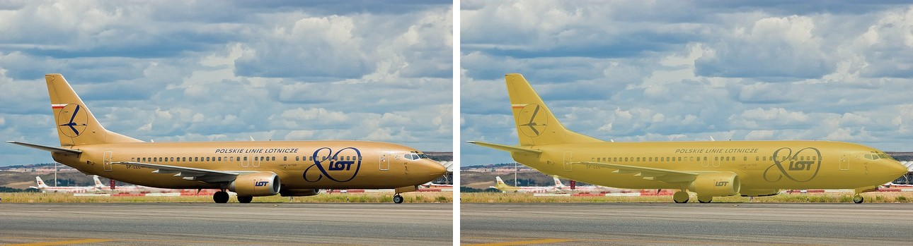
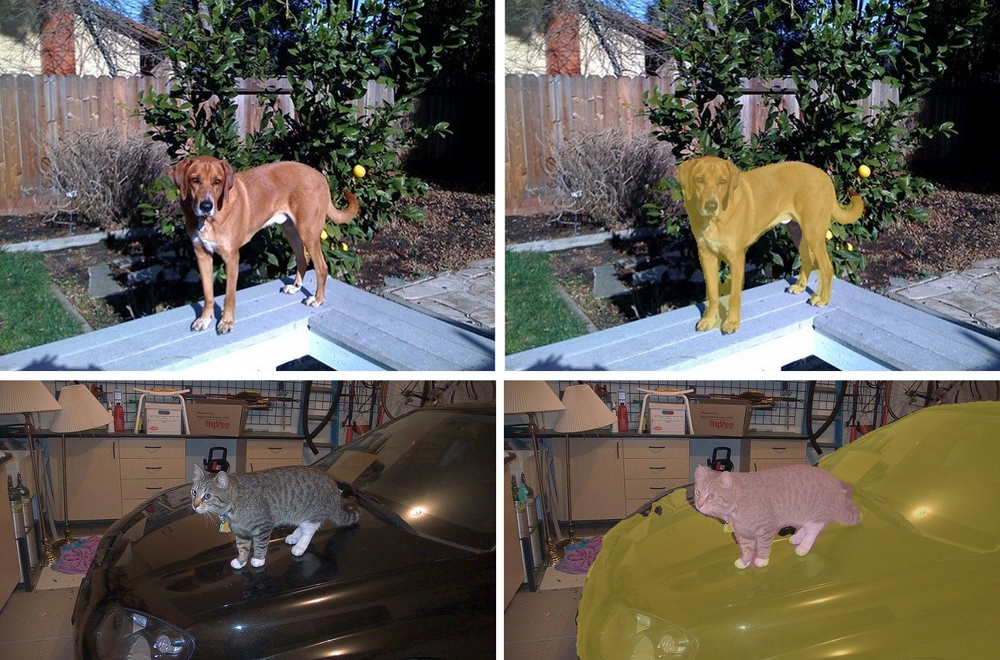

# DeepLabV3

<div style="background:#dff0d8; border:1px solid #cfe6bf; border-radius:3px; padding:12px 16px; color:#2a3a26;">
<b>Weights:</b> the pretrained weights for the DeepLabV3 model are hosted on the
kerasformers <a href="https://github.com/IMvision12/KerasFormers/releases/tag/deeplabv3" style="color:#1a5c8a;">deeplabv3</a>
release tag, and download automatically the first time you call
<code>from_weights(...)</code>.
</div>
<br>

DeepLabV3 does **semantic segmentation**: every pixel gets a class, with no notion of separate object instances. Two dogs side by side are one `dog` region, not two.

Its contribution is **atrous (dilated) convolution**. A plain classification backbone downsamples aggressively, which is fine for a single label but destroys the spatial detail segmentation needs. Dilated convolutions widen the receptive field without downsampling further, and the Atrous Spatial Pyramid Pooling head samples several dilation rates in parallel so one layer sees objects at multiple scales at once.

**Paper**: [Rethinking Atrous Convolution for Semantic Image Segmentation](https://arxiv.org/abs/1706.05587)

## API

### DeepLabV3SemanticSegment

```python
DeepLabV3SemanticSegment(backbone_variant="ResNet50", num_classes=21,
                         image_size=520, input_tensor=None,
                         name="DeepLabV3SemanticSegment")
```

The segmentation model: dilated ResNet backbone plus the ASPP head.
**This is the class for semantic segmentation.**

**Parameters**

- **backbone_variant** (`str`, *optional*, defaults to `"ResNet50"`): CNN backbone, `"ResNet50"` or `"ResNet101"`.
- **num_classes** (`int`, *optional*, defaults to `21`): Pascal VOC's 20 classes plus background.
- **image_size** (`int`, *optional*, defaults to `520`): input resolution the model is built for.
- **input_tensor** (`dict`, *optional*): pre-existing input tensors to build on.
- **name** (`str`, *optional*, defaults to `"DeepLabV3SemanticSegment"`): model name.

**Call** `model(pixel_values, training=False)`. **Returns** a tensor of shape
`(B, H, W, num_classes)`: per-pixel class logits at the input resolution.

### DeepLabV3Model

```python
DeepLabV3Model(backbone_variant="ResNet50", image_size=520,
               input_tensor=None, name="DeepLabV3Model")
```

The dilated backbone without the segmentation head, for features to attach your own
head to.

## Preprocessing

### DeepLabV3ImageProcessor

```python
DeepLabV3ImageProcessor(size=None, resample="bilinear", do_rescale=True,
                        rescale_factor=1/255, do_normalize=True,
                        image_mean=None, image_std=None, return_tensor=True,
                        data_format=None)
```

Resizes to a fixed square, rescales to `[0, 1]`, and normalizes with ImageNet
statistics.

**Parameters**

- **size** (`dict`, *optional*, defaults to `{"height": 520, "width": 520}`): target size.
- **resample** (`str`, *optional*, defaults to `"bilinear"`): resize interpolation.
- **do_rescale** (`bool`, *optional*, defaults to `True`): scale pixels to `[0, 1]`.
- **do_normalize** (`bool`, *optional*, defaults to `True`): apply ImageNet normalization.
- **image_mean** / **image_std** (`tuple`, *optional*): defaults to the ImageNet statistics.
- **return_tensor** (`bool`, *optional*, defaults to `True`): return backend tensors rather than numpy.
- **data_format** (`str`, *optional*): `"channels_last"` or `"channels_first"`. Defaults to `keras.config.image_data_format()`.

**post_process_semantic_segmentation**

```python
processor.post_process_semantic_segmentation(outputs, target_size=None,
                                             label_names=None, data_format=None)
```

Takes the per-pixel argmax and resizes the label map to `target_size`.

**Returns** a `dict`:

- **segmentation** (`(H, W)` `uint8`): the class id per pixel.
- **unique_classes**: the ids actually present.
- **class_names**: their names, from Pascal VOC unless `label_names` is given.

## Model Variants

| Variant id                     | Backbone   | Classes | Source      |
|--------------------------------|------------|--------:|-------------|
| `deeplabv3_resnet50_coco_voc`  | ResNet-50  |      21 | torchvision |
| `deeplabv3_resnet101_coco_voc` | ResNet-101 |      21 | torchvision |

Both are trained on the COCO subset that covers the Pascal VOC label set, so the
vocabulary is VOC's 20 classes plus background.

## Basic Usage: Semantic Segmentation



Each figure is the original image beside the predicted segmentation overlaid on it.


```python
import keras
import numpy as np
from PIL import Image
from kerasformers.models.deeplabv3 import (
    DeepLabV3ImageProcessor, DeepLabV3SemanticSegment,
)

model = DeepLabV3SemanticSegment.from_weights("deeplabv3_resnet50_coco_voc")
processor = DeepLabV3ImageProcessor()

image = Image.open("assets/data/coco_airplane.jpg").convert("RGB")
output = model(processor(image)["pixel_values"], training=False)
# output: (1, 520, 520, 21)

result = processor.post_process_semantic_segmentation(
    output, target_size=(image.height, image.width)
)
seg = np.asarray(keras.ops.convert_to_numpy(result["segmentation"]))

for cid, name in zip(result["unique_classes"], result["class_names"]):
    print(f"{name:14s} {int((seg == int(cid)).sum())} px")
```

```
background     181677 px
aeroplane      41683 px
```

`segmentation` is a plain `(H, W)` label map, so counting pixels per class is just a
comparison. There is no per-instance structure here: if two aeroplanes overlapped they
would share one region.

### Batch Processing Multiple Images



The processor accepts a list, and every image is resized to the same square, so
stacking is always safe. Post-process one image at a time, since each has its own
target size:

```python
import keras
import numpy as np
from PIL import Image
from kerasformers.models.deeplabv3 import (
    DeepLabV3ImageProcessor, DeepLabV3SemanticSegment,
)

model = DeepLabV3SemanticSegment.from_weights("deeplabv3_resnet50_coco_voc")
processor = DeepLabV3ImageProcessor()

paths = ["assets/data/coco_dog_yard.jpg", "assets/data/coco_cat_car.jpg"]
images = [Image.open(p).convert("RGB") for p in paths]

outputs = model(processor(paths)["pixel_values"], training=False)   # (2, 520, 520, 21)

for path, image, logits in zip(paths, images, outputs):
    result = processor.post_process_semantic_segmentation(
        logits[None], target_size=(image.height, image.width)
    )
    seg = np.asarray(keras.ops.convert_to_numpy(result["segmentation"]))
    print(f"\n{path}")
    for cid, name in zip(result["unique_classes"], result["class_names"]):
        print(f"  {name:12s} {int((seg == int(cid)).sum())} px")
```

```
assets/data/coco_dog_yard.jpg
  background   170539 px
  dog          16961 px

assets/data/coco_cat_car.jpg
  car          120579 px
  background   92789 px
  cat          17453 px
  bottle       219 px
```

The stray 236-pixel `bottle` on the second image is a good illustration of what a
semantic model gives you: no confidence score to threshold on, just a label per pixel.
Filter by region area if small spurious regions matter.

## Data Format

**Both the model and the processor support `channels_last` and `channels_first`.**

| | How it picks the format |
|---|---|
| Processors | A `data_format` kwarg, per instance. `None` (the default) resolves to `keras.config.image_data_format()`. |
| Models | Read `keras.config.image_data_format()` when they are **constructed**. There is no `data_format` argument. |

```python
import keras

keras.config.set_image_data_format("channels_first")

model = DeepLabV3SemanticSegment.from_weights("deeplabv3_resnet50_coco_voc")
processor = DeepLabV3ImageProcessor()
```

`post_process_semantic_segmentation` also takes `data_format`, since it has to know
which axis holds the classes before taking the argmax. It always returns `(H, W)`.

## Custom Class Names

A model fine-tuned on your own dataset predicts your class indices, not VOC's:

```python
result = processor.post_process_semantic_segmentation(
    output, target_size=(image.height, image.width),
    label_names=["background", "road", "building"],
)
```

Without it the post-processor falls back to the Pascal VOC names.

## Loading Fine-tuned and Community Weights

The release variants come from torchvision rather than the Hub, so there is no
`hf:` route for the official checkpoints. You can still construct the architecture and
load your own weights:

```python
from kerasformers.models.deeplabv3 import DeepLabV3SemanticSegment

# Architecture only, randomly initialized
model = DeepLabV3SemanticSegment.from_weights(
    "deeplabv3_resnet50_coco_voc", load_weights=False,
)

# Your own class count for fine-tuning
model = DeepLabV3SemanticSegment(backbone_variant="ResNet50", num_classes=3)
```

See also [SegFormer](segformer.md) for a transformer-based semantic segmenter, and
[MobileViT](mobilevit.md), which pairs this same DeepLabV3 head with a mobile backbone.
