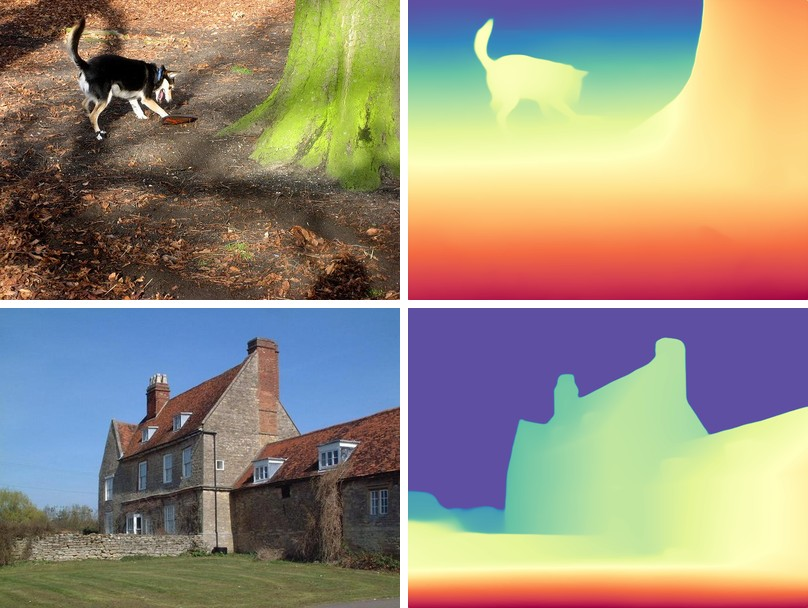

# Depth Anything V1

<div style="background:#dff0d8; border:1px solid #cfe6bf; border-radius:3px; padding:12px 16px; color:#2a3a26;">
<b>Weights:</b> the pretrained weights for the Depth Anything V1 model are hosted on the
kerasformers <a href="https://github.com/IMvision12/KerasFormers/releases/tag/depth_anything_v1" style="color:#1a5c8a;">depth_anything_v1</a>
release tag, and download automatically the first time you call
<code>from_weights(...)</code>.
</div>
<br>

Depth Anything estimates depth from a single image, with no camera parameters and no stereo pair. A DINOv2 ViT backbone feeds a DPT-style neck and head. What made V1 work is scale: 1.5 M labeled images train a teacher, which then pseudo-labels 62 M unlabeled ones, so the model generalizes to scenes no depth dataset covers.

The output is **relative inverse depth**: a bigger value means closer, and the units are arbitrary, so a map is only meaningful within its own image. For real metres or cross-image comparison, use the metric heads in [Depth Anything V2](depth_anything_v2.md), which keeps this architecture unchanged and only retrains it.

**Paper**: [Depth Anything: Unleashing the Power of Large-Scale Unlabeled Data](https://arxiv.org/abs/2401.10891)

## API

### DepthAnythingV1DepthEstimation

```python
DepthAnythingV1DepthEstimation(backbone_dim=384, backbone_depth=12,
                               backbone_num_heads=6, out_indices=None,
                               neck_hidden_sizes=None, fusion_hidden_size=64,
                               reassemble_factors=None,
                               depth_estimation_type="relative", max_depth=1.0,
                               image_size=518, input_tensor=None,
                               name="DepthAnythingV1DepthEstimation")
```

The DINOv2 backbone, DPT neck, and depth head. **This is the class for depth
estimation.**

**Parameters**

- **backbone_dim** (`int`, *optional*, defaults to `384`): ViT width. Filled in by `from_weights` from the variant config.
- **backbone_depth** (`int`, *optional*, defaults to `12`): transformer blocks, the main size lever from small to large.
- **backbone_num_heads** (`int`, *optional*, defaults to `6`): attention heads.
- **out_indices** (`tuple`, *optional*): block indices whose features feed the neck.
- **neck_hidden_sizes** (`tuple`, *optional*): per-scale reassemble widths.
- **fusion_hidden_size** (`int`, *optional*, defaults to `64`): DPT fusion width.
- **reassemble_factors** (`tuple`, *optional*): per-scale up/down sampling factors.
- **depth_estimation_type** (`str`, *optional*, defaults to `"relative"`): `"relative"` ends the head in a `ReLU`; `"metric"` in a `sigmoid` scaled by `max_depth`. All V1 variants are relative.
- **max_depth** (`float`, *optional*, defaults to `1.0`): output ceiling for metric heads. Unused when relative.
- **image_size** (`int` or `tuple`, *optional*, defaults to `518`): input resolution the model is built for.
- **input_tensor** (`dict`, *optional*): pre-existing input tensors to build on.
- **name** (`str`, *optional*, defaults to `"DepthAnythingV1DepthEstimation"`): model name.

**Call** `model(pixel_values, training=False)`. **Returns** a tensor of shape
`(B, 518, 518, 1)` under `channels_last`: per-pixel depth at the model's resolution.

### DepthAnythingV1Model

```python
DepthAnythingV1Model(backbone_dim=384, backbone_depth=12, backbone_num_heads=6,
                     out_indices=None, neck_hidden_sizes=None,
                     fusion_hidden_size=64, reassemble_factors=None,
                     image_size=518, input_tensor=None, name="DepthAnythingV1Model")
```

The backbone and DPT neck alone, without the head, returning the fused pyramid at quarter
resolution (`(B, 296, 296, 64)` for a 518 input). Use it as a feature extractor.

> **The backbone class has no entry on the release tag**, so
> `DepthAnythingV1Model.from_weights("depth_anything_small")` raises `"No release weights
> configured for variant"`: the release assets are exports of the full estimator. Load it
> over `hf:`, or read the layer you want off `DepthAnythingV1DepthEstimation`.

## Preprocessing

### DepthAnythingV1ImageProcessor

```python
DepthAnythingV1ImageProcessor(target_size=518, image_mean=None, image_std=None,
                              data_format=None)
```

Stretches the image to a square `target_size` and normalizes with ImageNet statistics.

**Parameters**

- **target_size** (`int`, *optional*, defaults to `518`): square side the image is resized to. Match the model's `image_size`.
- **image_mean** / **image_std** (`tuple`, *optional*): defaults to the ImageNet statistics.
- **data_format** (`str`, *optional*): `"channels_last"` or `"channels_first"`. Defaults to `keras.config.image_data_format()`.

`processor(image)` accepts a path, PIL image, or numpy array and returns a `dict` with
**pixel_values** `(1, 518, 518, 3)`.

**post_process_depth_estimation**

```python
processor.post_process_depth_estimation(predicted_depth, original_size, data_format=None)
```

Resamples the prediction back to `original_size`, given as `(height, width)`, and
squeezes the channel axis. **Returns** a `(H, W)` depth tensor.

## Model Variants

| Variant id | Backbone | Params | Resolution |
|---|---|---:|---:|
| `depth_anything_small` | ViT-S/14 | ~25 M | 518 |
| `depth_anything_base` | ViT-B/14 | ~97 M | 518 |
| `depth_anything_large` | ViT-L/14 | ~335 M | 518 |

## Basic Usage: Depth Estimation


The original beside its predicted depth, coloured with `Spectral_r` over the map's own min
and max. The photographer reads closest (red), the far bank and sky farthest (blue), and
the swan and seated figures separate cleanly from the water behind them.

```python
import keras
import matplotlib
import numpy as np
import torch
from PIL import Image
from kerasformers.models.depth_anything_v1 import (
    DepthAnythingV1DepthEstimation, DepthAnythingV1ImageProcessor,
)

model = DepthAnythingV1DepthEstimation.from_weights("depth_anything_large")
processor = DepthAnythingV1ImageProcessor()

image = Image.open("assets/data/coco_waterfront.jpg").convert("RGB")

with torch.no_grad():
    output = model(processor(image)["pixel_values"], training=False)
# output: (1, 518, 518, 1)

depth = processor.post_process_depth_estimation(
    output, original_size=(image.height, image.width)
)
depth = np.squeeze(np.asarray(keras.ops.convert_to_numpy(depth)))
print(depth.shape, round(float(depth.min()), 2), round(float(depth.max()), 2))

# Visualize: per-image min-max normalize, then Spectral_r.
lo, hi = float(depth.min()), float(depth.max())
rgb = matplotlib.colormaps["Spectral_r"]((depth - lo) / (hi - lo + 1e-8))[..., :3]
Image.fromarray((rgb * 255).astype("uint8")).save("assets/depth.jpg")
```

```
(427, 640) 0.0 319.38
```

The value range carries no unit: on these five scenes V1 produced maxima of 319, 268,
322, 379 and 213, which track scene content, not distance. Do not compare them across
images.

> Use `torch.no_grad()` on the torch backend. The large variant at 518x518 is a ViT-L,
> and autograd will hold every intermediate for a forward pass you never differentiate.

### Batch Processing Multiple Images

Every image is stretched to the same 518 square, so a batch is just stacked
`pixel_values`. Post-process each map on its own, since the originals differ in size:



```python
import keras
import numpy as np
import torch
from PIL import Image
from kerasformers.models.depth_anything_v1 import (
    DepthAnythingV1DepthEstimation, DepthAnythingV1ImageProcessor,
)

model = DepthAnythingV1DepthEstimation.from_weights("depth_anything_large")
processor = DepthAnythingV1ImageProcessor()

paths = ["assets/data/coco_dog_woods.jpg", "assets/data/ade_val_1.jpg"]
images = [Image.open(p).convert("RGB") for p in paths]

pixel_values = np.concatenate(
    [np.asarray(keras.ops.convert_to_numpy(processor(p)["pixel_values"])) for p in paths],
    axis=0,
)   # (2, 518, 518, 3)
with torch.no_grad():
    output = model(pixel_values, training=False)   # (2, 518, 518, 1)

for path, image, logits in zip(paths, images, output):
    depth = processor.post_process_depth_estimation(
        logits[None], original_size=(image.height, image.width)
    )
    depth = np.squeeze(np.asarray(keras.ops.convert_to_numpy(depth)))
    print(f"{path}: {depth.shape}  [{depth.min():.2f}, {depth.max():.2f}]")
```

```
assets/data/coco_dog_woods.jpg: (480, 640)  [1.43, 213.33]
assets/data/ade_val_1.jpg: (480, 640)  [0.00, 267.59]
```

## Feature Extraction

`DepthAnythingV1Model` stops after the DPT neck, for attaching your own head:

```python
from kerasformers.models.depth_anything_v1 import DepthAnythingV1Model

backbone = DepthAnythingV1Model.from_weights("hf:LiheYoung/depth-anything-small-hf")
features = backbone(processor(image)["pixel_values"], training=False)
# features: (1, 296, 296, 64)
```

## Input Resolution

The default is 518x518, the DINOv2 pretraining size. Other sizes work as long as both
sides are **multiples of the patch size, 14**: the checkpoint's position embeddings are
bilinearly interpolated to the requested patch grid at load time, so the pretrained
weights stay valid.

```python
# 392 / 14 = 28 x 28 patches
model = DepthAnythingV1DepthEstimation.from_weights(
    "depth_anything_small", image_size=392
)

# Non-square, 28 x 56 patches
model = DepthAnythingV1DepthEstimation.from_weights(
    "depth_anything_small", image_size=(392, 784)
)
```

Pass the matching `target_size` to the processor. Larger inputs recover more fine
structure at quadratic attention cost.

> **Resizing works on the release path, not `hf:`.** The interpolation lives in
> `ViTAddPositionEmbs.load_own_variables`, which the Keras `.weights.h5` reader calls;
> the `hf:` converter assigns the checkpoint tensor straight into the variable and so
> requires an exact match. Asking for a non-default size over `hf:` fails with
> `Unsupported layer type or shape mismatch for backbone_pos_embed/pos_embed`.

## Data Format

**Both the model and the processor support `channels_last` and `channels_first`.**

| | How it picks the format |
|---|---|
| Processors | A `data_format` kwarg, per instance. `None` (the default) resolves to `keras.config.image_data_format()`. |
| Models | Read `keras.config.image_data_format()` when they are **constructed**. There is no `data_format` argument. |

```python
import keras

keras.config.set_image_data_format("channels_first")

model = DepthAnythingV1DepthEstimation.from_weights("depth_anything_large")
processor = DepthAnythingV1ImageProcessor()
# model input: (B, 3, 518, 518), output: (B, 1, 518, 518)
```

`post_process_depth_estimation` also takes `data_format`, and always returns `(H, W)`.

## Loading Fine-tuned and Community Weights

Any Hugging Face repo whose `model_type` is `"depth_anything"` loads with the `hf:`
prefix.

```python
from kerasformers.models.depth_anything_v1 import DepthAnythingV1DepthEstimation

model = DepthAnythingV1DepthEstimation.from_weights(
    "hf:LiheYoung/depth-anything-large-hf"
)
model = DepthAnythingV1DepthEstimation.from_weights("hf:<user>/depth-anything-finetuned")

# Architecture only, randomly initialized
model = DepthAnythingV1DepthEstimation.from_weights(
    "depth_anything_small", load_weights=False
)
```

See also [Depth Anything V2](depth_anything_v2.md), the same architecture retrained for
sharper boundaries and metric output.
