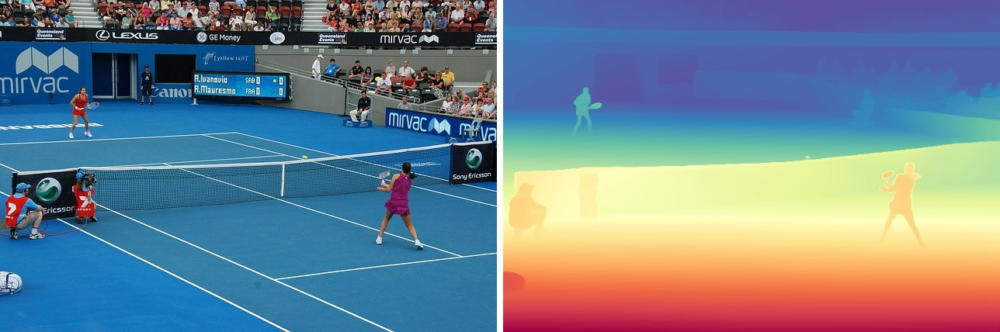
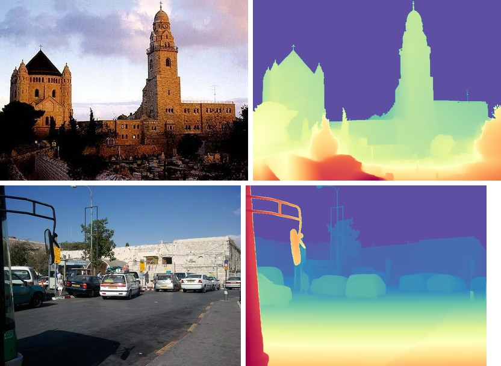
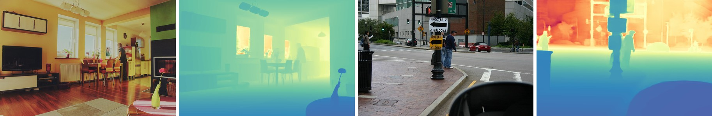

# Depth Anything V2

<div style="background:#dff0d8; border:1px solid #cfe6bf; border-radius:3px; padding:12px 16px; color:#2a3a26;">
<b>Weights:</b> the pretrained weights for the Depth Anything V2 model are hosted on the
kerasformers <a href="https://github.com/IMvision12/KerasFormers/releases/tag/depth_anything_v2" style="color:#1a5c8a;">depth_anything_v2</a>
release tag, and download automatically the first time you call
<code>from_weights(...)</code>.
</div>
<br>

V2 changes **nothing** about [V1](depth_anything_v1.md)'s architecture: the same DINOv2 ViT backbone, the same DPT neck and head. What changed is the data. V1 learned from real labeled images, whose depth annotations are noisy around edges; V2 replaces them with synthetic images, whose labels are exact, and recovers real-world coverage through a much larger teacher pseudo-labeling 62 M unlabeled photos.

The payoff is **boundary fidelity**, plus metric heads that return actual metres rather than the relative inverse depth V1 is limited to.

**Paper**: [Depth Anything V2](https://arxiv.org/abs/2406.09414)

## API

### DepthAnythingV2DepthEstimation

```python
DepthAnythingV2DepthEstimation(backbone_dim=384, backbone_depth=12,
                               backbone_num_heads=6, out_indices=None,
                               neck_hidden_sizes=None, fusion_hidden_size=64,
                               reassemble_factors=None,
                               depth_estimation_type="relative", max_depth=1.0,
                               image_size=518, input_tensor=None,
                               name="DepthAnythingV2DepthEstimation")
```

The DINOv2 backbone, DPT neck, and depth head. Subclasses the V1 estimator. **This is the
class for depth estimation.**

**Parameters**

- **backbone_dim** (`int`, *optional*, defaults to `384`): ViT width. Filled in by `from_weights` from the variant config.
- **backbone_depth** (`int`, *optional*, defaults to `12`): transformer blocks, the main size lever from small to large.
- **backbone_num_heads** (`int`, *optional*, defaults to `6`): attention heads.
- **out_indices** (`tuple`, *optional*): block indices whose features feed the neck.
- **neck_hidden_sizes** (`tuple`, *optional*): per-scale reassemble widths.
- **fusion_hidden_size** (`int`, *optional*, defaults to `64`): DPT fusion width.
- **reassemble_factors** (`tuple`, *optional*): per-scale up/down sampling factors.
- **depth_estimation_type** (`str`, *optional*, defaults to `"relative"`): `"relative"` ends the head in a `ReLU`; `"metric"` in a `sigmoid` scaled by `max_depth`. Set from the variant config.
- **max_depth** (`float`, *optional*, defaults to `1.0`): output ceiling for metric heads, `20` indoor or `80` outdoor. Unused when relative.
- **image_size** (`int` or `tuple`, *optional*, defaults to `518`): input resolution the model is built for.
- **input_tensor** (`dict`, *optional*): pre-existing input tensors to build on.
- **name** (`str`, *optional*, defaults to `"DepthAnythingV2DepthEstimation"`): model name.

**Call** `model(pixel_values, training=False)`. **Returns** a tensor of shape
`(B, 518, 518, 1)` under `channels_last`: per-pixel depth at the model's resolution.

### DepthAnythingV2Model

```python
DepthAnythingV2Model(backbone_dim=384, backbone_depth=12, backbone_num_heads=6,
                     out_indices=None, neck_hidden_sizes=None,
                     fusion_hidden_size=64, reassemble_factors=None,
                     image_size=518, input_tensor=None, name="DepthAnythingV2Model")
```

The backbone and DPT neck alone, without the head, returning the fused pyramid at quarter
resolution (`(B, 296, 296, 64)` for a 518 input). Use it as a feature extractor.

> **The backbone class has no entry on the release tag**, so
> `DepthAnythingV2Model.from_weights("depth_anything_v2_small")` raises `"No release
> weights configured for variant"`: the release assets are exports of the full estimator.
> Load it over `hf:`, or read the layer you want off `DepthAnythingV2DepthEstimation`.

## Preprocessing

### DepthAnythingV2ImageProcessor

```python
DepthAnythingV2ImageProcessor(target_size=518, image_mean=None, image_std=None,
                              data_format=None)
```

Stretches the image to a square `target_size` and normalizes with ImageNet statistics.

**Parameters**

- **target_size** (`int`, *optional*, defaults to `518`): square side the image is resized to. Match the model's `image_size`.
- **image_mean** / **image_std** (`tuple`, *optional*): defaults to the ImageNet statistics.
- **data_format** (`str`, *optional*): `"channels_last"` or `"channels_first"`. Defaults to `keras.config.image_data_format()`.

`processor(image)` accepts a path, PIL image, or numpy array and returns a `dict` with
**pixel_values** `(1, 518, 518, 3)`.

**post_process_depth_estimation**

```python
processor.post_process_depth_estimation(predicted_depth, original_size, data_format=None)
```

Resamples the prediction back to `original_size`, given as `(height, width)`, and
squeezes the channel axis. **Returns** a `(H, W)` depth tensor. For relative variants the
values are inverse depth; for metric variants they are metres.

## Model Variants

Nine variants across two output types. Relative variants return unitless inverse depth;
metric variants return metres, bounded by `max_depth`.

| Variant id | Backbone | Output | `max_depth` |
|---|---|---|---:|
| `depth_anything_v2_small` | ViT-S/14 | relative | n/a |
| `depth_anything_v2_base` | ViT-B/14 | relative | n/a |
| `depth_anything_v2_large` | ViT-L/14 | relative | n/a |
| `depth_anything_v2_metric_indoor_{small,base,large}` | ViT-S/B/L | metric, indoor | 20 m |
| `depth_anything_v2_metric_outdoor_{small,base,large}` | ViT-S/B/L | metric, outdoor | 80 m |

The metric heads are fine-tuned on Hypersim (indoor) and Virtual KITTI (outdoor), and are
**not interchangeable**: an outdoor model on a living room will happily report tens of
metres.

## Basic Usage: Depth Estimation



The original beside its predicted depth, coloured with `Spectral_r` over the map's own min
and max. The near player reads closest (red), the court recedes smoothly to the packed
stands (blue), and the net and far player stay crisp against the surface behind them.

```python
import keras
import matplotlib
import numpy as np
import torch
from PIL import Image
from kerasformers.models.depth_anything_v2 import (
    DepthAnythingV2DepthEstimation, DepthAnythingV2ImageProcessor,
)

model = DepthAnythingV2DepthEstimation.from_weights("depth_anything_v2_large")
processor = DepthAnythingV2ImageProcessor()

image = Image.open("assets/data/coco_tennis.jpg").convert("RGB")

with torch.no_grad():
    output = model(processor(image)["pixel_values"], training=False)
# output: (1, 518, 518, 1)

depth = processor.post_process_depth_estimation(
    output, original_size=(image.height, image.width)
)
depth = np.squeeze(np.asarray(keras.ops.convert_to_numpy(depth)))
print(depth.shape, round(float(depth.min()), 2), round(float(depth.max()), 2))

# Visualize: per-image min-max normalize, then Spectral_r.
lo, hi = float(depth.min()), float(depth.max())
rgb = matplotlib.colormaps["Spectral_r"]((depth - lo) / (hi - lo + 1e-8))[..., :3]
Image.fromarray((rgb * 255).astype("uint8")).save("assets/depth.jpg")
```

```
(428, 640) 12.33 592.77
```

The value range carries no unit: bigger means closer, and the numbers are only comparable
within this one image. Do not compare them across images, and use a
[metric variant](#metric-depth) if you need real distances.

> Use `torch.no_grad()` on the torch backend. The large variant at 518x518 is a ViT-L,
> and autograd will hold every intermediate for a forward pass you never differentiate.

### Batch Processing Multiple Images

Every image is stretched to the same 518 square, so a batch is just stacked
`pixel_values`. Post-process each map on its own, since the originals differ in size:



```python
import keras
import numpy as np
import torch
from PIL import Image
from kerasformers.models.depth_anything_v2 import (
    DepthAnythingV2DepthEstimation, DepthAnythingV2ImageProcessor,
)

model = DepthAnythingV2DepthEstimation.from_weights("depth_anything_v2_large")
processor = DepthAnythingV2ImageProcessor()

paths = ["assets/data/ade_val_2.jpg", "assets/data/coco_parking.jpg"]
images = [Image.open(p).convert("RGB") for p in paths]

pixel_values = np.concatenate(
    [np.asarray(keras.ops.convert_to_numpy(processor(p)["pixel_values"])) for p in paths],
    axis=0,
)   # (2, 518, 518, 3)
with torch.no_grad():
    output = model(pixel_values, training=False)   # (2, 518, 518, 1)

for path, image, logits in zip(paths, images, output):
    depth = processor.post_process_depth_estimation(
        logits[None], original_size=(image.height, image.width)
    )
    depth = np.squeeze(np.asarray(keras.ops.convert_to_numpy(depth)))
    print(f"{path}: {depth.shape}  [{depth.min():.2f}, {depth.max():.2f}]")
```

```
assets/data/ade_val_2.jpg: (364, 500)  [0.00, 365.61]
assets/data/coco_parking.jpg: (480, 640)  [0.00, 557.88]
```

## What V2 Buys Over V1


Original, then [`depth_anything_large`](depth_anything_v1.md), then
`depth_anything_v2_large`. Both read the scene correctly, and V1 is not wrong anywhere in
particular. What V2 buys is edge fidelity: the phone in the subject's hands, the gap
between her arm and body, and the individual ribs of the bridge arch all survive in V2
and smear in V1. Swapping versions is a two-line import change; the processor and
post-processing are identical.

## Metric Depth



An indoor scene with the indoor head, then a street with the outdoor head. Here the
colormap runs over the head's absolute range rather than per image, so **blue is near and
red is far**, the reverse of the relative figures above.

```python
import keras
import numpy as np
import torch
from PIL import Image
from kerasformers.models.depth_anything_v2 import (
    DepthAnythingV2DepthEstimation, DepthAnythingV2ImageProcessor,
)

model = DepthAnythingV2DepthEstimation.from_weights(
    "depth_anything_v2_metric_indoor_large"
)
processor = DepthAnythingV2ImageProcessor()

image = Image.open("assets/data/coco_living_room.jpg").convert("RGB")
with torch.no_grad():
    output = model(processor(image)["pixel_values"], training=False)

depth = processor.post_process_depth_estimation(
    output, original_size=(image.height, image.width)
)
depth = np.squeeze(np.asarray(keras.ops.convert_to_numpy(depth)))
print(f"{depth.min():.2f} m to {depth.max():.2f} m, median {np.median(depth):.2f} m")

# Colour on the absolute scale (max_depth) so two images stay comparable.
normalized = np.clip(depth / 20.0, 0.0, 1.0)      # 80.0 for the outdoor head
```

```
1.26 m to 14.74 m, median 4.38 m
```

The outdoor head on the street scene gives `3.27 m to 76.64 m, median 17.33 m`. Both sit
inside their bounds (20 m and 80 m), and both are plausible for the scene, which is the
cheapest sanity check available: a metric model pinned at its ceiling is telling you the
scene is out of its training domain.

## Feature Extraction

`DepthAnythingV2Model` stops after the DPT neck, for attaching your own head:

```python
from kerasformers.models.depth_anything_v2 import DepthAnythingV2Model

backbone = DepthAnythingV2Model.from_weights(
    "hf:depth-anything/Depth-Anything-V2-Small-hf"
)
features = backbone(processor(image)["pixel_values"], training=False)
# features: (1, 296, 296, 64)
```

## Input Resolution

The default is 518x518, the DINOv2 pretraining size. Other sizes work as long as both
sides are **multiples of the patch size, 14**: the checkpoint's position embeddings are
bilinearly interpolated to the requested patch grid at load time, so the pretrained
weights stay valid.

```python
# 392 / 14 = 28 x 28 patches
model = DepthAnythingV2DepthEstimation.from_weights(
    "depth_anything_v2_small", image_size=392
)

# Non-square, 28 x 56 patches
model = DepthAnythingV2DepthEstimation.from_weights(
    "depth_anything_v2_small", image_size=(392, 784)
)
```

Pass the matching `target_size` to the processor. Larger inputs recover more fine
structure at quadratic attention cost.

> **Resizing works on the release path, not `hf:`.** The interpolation lives in
> `ViTAddPositionEmbs.load_own_variables`, which the Keras `.weights.h5` reader calls;
> the `hf:` converter assigns the checkpoint tensor straight into the variable and so
> requires an exact match. Asking for a non-default size over `hf:` fails with
> `Unsupported layer type or shape mismatch for backbone_pos_embed/pos_embed`.

## Data Format

**Both the model and the processor support `channels_last` and `channels_first`.**

| | How it picks the format |
|---|---|
| Processors | A `data_format` kwarg, per instance. `None` (the default) resolves to `keras.config.image_data_format()`. |
| Models | Read `keras.config.image_data_format()` when they are **constructed**. There is no `data_format` argument. |

```python
import keras

keras.config.set_image_data_format("channels_first")

model = DepthAnythingV2DepthEstimation.from_weights("depth_anything_v2_large")
processor = DepthAnythingV2ImageProcessor()
# model input: (B, 3, 518, 518), output: (B, 1, 518, 518)
```

`post_process_depth_estimation` also takes `data_format`, and always returns `(H, W)`.

## Loading Fine-tuned and Community Weights

Any Hugging Face repo whose `model_type` is `"depth_anything"` loads with the `hf:`
prefix.

```python
from kerasformers.models.depth_anything_v2 import DepthAnythingV2DepthEstimation

model = DepthAnythingV2DepthEstimation.from_weights(
    "hf:depth-anything/Depth-Anything-V2-Large-hf"
)
model = DepthAnythingV2DepthEstimation.from_weights("hf:<user>/depth-anything-finetuned")

# Architecture only, randomly initialized
model = DepthAnythingV2DepthEstimation.from_weights(
    "depth_anything_v2_small", load_weights=False
)
```

See also [Depth Anything V1](depth_anything_v1.md), the original release this retrains.
