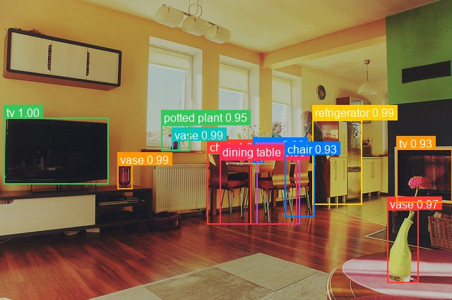

# DETR

**Paper**: [End-to-End Object Detection with Transformers](https://arxiv.org/abs/2005.12872)

DETR (DEtection TRansformer) is an end-to-end object detection model that combines a convolutional backbone with a Transformer encoder-decoder architecture. It eliminates the need for hand-designed components like non-maximum suppression and anchor generation by using a set-based global loss via bipartite matching.

## Architecture Highlights

- **Bipartite Matching Loss:** Frames object detection as a direct set prediction problem utilizing Hungarian matching for optimal assignments.
- **Transformers Encoder-Decoder:** Replaces standard CNN detection heads with a robust transformer architecture, preserving global image context and relationships between objects in the scene.
- **ResNet Backbones:** Uses standard deep residual networks (ResNet-50/ResNet-101) to extract initial 2D feature representations.
- **Simplified Pipeline:** Streamlines standard complex detection pipelines into a straightforward encode-decode translation framework.

## Available Variants

| Variant | Description | HF original |
|---|---|---|
| `detr-resnet-50` | DETR with a ResNet-50 backbone | `facebook/detr-resnet-50` |
| `detr-resnet-101` | DETR with a ResNet-101 backbone | `facebook/detr-resnet-101` |

## Basic Usage

```python
from kmodels.models.detr import DETRDetect

# Load kmodels release weights (COCO pre-trained)
model = DETRDetect.from_weights("detr-resnet-50")

# Untrained model
model = DETRDetect.from_weights("detr-resnet-50", load_weights=False)

# Load original HF checkpoint or a community fine-tune
model = DETRDetect.from_weights("hf:facebook/detr-resnet-50")
model = DETRDetect.from_weights("hf:my-username/my-detr-finetune")
```

## Example Inference

```python
from kmodels.models.detr import DETRDetect, DETRImageProcessor
from PIL import Image

model = DETRDetect.from_weights("detr-resnet-50")

image = Image.open("image.jpg")
original_size = image.size[::-1]  # (H, W)

processor = DETRImageProcessor(size={"height": 800, "width": 800})
inputs = processor(image)

output = model(inputs["pixel_values"], training=False)
# output["logits"]:     (1, 100, 92) — class logits per query
# output["pred_boxes"]: (1, 100, 4)  — normalized (cx, cy, w, h)

results = processor.post_process_object_detection(
    output, threshold=0.7, target_sizes=[original_size]
)
for score, label, box in zip(results[0]["scores"], results[0]["label_names"], results[0]["boxes"]):
    print(f"{label}: {score:.2f} at [{box[0]:.0f}, {box[1]:.0f}, {box[2]:.0f}, {box[3]:.0f}]")
```

### Data format

The image processor accepts a `data_format=None` kwarg. The default (`None`) resolves to `keras.config.image_data_format()`; pass `"channels_first"` or `"channels_last"` to override per-call without touching global state.

```python
# follow the global config (the default)
processor = DETRImageProcessor()
inputs = processor("photo.jpg")

# force channels_first for this call only
processor = DETRImageProcessor(data_format="channels_first")
inputs = processor("photo.jpg")
```

Detection post-processors emit boxes in `xyxy` pixel coordinates and class indices — there is no spatial channel axis to interpret, so they don't take a `data_format` kwarg. See `docs/utils.md` for the families that do.

## Full Inference with Visualization

```python
import os
os.environ["KERAS_BACKEND"] = "torch"

import numpy as np
from PIL import Image
import matplotlib
matplotlib.use("Agg")
import matplotlib.pyplot as plt

from kmodels.models.detr import DETRDetect, DETRImageProcessor

model = DETRDetect.from_weights("detr-resnet-50")

img = Image.open("image.jpg").convert("RGB")
original_size = img.size[::-1]

processor = DETRImageProcessor(size={"height": 800, "width": 800})
inputs = processor(img)
output = model(inputs["pixel_values"], training=False)

results = processor.post_process_object_detection(output, threshold=0.7, target_sizes=[original_size])

COLORS = plt.cm.tab10.colors

fig, ax = plt.subplots(1, 1, figsize=(10, 7))
ax.imshow(np.array(img))

for i, (score, label, box) in enumerate(zip(results[0]["scores"], results[0]["label_names"], results[0]["boxes"])):
    color = COLORS[i % len(COLORS)]
    x1, y1, x2, y2 = box
    rect = plt.Rectangle((x1, y1), x2 - x1, y2 - y1, linewidth=2, edgecolor=color, facecolor="none")
    ax.add_patch(rect)
    ax.text(x1, y1 - 5, f"{label}: {score:.2f}", fontsize=11, color="white",
            bbox=dict(boxstyle="round,pad=0.2", facecolor=color, alpha=0.8))

ax.set_title("DETR Object Detection", fontsize=16)
ax.axis("off")
plt.tight_layout()
fig.savefig("detr_output.jpg", bbox_inches="tight", dpi=120)
plt.close(fig)
```



## Custom Dataset Usage

When using a model fine-tuned on a custom dataset, pass your class names to the post-processor via `label_names`:

```python
MY_CLASSES = ["cat", "dog", "bird"]

results = processor.post_process_object_detection(output, threshold=0.7,
    target_sizes=[original_size], label_names=MY_CLASSES)
```

If `label_names` is not provided, COCO class names are used by default.
