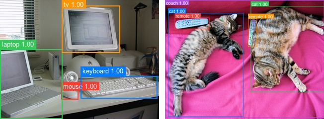
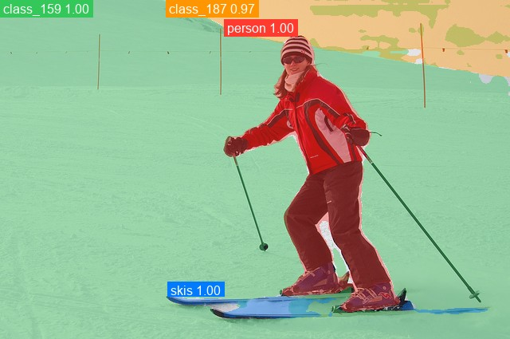

# DETR

<div style="background:#dff0d8; border:1px solid #cfe6bf; border-radius:3px; padding:12px 16px; color:#2a3a26;">
<b>Weights:</b> the pretrained weights for the DETR model are hosted on the
kerasformers <a href="https://github.com/IMvision12/KerasFormers/releases/tag/detr" style="color:#1a5c8a;">detr</a>
release tag, and download automatically the first time you call
<code>from_weights(...)</code>.
</div>
<br>

DETR (DEtection TRansformer) treats object detection as direct set prediction. A ResNet backbone produces a feature map, a transformer encoder-decoder attends over it with a fixed set of learned object queries, and each query emits one class and one box. Training uses a bipartite (Hungarian) matching loss, so every ground-truth object is assigned exactly one query.

That framing removes the hand-tuned pieces conventional detectors need: no anchor boxes, no non-maximum suppression, no post-hoc duplicate filtering. The number of queries caps how many objects one image can yield, which is why the default of 100 is generous for COCO scenes.

**Paper**: [End-to-End Object Detection with Transformers](https://arxiv.org/abs/2005.12872)

## API

### DETRDetect

```python
DETRDetect(backbone_variant="ResNet50", hidden_dim=256, num_heads=8,
           num_encoder_layers=6, num_decoder_layers=6, dim_feedforward=2048,
           dropout_rate=0.1, num_queries=100, num_classes=92, image_size=800,
           input_tensor=None, name="DETRDetect")
```

The detection model: backbone, transformer, and the class and box heads. **This is the
class for object detection.**

**Parameters**

- **backbone_variant** (`str`, *optional*, defaults to `"ResNet50"`): CNN backbone, `"ResNet50"` or `"ResNet101"`.
- **hidden_dim** (`int`, *optional*, defaults to `256`): transformer width, the `d_model` of the HF config.
- **num_heads** (`int`, *optional*, defaults to `8`): attention heads.
- **num_encoder_layers** (`int`, *optional*, defaults to `6`): encoder depth.
- **num_decoder_layers** (`int`, *optional*, defaults to `6`): decoder depth.
- **dim_feedforward** (`int`, *optional*, defaults to `2048`): FFN inner dimension.
- **dropout_rate** (`float`, *optional*, defaults to `0.1`): dropout, active only during training.
- **num_queries** (`int`, *optional*, defaults to `100`): learned object queries, the hard ceiling on detections per image.
- **num_classes** (`int`, *optional*, defaults to `92`): COCO's 91 classes plus the "no object" class.
- **image_size** (`int`, *optional*, defaults to `800`): input resolution the model is built for.
- **input_tensor** (`dict`, *optional*): pre-existing input tensors to build on.
- **name** (`str`, *optional*, defaults to `"DETRDetect"`): model name.

**Call** `model(pixel_values, training=False)`. **Returns** a `dict`:

- **logits** (`(B, num_queries, num_classes)`): per-query class logits.
- **pred_boxes** (`(B, num_queries, 4)`): normalized `(cx, cy, w, h)` in `[0, 1]`.

Raw output is one prediction per query, most of them the "no object" class. Run it
through `post_process_object_detection` to get scored, pixel-space boxes.

### DetrModel

```python
DetrModel(backbone_variant="ResNet50", hidden_dim=256, num_heads=8,
          num_encoder_layers=6, num_decoder_layers=6, dim_feedforward=2048,
          dropout_rate=0.1, num_queries=100, image_size=800,
          input_tensor=None, name="DetrModel")
```

The backbone and transformer without detection heads, ending at the decoder hidden
states. Use it when you want DETR features to attach your own head to.

**Parameters** are identical to [DETRDetect](#detrdetect), minus **num_classes**, and
**name** defaults to `"DetrModel"`.

**Returns** the decoder's last hidden state, `(B, num_queries, hidden_dim)`.

### DETRPanopticSegment

```python
DETRPanopticSegment(backbone_variant="ResNet50", hidden_dim=256, num_heads=8,
                    num_encoder_layers=6, num_decoder_layers=6,
                    dim_feedforward=2048, dropout_rate=0.1, num_queries=100,
                    num_classes=250, image_size=800, input_tensor=None,
                    name="DETRPanopticSegment")
```

Adds a mask head for panoptic segmentation, predicting a per-query mask alongside the
class and box. Needs a panoptic checkpoint: see the panoptic variants below.

**Parameters** match [DETRDetect](#detrdetect), except **num_classes** defaults to
`250` (COCO panoptic's things plus stuff) and **name** defaults to
`"DETRPanopticSegment"`.

## Preprocessing

### DETRImageProcessor

```python
DETRImageProcessor(size=None, resample="bilinear", do_rescale=True,
                   rescale_factor=1/255, do_normalize=True, image_mean=None,
                   image_std=None, return_tensor=True, data_format=None)
```

Resizes to a fixed square, rescales to `[0, 1]`, and normalizes with ImageNet
statistics.

**Parameters**

- **size** (`dict`, *optional*, defaults to `{"height": 800, "width": 800}`): target size.
- **resample** (`str`, *optional*, defaults to `"bilinear"`): resize interpolation.
- **do_rescale** (`bool`, *optional*, defaults to `True`): scale pixels to `[0, 1]`.
- **rescale_factor** (`float`, *optional*, defaults to `1/255`): the rescaling factor.
- **do_normalize** (`bool`, *optional*, defaults to `True`): apply mean/std normalization.
- **image_mean** (`tuple`, *optional*, defaults to `(0.485, 0.456, 0.406)`): per-channel mean.
- **image_std** (`tuple`, *optional*, defaults to `(0.229, 0.224, 0.225)`): per-channel std.
- **return_tensor** (`bool`, *optional*, defaults to `True`): return backend tensors rather than numpy.
- **data_format** (`str`, *optional*): `"channels_last"` or `"channels_first"`. Defaults to `keras.config.image_data_format()`.

**Call** `processor(image)` with a path, a PIL image, an array, or a **list** of any
mix of those. **Returns** a `dict`:

- **pixel_values** (`(B, H, W, 3)`): the preprocessed images, in the configured data format.

A list is preprocessed and stacked into one batch, which is always safe here because
every image is resized to the same square. See
[Batch Processing](#batch-processing-multiple-images).

**post_process_object_detection**

```python
processor.post_process_object_detection(outputs, threshold=0.7, target_sizes=None,
                                        label_names=None)
```

Softmaxes the logits, drops the "no object" class, keeps whatever clears `threshold`,
and converts boxes to pixel-space `(x0, y0, x1, y1)` scaled to `target_sizes`.

- **outputs**: the `dict` returned by the model.
- **threshold** (`float`, *optional*, defaults to `0.7`): minimum class probability.
- **target_sizes** (`list` of `(height, width)`, *optional*): original image sizes, one per batch element.
- **label_names** (`list` of `str`, *optional*): class names. Defaults to COCO's 91 classes.

**Returns** a list with one `dict` per image:

- **scores**: class probability per kept detection.
- **labels**: integer class indices.
- **label_names**: the resolved class names.
- **boxes**: `(x0, y0, x1, y1)` in pixels.

## Model Variants

Detection variants for `DETRDetect.from_weights`:

| Variant id        | Backbone   | Params | HF original              |
|-------------------|------------|-------:|--------------------------|
| `detr-resnet-50`  | ResNet-50  | ~41 M  | `facebook/detr-resnet-50`  |
| `detr-resnet-101` | ResNet-101 | ~60 M  | `facebook/detr-resnet-101` |

Panoptic variants for `DETRPanopticSegment.from_weights`:

| Variant id                 | Backbone   | HF original                        |
|----------------------------|------------|------------------------------------|
| `detr-resnet-50-panoptic`  | ResNet-50  | `facebook/detr-resnet-50-panoptic`  |
| `detr-resnet-101-panoptic` | ResNet-101 | `facebook/detr-resnet-101-panoptic` |

## Basic Usage: Object Detection


```python
from PIL import Image
from kerasformers.models.detr import DETRDetect, DETRImageProcessor

model = DETRDetect.from_weights("detr-resnet-50")
processor = DETRImageProcessor()

image = Image.open("assets/coco/coco_living_room.jpg").convert("RGB")
inputs = processor(image)

output = model(inputs["pixel_values"], training=False)
# output["logits"]:     (1, 100, 92)
# output["pred_boxes"]: (1, 100, 4)

results = processor.post_process_object_detection(
    output, threshold=0.9, target_sizes=[(image.height, image.width)]
)[0]

# Queries come back in the model's own order, so sort by score for readability.
detections = sorted(
    zip(results["scores"], results["label_names"], results["boxes"]),
    key=lambda d: -float(d[0]),
)
for score, name, box in detections:
    print(f"{name:14s} {float(score):.3f}  {[round(float(v)) for v in box]}")
```

```
chair          0.999  [293, 216, 355, 318]
tv             0.997  [5, 167, 153, 261]
vase           0.994  [358, 213, 373, 231]
vase           0.992  [166, 234, 187, 268]
chair          0.992  [363, 220, 424, 318]
refrigerator   0.989  [442, 170, 512, 290]
vase           0.986  [243, 199, 253, 213]
dining table   0.985  [311, 226, 420, 318]
vase           0.968  [548, 297, 592, 401]
potted plant   0.954  [228, 177, 268, 214]
chair          0.930  [403, 219, 445, 307]
tv             0.925  [561, 211, 640, 287]
```

The `0.9` threshold is deliberately high. DETR is confident on clean COCO objects, and
lowering it mostly adds duplicates of what is already found.

### Batch Processing Multiple Images

Pass a list of images and one `target_sizes` entry per image:



```python
from PIL import Image
from kerasformers.models.detr import DETRDetect, DETRImageProcessor

model = DETRDetect.from_weights("detr-resnet-50")
processor = DETRImageProcessor()

paths = ["assets/coco/coco_desk.jpg", "assets/coco/coco_cats.jpg"]
images = [Image.open(p).convert("RGB") for p in paths]

inputs = processor(paths)                      # (2, 800, 800, 3)
output = model(inputs["pixel_values"], training=False)   # (2, 100, 92) and (2, 100, 4)

results = processor.post_process_object_detection(
    output, threshold=0.9,
    target_sizes=[(im.height, im.width) for im in images],
)

for path, result in zip(paths, results):
    print(f"\n{path}")
    detections = sorted(
        zip(result["scores"], result["label_names"], result["boxes"]),
        key=lambda d: -float(d[0]),
    )
    for score, name, box in detections:
        print(f"  {name:10s} {float(score):.3f}  {[round(float(v)) for v in box]}")
```

```
assets/coco/coco_desk.jpg
  mouse      0.999  [123, 181, 157, 200]
  laptop     0.999  [0, 99, 125, 239]
  keyboard   0.998  [162, 153, 316, 198]
  tv         0.998  [124, 11, 241, 106]

assets/coco/coco_cats.jpg
  remote     0.999  [39, 71, 178, 117]
  cat        0.998  [345, 24, 640, 371]
  cat        0.998  [12, 52, 315, 469]
  remote     0.996  [334, 74, 370, 188]
  couch      0.996  [0, 1, 640, 474]
```

Every image is resized to the same square, so stacking is always safe here. Batch
results are identical to running the images one at a time.

## Panoptic Segmentation

`DETRPanopticSegment` adds a mask head, predicting a per-query mask alongside the class
and box. It needs one of the panoptic variants, whose head is 251-way (COCO panoptic's
things plus stuff, plus "no object") rather than the detector's 92.



```python
from PIL import Image
from kerasformers.models.detr import DETRImageProcessor, DETRPanopticSegment

model = DETRPanopticSegment.from_weights("detr-resnet-50-panoptic")
processor = DETRImageProcessor()

image = Image.open("assets/coco/coco_skier.jpg").convert("RGB")
output = model(processor(image)["pixel_values"], training=False)

# output["logits"]:     (1, 100, 251)
# output["pred_boxes"]: (1, 100, 4)
# output["pred_masks"]: (1, 100, 200, 200)   per-query mask logits
```

`pred_masks` is one mask logit map per query, at a lower resolution than the input.
Threshold at zero for a binary mask, and resize to the target size yourself.

### Rendering the masks

Since nothing in the library does this for you, here is the overlay above, end to end.
The one detail worth copying is the **paint order**: sort by mask area and draw the
largest first, or a big stuff region such as a wall will bury every object inside it.

```python
import keras
import numpy as np
from PIL import Image
from kerasformers.utils.labels_util import COCO_91_CLASSES

PALETTE = [(255, 59, 48), (52, 199, 89), (0, 122, 255), (255, 149, 0),
           (175, 82, 222), (255, 204, 0), (0, 199, 190), (255, 45, 85)]

logits = np.asarray(keras.ops.convert_to_numpy(output["logits"]))[0]     # (100, 251)
masks = np.asarray(keras.ops.convert_to_numpy(output["pred_masks"]))[0]  # (100, 200, 200)

probs = np.exp(logits - logits.max(-1, keepdims=True))
probs /= probs.sum(-1, keepdims=True)
probs = probs[:, :-1]                       # drop the "no object" column
scores, labels = probs.max(-1), probs.argmax(-1)

keep = np.where(scores > 0.85)[0]
keep = keep[np.argsort(-scores[keep])][:8]

W, H = image.size
binary = {q: np.asarray(Image.fromarray(masks[q]).resize((W, H), Image.BILINEAR)) > 0.0
          for q in keep}

canvas = np.asarray(image, dtype="float32").copy()
for q in sorted(keep, key=lambda q: -int(binary[q].sum())):   # largest first
    m = binary[q]
    canvas[m] = 0.6 * canvas[m] + 0.4 * np.array(PALETTE[list(keep).index(q) % 8],
                                                 dtype="float32")

Image.fromarray(canvas.astype("uint8")).save("panoptic.jpg")

for q in keep:
    idx = int(labels[q])
    name = COCO_91_CLASSES[idx] if idx < len(COCO_91_CLASSES) else f"class_{idx}"
    print(f"{name:14s} {scores[q]:.3f}  area {int(binary[q].sum())}")
```

```
person         1.000  area 29690
class_159      0.999  area 218106
skis           0.995  area 3794
class_187      0.974  area 25486
```

`class_159` is the snow and `class_187` the sky. At 218106 pixels the snow is over
seven times the size of the skier, which is exactly why it has to be painted first.

Two things to know before using it:

**There is no panoptic post-processor.** `DETRImageProcessor` provides
`post_process_object_detection` only. That method works on panoptic output and returns
the boxes and scores correctly, but it ignores `pred_masks` entirely, so stitching
queries into a single panoptic map is left to you.

**Pass `label_names`.** The post-processor falls back to COCO's 91 detection names,
which do not cover a 251-class panoptic head, so high-numbered classes come back as
placeholders:

```
person 1.000, class_159 0.999, skis 0.995, class_187 0.974
```

`person` and `skis` are COCO detection classes so they resolve, while `class_159`
(snow) and `class_187` (sky) are stuff classes with no name in the default list. The library ships
`COCO_91_CLASSES`, `COCO_80_CLASSES`, and `PASCAL_VOC_CLASSES` in
`kerasformers.utils.labels_util`, plus `COCO_PANOPTIC_THING_IDS` and
`COCO_PANOPTIC_STUFF_IDS`, but no panoptic **name** list, so supply your own.

## Custom Class Names

A model fine-tuned on your own dataset predicts your class indices, not COCO's. Pass
the names through `label_names` so `label_names` in the result reads correctly:

```python
MY_CLASSES = ["background", "cat", "dog", "bird"]

results = processor.post_process_object_detection(
    output, threshold=0.7, target_sizes=[(image.height, image.width)],
    label_names=MY_CLASSES,
)
```

Without it the post-processor falls back to the COCO names, which silently mislabels a
custom model. The integer `labels` are unaffected either way.

## Data Format

**Both the models and the processors support `channels_last` and `channels_first`.**
Neither is hard-coded to a layout, so the whole pipeline runs either way.

They pick the format differently, which is the one thing to keep straight:

| | How it picks the format |
|---|---|
| Processors | A `data_format` kwarg, per instance. `None` (the default) resolves to `keras.config.image_data_format()`. |
| Models | Read `keras.config.image_data_format()` when they are **constructed**. There is no `data_format` argument. |

So a processor can be overridden on its own, while a model follows the global setting
in force at build time.

### Overriding the processor only

```python
DETRImageProcessor(data_format="channels_last")("photo.jpg")
# {"pixel_values": (1, 800, 800, 3)}

DETRImageProcessor(data_format="channels_first")("photo.jpg")
# {"pixel_values": (1, 3, 800, 800)}
```

### Switching the whole pipeline

Set the global format before constructing the model, and both sides agree:

```python
import keras

keras.config.set_image_data_format("channels_first")

model = DETRDetect.from_weights("detr-resnet-50")
processor = DETRImageProcessor()

inputs = processor(image)
# inputs["pixel_values"] is (1, 3, 800, 800)
output = model(inputs["pixel_values"], training=False)
```

Detections are the same under either layout. Only the tensor shape changes.

Note that `keras.config.set_image_data_format` is global state. Set it once at the top
of a script rather than toggling it between calls, since already-built models keep the
layout they were constructed with.

The post-processor is not format-sensitive: it emits `xyxy` pixel boxes and class
indices, which have no channel axis to interpret, so it takes no `data_format` kwarg.

## Loading Fine-tuned and Community Weights

You are not limited to the official variants above. Any Hugging Face repo whose
`model_type` is `"detr"` loads directly with the `hf:` prefix, including the original
`facebook/detr-*` checkpoints and arbitrary user fine-tunes.

```python
from kerasformers.models.detr import DETRDetect

# The original Facebook checkpoints
model = DETRDetect.from_weights("hf:facebook/detr-resnet-50")

# Somebody's fine-tune
model = DETRDetect.from_weights("hf:<user>/detr-finetuned-on-my-data")

# Architecture only, randomly initialized
model = DETRDetect.from_weights("detr-resnet-50", load_weights=False)
```

No shape arguments are needed. The architecture is read from the repo's `config.json`
and mapped onto the constructor: `d_model`, `encoder_attention_heads`,
`encoder_layers`, `decoder_layers`, `encoder_ffn_dim`, and the backbone.

All three model classes accept `hf:`, as does `DETRImageProcessor`, so you can pull the
matching preprocessing from the same repo:

```python
processor = DETRImageProcessor.from_weights("hf:facebook/detr-resnet-50")
```

Loading `hf:facebook/detr-resnet-50` and the `detr-resnet-50` release variant produces
identical outputs, since they are the same checkpoint by two routes.
