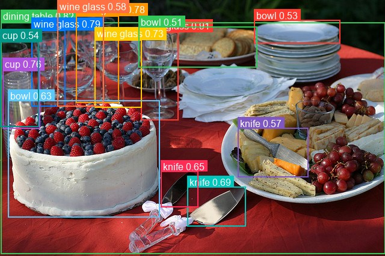
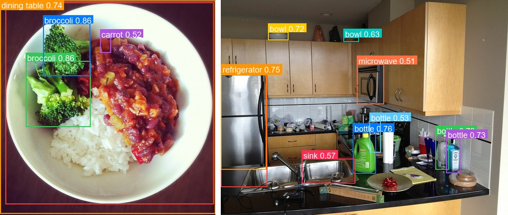

# D-FINE

<div style="background:#dff0d8; border:1px solid #cfe6bf; border-radius:3px; padding:12px 16px; color:#2a3a26;">
<b>Weights:</b> the pretrained weights for the D-FINE model are hosted on the
kerasformers <a href="https://github.com/IMvision12/KerasFormers/releases/tag/dfine" style="color:#1a5c8a;">dfine</a>
release tag, and download automatically the first time you call
<code>from_weights(...)</code>.
</div>
<br>

D-FINE is a real-time detector built on the RT-DETR recipe: an HGNetV2 backbone, a hybrid encoder that mixes attention-based intra-scale interaction (AIFI) with cross-scale feature merging (CCFM), and a deformable decoder with 300 queries. Like RT-DETR it is NMS-free, so one forward pass is the whole pipeline.

Its contribution is how boxes are regressed. Rather than predicting four coordinates directly, D-FINE reformulates regression as **Fine-grained Distribution Refinement**: each decoder layer predicts a distribution over discrete offset bins and accumulates refinements across layers. A Localization Quality Estimation head then folds box-distribution confidence back into the classification score.

**Paper**: [D-FINE: Redefine Regression Task of DETRs as Fine-grained Distribution Refinement](https://arxiv.org/abs/2410.13842)

## API

### DFineDetect

```python
DFineDetect(stem_channels=(3, 16, 16), stage_in_channels=(16, 64, 256, 512),
            stage_mid_channels=(16, 32, 64, 128),
            stage_out_channels=(64, 256, 512, 1024), stage_num_blocks=(1, 1, 2, 1),
            stage_numb_of_layers=(3, 3, 3, 3), use_lab=True,
            encoder_in_channels=(256, 512, 1024), encoder_hidden_dim=256,
            encoder_ffn_dim=1024, encode_proj_layers=(2,), hidden_expansion=1.0,
            ccfm_num_blocks=1, hidden_dim=256, decoder_num_layers=6,
            decoder_ffn_dim=1024, decoder_n_points=None, num_feature_levels=3,
            feat_strides=(8, 16, 32), num_classes=80, num_queries=300,
            image_size=640, input_tensor=None, name="DFineDetect")
```

The detector: backbone, hybrid encoder, and the distribution-refinement decoder.
**This is the class for object detection.**

Most parameters are architecture dimensions that `from_weights` fills in from the
variant config, so you rarely set them by hand. The ones worth knowing:

- **num_classes** (`int`, *optional*, defaults to `80`): COCO's 80 categories. D-FINE has no background class, unlike DETR's 92.
- **num_queries** (`int`, *optional*, defaults to `300`): decoder queries, the ceiling on detections per image.
- **image_size** (`int`, *optional*, defaults to `640`): input resolution the model is built for. Must be a multiple of 32, see [Input Resolution](#input-resolution).
- **decoder_num_layers** (`int`, *optional*, defaults to `6`): decoder depth. 3 for nano and small, 4 for medium, 6 for large and xlarge.
- **hidden_dim** (`int`, *optional*, defaults to `256`): decoder width. `128` for nano.
- **stage_out_channels** (`tuple`, *optional*): HGNetV2 stage widths, the main size lever across variants.
- **feat_strides** (`tuple`, *optional*, defaults to `(8, 16, 32)`): strides of the three feature levels.
- **num_feature_levels** (`int`, *optional*, defaults to `3`): multi-scale levels fed to the decoder.
- **use_lab** (`bool`, *optional*, defaults to `True`): Learnable Affine Blocks in the backbone, used by the smaller variants.
- **input_tensor** (`dict`, *optional*): pre-existing input tensors to build on.
- **name** (`str`, *optional*, defaults to `"DFineDetect"`): model name.

**Call** `model(pixel_values, training=False)`. **Returns** a `dict`:

- **logits** (`(B, num_queries, num_classes)`): per-query class logits, sigmoid-activated downstream.
- **pred_boxes** (`(B, num_queries, 4)`): normalized `(cx, cy, w, h)` in `[0, 1]`.

### DFineModel

```python
DFineModel(..., name="DFineModel")
```

The backbone and encoder without detection heads. **Parameters** match
[DFineDetect](#dfinedetect), minus `num_classes`, with **name** defaulting to
`"DFineModel"`. Use it for features to attach your own head to.

## Preprocessing

### DFineImageProcessor

```python
DFineImageProcessor(size=None, resample="bilinear", do_rescale=True,
                    rescale_factor=1/255, do_normalize=False, image_mean=None,
                    image_std=None, return_tensor=True, data_format=None)
```

Resizes to a fixed square and rescales to `[0, 1]`.

**Parameters**

- **size** (`dict`, *optional*, defaults to `{"height": 640, "width": 640}`): target size.
- **resample** (`str`, *optional*, defaults to `"bilinear"`): resize interpolation.
- **do_rescale** (`bool`, *optional*, defaults to `True`): scale pixels to `[0, 1]`.
- **rescale_factor** (`float`, *optional*, defaults to `1/255`): the rescaling factor.
- **do_normalize** (`bool`, *optional*, defaults to **`False`**): see the note below.
- **image_mean** / **image_std** (`tuple`, *optional*): normalization statistics, unused while `do_normalize` is `False`.
- **return_tensor** (`bool`, *optional*, defaults to `True`): return backend tensors rather than numpy.
- **data_format** (`str`, *optional*): `"channels_last"` or `"channels_first"`. Defaults to `keras.config.image_data_format()`.

> **`do_normalize` defaults to `False` here, and that is correct.** D-FINE inherits
> RT-DETR's recipe and was trained on rescaled `[0, 1]` input with no ImageNet
> normalization, matching `ustc-community/dfine-*` upstream. DETR and RF-DETR default
> to `True`. Setting it to `True` here silently degrades detection quality.

**Call** `processor(image)` with a path, a PIL image, an array, or a **list** of any
mix of those. **Returns** a `dict`:

- **pixel_values** (`(B, H, W, 3)`): preprocessed images, in the configured data format.

**post_process_object_detection**

```python
processor.post_process_object_detection(outputs, threshold=0.5, target_sizes=None,
                                        num_top_queries=300, label_names=None)
```

Applies sigmoid (not softmax, since there is no background class), takes the top
scoring query/class pairs, converts boxes to pixel `(x0, y0, x1, y1)`, and filters by
`threshold`. Omitting `target_sizes` leaves boxes normalized.

**Returns** a list with one `dict` per image, holding **scores**, **labels**,
**label_names**, and **boxes**.

## Model Variants

| Variant id     | Backbone       | Decoder layers | Params | HF original                        |
|----------------|----------------|---------------:|-------:|------------------------------------|
| `dfine-nano`   | HGNetV2-Nano   |              3 |   6 M  | `ustc-community/dfine-nano-coco`   |
| `dfine-small`  | HGNetV2-Small  |              3 |  11 M  | `ustc-community/dfine-small-coco`  |
| `dfine-medium` | HGNetV2-Medium |              4 |  20 M  | `ustc-community/dfine-medium-coco` |
| `dfine-large`  | HGNetV2-Large  |              6 |  32 M  | `ustc-community/dfine-large-coco`  |
| `dfine-xlarge` | HGNetV2-XLarge |              6 |  63 M  | `ustc-community/dfine-xlarge-coco` |

All are 640×640 COCO models. `dfine-nano` also narrows `hidden_dim` to 128.

## Basic Usage: Object Detection



```python
from PIL import Image
from kerasformers.models.dfine import DFineDetect, DFineImageProcessor

model = DFineDetect.from_weights("dfine-nano")
processor = DFineImageProcessor()

image = Image.open("assets/data/coco_buffet.jpg").convert("RGB")
inputs = processor(image)

output = model(inputs["pixel_values"], training=False)
# output["logits"]:     (1, 300, 80)
# output["pred_boxes"]: (1, 300, 4)

results = processor.post_process_object_detection(
    output, threshold=0.5, target_sizes=[(image.height, image.width)]
)[0]

# Queries come back in the model's own order, so sort by score for readability.
detections = sorted(
    zip(results["scores"], results["label_names"], results["boxes"]),
    key=lambda d: -float(d[0]),
)
for score, name, box in detections:
    print(f"{name:14s} {float(score):.3f}  {[round(float(v)) for v in box]}")
```

```
wine glass     0.905  [234, 53, 296, 200]
dining table   0.817  [1, 37, 640, 423]
wine glass     0.794  [52, 50, 108, 177]
wine glass     0.778  [126, 26, 197, 171]
cup            0.763  [4, 117, 66, 214]
wine glass     0.734  [157, 66, 235, 179]
knife          0.690  [311, 311, 408, 377]
knife          0.651  [267, 285, 329, 345]
bowl           0.629  [13, 167, 265, 362]
wine glass     0.577  [95, 18, 172, 177]
knife          0.569  [395, 213, 512, 295]
cup            0.544  [0, 69, 64, 211]
bowl           0.532  [422, 33, 565, 72]
bowl           0.505  [230, 44, 427, 112]
```

The `0.5` threshold suits D-FINE's sigmoid scores. It is a lower bar than DETR's `0.9`
because these scores are not softmax-normalized against a background class.

### Batch Processing Multiple Images

Pass a list of images and one `target_sizes` entry per image:



```python
from PIL import Image
from kerasformers.models.dfine import DFineDetect, DFineImageProcessor

model = DFineDetect.from_weights("dfine-nano")
processor = DFineImageProcessor()

paths = ["assets/data/coco_food_bowl.jpg", "assets/data/coco_kitchen.jpg"]
images = [Image.open(p).convert("RGB") for p in paths]

inputs = processor(paths)                                  # (2, 640, 640, 3)
output = model(inputs["pixel_values"], training=False)

results = processor.post_process_object_detection(
    output, threshold=0.5,
    target_sizes=[(im.height, im.width) for im in images],
)

for path, result in zip(paths, results):
    print(f"\n{path}")
    detections = sorted(
        zip(result["scores"], result["label_names"], result["boxes"]),
        key=lambda d: -float(d[0]),
    )
    for score, name, box in detections:
        print(f"  {name:12s} {float(score):.3f}  {[round(float(v)) for v in box]}")
```

```
assets/data/coco_food_bowl.jpg
  bowl         0.867  [15, 6, 607, 581]
  broccoli     0.857  [73, 173, 257, 361]
  broccoli     0.857  [122, 66, 256, 216]
  dining table 0.737  [0, 1, 612, 608]
  carrot       0.518  [284, 106, 315, 150]

assets/data/coco_kitchen.jpg
  refrigerator 0.803  [0, 166, 103, 417]
  bottle       0.791  [478, 299, 508, 378]
  bottle       0.762  [294, 294, 345, 387]
  refrigerator 0.753  [0, 166, 101, 378]
  bottle       0.733  [502, 308, 533, 386]
  bowl         0.720  [105, 71, 150, 89]
  bowl         0.632  [273, 83, 307, 93]
  sink         0.569  [180, 354, 299, 409]
  bottle       0.526  [331, 270, 356, 340]
  microwave    0.506  [303, 143, 363, 232]
```

Every image is resized to the same square, so stacking is always safe. Batch results
are identical to running the images one at a time.

## Input Resolution

D-FINE is Functional, so the input shape is fixed when the model is constructed. To run
at another resolution, build at that size and match the processor:

```python
model = DFineDetect.from_weights("dfine-nano", image_size=512)
processor = DFineImageProcessor(size={"height": 512, "width": 512})
```

**The side must be a multiple of 32.** The three feature levels use strides 8, 16, and
32 and the encoder fuses them together, so a side like 600 yields mismatched maps and
raises during the reshape.

Pretrained weights load at any valid size: position encodings are computed sine
functions rather than a learned grid, so nothing is tied to the training resolution.
Quality still peaks near the native 640:

```
320:  tv 0.726, keyboard 0.725, laptop 0.571          <- degrades sharply
480:  laptop 0.928, mouse 0.918, tv 0.896, keyboard 0.790
512:  laptop 0.955, keyboard 0.945, mouse 0.924, tv 0.907
640:  laptop 0.951, keyboard 0.944, tv 0.926, mouse 0.918   <- native
800:  tv 0.918, laptop 0.886, keyboard 0.881, mouse 0.845
```

480 to 800 is the comfortable band. At 320 the model starts missing objects outright.

## Custom Class Names

A model fine-tuned on your own dataset predicts your class indices, not COCO's. Pass
the names so `label_names` reads correctly:

```python
MY_CLASSES = ["cat", "dog", "bird"]

results = processor.post_process_object_detection(
    output, threshold=0.5, target_sizes=[(image.height, image.width)],
    label_names=MY_CLASSES,
)
```

Without it the post-processor falls back to COCO's 80 names, silently mislabeling a
custom model. The integer `labels` are unaffected.

## Data Format

**Both the models and the processors support `channels_last` and `channels_first`.**
Neither is hard-coded to a layout, so the whole pipeline runs either way.

They pick the format differently, which is the one thing to keep straight:

| | How it picks the format |
|---|---|
| Processors | A `data_format` kwarg, per instance. `None` (the default) resolves to `keras.config.image_data_format()`. |
| Models | Read `keras.config.image_data_format()` when they are **constructed**. There is no `data_format` argument. |

### Overriding the processor only

```python
DFineImageProcessor(data_format="channels_last")("photo.jpg")
# {"pixel_values": (1, 640, 640, 3)}

DFineImageProcessor(data_format="channels_first")("photo.jpg")
# {"pixel_values": (1, 3, 640, 640)}
```

### Switching the whole pipeline

Set the global format before constructing the model, and both sides agree:

```python
import keras

keras.config.set_image_data_format("channels_first")

model = DFineDetect.from_weights("dfine-nano")
processor = DFineImageProcessor()
```

Detections are the same under either layout. Only the tensor shape changes. Set it once
at the top of a script, since already-built models keep the layout they were
constructed with.

The post-processor is not format-sensitive: it emits `xyxy` pixel boxes and class
indices, which have no channel axis, so it takes no `data_format` kwarg.

## Loading Fine-tuned and Community Weights

Any Hugging Face repo whose `model_type` is `"d_fine"` loads directly with the `hf:`
prefix, including the upstream checkpoints and arbitrary fine-tunes.

```python
from kerasformers.models.dfine import DFineDetect

# Upstream release
model = DFineDetect.from_weights("hf:ustc-community/dfine-nano-coco")

# Somebody's fine-tune
model = DFineDetect.from_weights("hf:<user>/dfine-finetuned-on-my-data")

# Architecture only, randomly initialized
model = DFineDetect.from_weights("dfine-nano", load_weights=False)
```

No shape arguments are needed. The architecture is read from the repo's `config.json`
and mapped onto the constructor. Both model classes accept `hf:`, as does
`DFineImageProcessor`:

```python
processor = DFineImageProcessor.from_weights("hf:ustc-community/dfine-nano-coco")
```

Loading `hf:ustc-community/dfine-nano-coco` and the `dfine-nano` release variant
produces identical outputs, since they are the same checkpoint by two routes.
