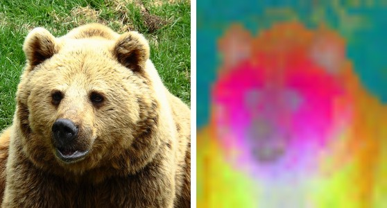
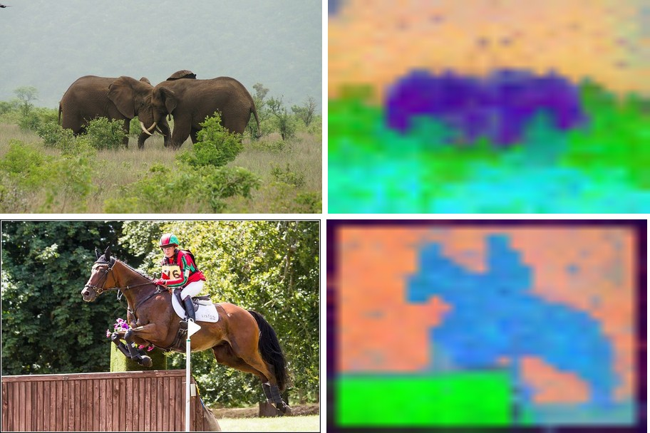

# DINO

<div style="background:#dff0d8; border:1px solid #cfe6bf; border-radius:3px; padding:12px 16px; color:#2a3a26;">
<b>Weights:</b> the pretrained weights for the DINO models are hosted on the
kerasformers <a href="https://github.com/IMvision12/KerasFormers/releases/tag/dino12" style="color:#1a5c8a;">dino12</a>
release tag, and download automatically the first time you call
<code>from_weights(...)</code>.
</div>
<br>

DINO is self-supervised: it trains a ViT with no labels, by matching the outputs of a
student and a teacher network across different crops of the same image. The surprise in
the paper was that the resulting features are *semantic* for free. The [CLS] token's
attention lands on objects, and the patch features cluster into parts, without a single
annotation.

These are **backbones**, not task models. They take an image and return features; what you
do with them, classification, segmentation, retrieval, is up to a head you add. The
figures below make the learned structure visible by running PCA on the patch features and
mapping the top three components to RGB.

**Paper**: [Emerging Properties in Self-Supervised Vision Transformers](https://arxiv.org/abs/2104.14294)

## API

### DinoViTModel

```python
DinoViTModel(as_backbone=False, patch_size=16, embed_dim=384, depth=12,
             num_heads=6, mlp_ratio=4.0, qkv_bias=True, qk_norm=False,
             drop_rate=0.0, attn_drop_rate=0.0, include_normalization=True,
             normalization_mode="imagenet", image_size=224,
             input_tensor=None, name="DinoViTModel")
```

The DINO Vision Transformer. **This is the main backbone class.**

**Parameters**

- **as_backbone** (`bool`, *optional*, defaults to `False`): return a list of intermediate feature maps (embedding + one per block) instead of the final token sequence.
- **patch_size** (`int`, *optional*, defaults to `16`): pixels per patch. `8` for the `*8` variants. Filled in by `from_weights`.
- **embed_dim** / **depth** / **num_heads** (`int`, *optional*): transformer width, blocks, and heads. Set from the variant config.
- **mlp_ratio** / **qkv_bias** / **qk_norm** / **drop_rate** / **attn_drop_rate**: standard ViT block knobs.
- **include_normalization** (`bool`, *optional*, defaults to `True`): normalize inside the model, so you feed raw `[0, 255]` pixels.
- **normalization_mode** (`str`, *optional*, defaults to `"imagenet"`): which mean/std to use when normalizing.
- **image_size** (`int` or `tuple`, *optional*, defaults to `224`): input resolution the model is built for.
- **input_tensor** (`dict`, *optional*): pre-existing input tensors to build on.
- **name** (`str`, *optional*, defaults to `"DinoViTModel"`): model name.

**Call** `model(pixel_values, training=False)` with raw `[0, 255]` pixels. **Returns** the
token sequence `(B, 1 + num_patches, embed_dim)`, the leading token being `[CLS]`. With
`as_backbone=True`, a list of `depth + 1` such tensors.

### DinoResNetModel

```python
DinoResNetModel(as_backbone=False, depths=None, filters=None,
                include_normalization=True, normalization_mode="imagenet",
                image_size=224, input_tensor=None, name="DinoResNetModel")
```

The DINO ResNet-50 backbone, for a convolutional alternative. **Returns** the final
`(B, 7, 7, 2048)` feature map under `channels_last`, or with `as_backbone=True` the four
stage maps (`(B, 56, 56, 256)` through `(B, 7, 7, 2048)`).

## Preprocessing

There is no separate image processor. Both models carry `include_normalization=True`, so
feed **raw `[0, 255]` pixels** (resized to the model's `image_size`) and normalization
happens inside. Pass `include_normalization=False` if you have already normalized.

## Model Variants

| Variant id | Backbone | Patch | Params |
|---|---|---|---:|
| `dino_vits16` | ViT-S | 16 | ~21 M |
| `dino_vits8` | ViT-S | 8 | ~21 M |
| `dino_vitb16` | ViT-B | 16 | ~85 M |
| `dino_vitb8` | ViT-B | 8 | ~85 M |
| `dino_resnet50` | ResNet-50 | n/a | ~23 M |

The `*8` variants use an 8-pixel patch, so four times as many tokens and a much finer
feature map, at a higher compute cost.

## Basic Usage: Feature Extraction



Run the backbone, drop the `[CLS]` token, and PCA the patch features to three components
for an RGB view of what the model sees. The bear's head and body separate cleanly from
the grass, with no supervision anywhere in the pipeline.

```python
import keras
import numpy as np
import torch
from PIL import Image
from kerasformers.models.dino import DinoViTModel

size, patch = 448, 16
model = DinoViTModel.from_weights("dino_vits16", image_size=size)

image = Image.open("assets/data/coco_bear.jpg").convert("RGB")
x = np.asarray(image.resize((size, size)))[None].astype("float32")   # raw [0, 255]

with torch.no_grad():
    tokens = model(x, training=False)
tokens = np.asarray(keras.ops.convert_to_numpy(tokens))[0]
print(tokens.shape)   # (1 + num_patches, embed_dim)

# PCA the patch tokens (drop the CLS token) to RGB.
grid = size // patch
patches = tokens[1:].reshape(grid * grid, -1).astype("float64")
patches -= patches.mean(0, keepdims=True)
proj = patches @ np.linalg.svd(patches, full_matrices=False)[2][:3].T
proj = proj.reshape(grid, grid, 3)
lo, hi = proj.min((0, 1)), proj.max((0, 1))
proj = (proj - lo) / (hi - lo + 1e-8)

vis = Image.fromarray((proj * 255).astype("uint8")).resize(image.size, Image.BILINEAR)
vis.save("assets/dino_pca.jpg")
```

```
(785, 384)
```

`785 = 1 + 28 * 28`: one `[CLS]` token plus a 28x28 patch grid at 448/16. The `[CLS]`
token, `tokens[0]`, is the image-level embedding you would feed a classification head; the
patches are the dense features the PCA above visualizes.

> Use `torch.no_grad()` on the torch backend. These are pure forward passes; autograd
> would retain every intermediate for nothing.

### Batch Processing Multiple Images

Stack images that share a size into one batch:



```python
import keras
import numpy as np
import torch
from PIL import Image
from kerasformers.models.dino import DinoViTModel

size = 448
model = DinoViTModel.from_weights("dino_vits16", image_size=size)

paths = ["assets/data/coco_elephants.jpg", "assets/data/coco_horse_jump.jpg"]
batch = np.stack(
    [np.asarray(Image.open(p).convert("RGB").resize((size, size)), "float32")
     for p in paths]
)   # (2, 448, 448, 3)

with torch.no_grad():
    tokens = model(batch, training=False)
print(np.asarray(keras.ops.convert_to_numpy(tokens)).shape)   # (2, 785, 384)
```

```
(2, 785, 384)
```

Each row of the figure is an image beside its own feature PCA: the elephants separate from
the scrub, the horse and rider from the trees behind.

## Intermediate Features

`as_backbone=True` returns the embedding plus one feature map per block, for feeding a
DPT-style neck or an FPN:

```python
model = DinoViTModel.from_weights("dino_vits16", as_backbone=True, image_size=size)
features = model(x, training=False)   # x from above, at 448
print(len(features), features[-1].shape)   # 13  (1, 785, 384)
```

`DinoResNetModel(as_backbone=True)` gives the four convolutional stage maps instead.

## Data Format

The ViT works in token space, so it is layout-agnostic. `DinoResNetModel` reads
`keras.config.image_data_format()` when it is **constructed** and returns
`channels_last` `(B, 7, 7, 2048)` or `channels_first` `(B, 2048, 7, 7)` accordingly.

```python
import keras
keras.config.set_image_data_format("channels_first")
model = DinoResNetModel.from_weights("dino_resnet50")   # output (B, 2048, 7, 7)
```

## Input Resolution

Any size that is a **multiple of the patch size** works: the learned position embeddings
are bilinearly interpolated to the requested patch grid at load time, so the pretrained
weights stay valid. The figures here use `image_size=448` for a finer map than the
default 224 gives.

## Loading Fine-tuned and Community Weights

Any Hugging Face repo whose `model_type` is `"vit"` in the DINO layout loads with the
`hf:` prefix.

```python
from kerasformers.models.dino import DinoViTModel

model = DinoViTModel.from_weights("hf:facebook/dino-vits16")
model = DinoViTModel.from_weights("hf:<user>/dino-finetuned")

# Architecture only, randomly initialized
model = DinoViTModel.from_weights("dino_vits16", load_weights=False)
```

See also [DINOv2](dinov2.md), which adds register-free dense features and layer scale, and
[DINOv3](dinov3.md), which adds register tokens and rotary position embeddings.
