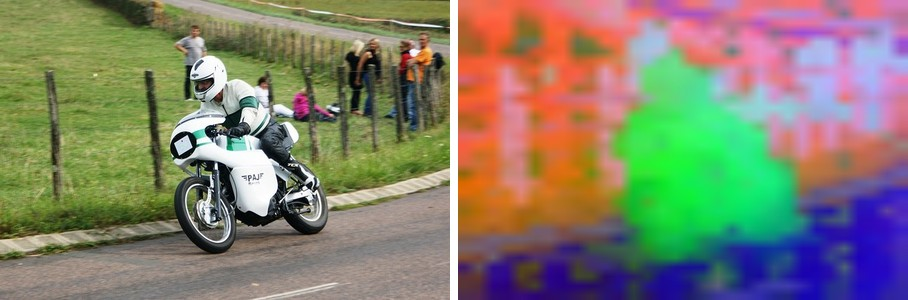
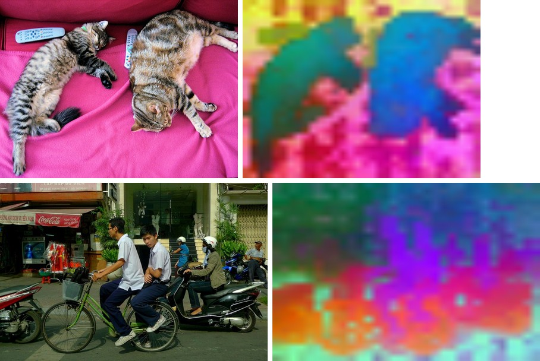

# DINOv2

<div style="background:#dff0d8; border:1px solid #cfe6bf; border-radius:3px; padding:12px 16px; color:#2a3a26;">
<b>Weights:</b> the pretrained weights for the DINOv2 models are hosted on the
kerasformers <a href="https://github.com/IMvision12/KerasFormers/releases/tag/dino12" style="color:#1a5c8a;">dino12</a>
release tag, and download automatically the first time you call
<code>from_weights(...)</code>.
</div>
<br>

DINOv2 keeps [DINO](dino.md)'s self-supervised recipe and scales it: a curated 142 M-image
dataset, a larger teacher, and a training objective (iBOT plus DINO) that supervises
individual patches, not just the image-level `[CLS]` token. The result is **dense
features good enough to use raw**: run a linear probe on the patch tokens and you get
competitive depth, segmentation, and correspondence, with the backbone frozen.

Like DINO these are backbones, not task models. The figures below PCA the patch features
to three RGB components, the visualization the DINOv2 paper made famous: the object pops
out of the background and its parts take on consistent colours.

**Paper**: [DINOv2: Learning Robust Visual Features without Supervision](https://arxiv.org/abs/2304.07193)

## API

### DinoV2Model

```python
DinoV2Model(as_backbone=False, patch_size=14, embed_dim=384, depth=12,
            num_heads=6, mlp_ratio=4.0, qkv_bias=True, qk_norm=False,
            drop_rate=0.0, attn_drop_rate=0.0, layer_scale_init=1.0,
            include_normalization=True, normalization_mode="imagenet",
            image_size=224, input_tensor=None, name="DinoV2Model")
```

The DINOv2 Vision Transformer. **This is the backbone class.**

**Parameters**

- **as_backbone** (`bool`, *optional*, defaults to `False`): return a list of intermediate feature maps (embedding + one per block) instead of the final token sequence.
- **patch_size** (`int`, *optional*, defaults to `14`): pixels per patch. DINOv2 uses 14, so a 224 input is a 16x16 grid.
- **embed_dim** / **depth** / **num_heads** (`int`, *optional*): transformer width, blocks, and heads. Filled in by `from_weights` from the variant config.
- **layer_scale_init** (`float`, *optional*, defaults to `1.0`): initial LayerScale value, DINOv2's per-branch learned scaling.
- **include_normalization** (`bool`, *optional*, defaults to `True`): normalize inside the model, so you feed raw `[0, 255]` pixels.
- **normalization_mode** (`str`, *optional*, defaults to `"imagenet"`): which mean/std to use when normalizing.
- **image_size** (`int` or `tuple`, *optional*, defaults to `224`): input resolution the model is built for.
- **input_tensor** (`dict`, *optional*): pre-existing input tensors to build on.
- **name** (`str`, *optional*, defaults to `"DinoV2Model"`): model name.

**Call** `model(pixel_values, training=False)` with raw `[0, 255]` pixels. **Returns** the
token sequence `(B, 1 + num_patches, embed_dim)`, the leading token being `[CLS]`. With
`as_backbone=True`, a list of `depth + 1` such tensors.

## Preprocessing

There is no separate image processor. `DinoV2Model` carries `include_normalization=True`,
so feed **raw `[0, 255]` pixels** resized to the model's `image_size`; normalization
happens inside. Pass `include_normalization=False` if you have already normalized.

## Model Variants

| Variant id | Backbone | Patch | Params |
|---|---|---|---:|
| `dinov2_vits14` | ViT-S | 14 | ~21 M |
| `dinov2_vitb14` | ViT-B | 14 | ~86 M |
| `dinov2_vitl14` | ViT-L | 14 | ~300 M |

## Basic Usage: Feature Extraction



Run the backbone, drop the `[CLS]` token, and PCA the patch features to three components.
The rider and machine take one colour, the grass and road two others, all recovered with
no labels.

```python
import keras
import numpy as np
import torch
from PIL import Image
from kerasformers.models.dino_v2 import DinoV2Model

size, patch = 448, 14
model = DinoV2Model.from_weights("dinov2_vits14", image_size=size)

image = Image.open("assets/data/coco_motorcycle.jpg").convert("RGB")
x = np.asarray(image.resize((size, size)))[None].astype("float32")   # raw [0, 255]

with torch.no_grad():
    tokens = model(x, training=False)
tokens = np.asarray(keras.ops.convert_to_numpy(tokens))[0]
print(tokens.shape)   # (1 + num_patches, embed_dim)

# PCA the patch tokens (drop the CLS token) to RGB.
grid = size // patch
patches = tokens[1:].reshape(grid * grid, -1).astype("float64")
patches -= patches.mean(0, keepdims=True)
proj = patches @ np.linalg.svd(patches, full_matrices=False)[2][:3].T
proj = proj.reshape(grid, grid, 3)
lo, hi = proj.min((0, 1)), proj.max((0, 1))
proj = (proj - lo) / (hi - lo + 1e-8)

vis = Image.fromarray((proj * 255).astype("uint8")).resize(image.size, Image.BILINEAR)
vis.save("assets/dinov2_pca.jpg")
```

```
(1025, 384)
```

`1025 = 1 + 32 * 32`: one `[CLS]` token plus a 32x32 patch grid at 448/14. DINOv2's whole
selling point is that those patch features are good enough to use directly, so a linear
layer on `tokens[1:]` is a real segmentation or depth head.

> Use `torch.no_grad()` on the torch backend. These are pure forward passes; autograd
> would retain every intermediate for nothing.

### Batch Processing Multiple Images

Stack images that share a size into one batch:



```python
import keras
import numpy as np
import torch
from PIL import Image
from kerasformers.models.dino_v2 import DinoV2Model

size = 448
model = DinoV2Model.from_weights("dinov2_vits14", image_size=size)

paths = ["assets/data/coco_cats.jpg", "assets/data/coco_bicycles.jpg"]
batch = np.stack(
    [np.asarray(Image.open(p).convert("RGB").resize((size, size)), "float32")
     for p in paths]
)   # (2, 448, 448, 3)

with torch.no_grad():
    tokens = model(batch, training=False)
print(np.asarray(keras.ops.convert_to_numpy(tokens)).shape)   # (2, 1025, 384)
```

```
(2, 1025, 384)
```

The two cats separate from the blanket as one region each; even the cluttered street
resolves the riders, bikes, and shopfront into distinct patches.

## Intermediate Features

`as_backbone=True` returns the embedding plus one feature map per block, for feeding a
DPT-style neck or a segmentation head, which is exactly how DINOv2 is used for dense
prediction:

```python
model = DinoV2Model.from_weights("dinov2_vits14", as_backbone=True, image_size=size)
features = model(x, training=False)   # x from above, at 448
print(len(features), features[-1].shape)   # 13  (1, 1025, 384)
```

## Data Format

The ViT works in token space, so it is layout-agnostic: it returns `(B, tokens, dim)`
regardless of `keras.config.image_data_format()`.

## Input Resolution

Any size that is a **multiple of the patch size, 14**, works: the learned position
embeddings are bilinearly interpolated to the requested patch grid at load time, so the
pretrained weights stay valid. The figures here use `image_size=448` for a finer map than
the default 224 gives.

> Interpolation runs in the Keras `.weights.h5` reader, which the release path uses. The
> `hf:` path assigns the checkpoint tensor directly and so requires an exact match; ask
> for a non-default size over `hf:` and it raises a position-embedding shape mismatch.

## Loading Fine-tuned and Community Weights

Any Hugging Face repo whose `model_type` is `"dinov2"` loads with the `hf:` prefix.

```python
from kerasformers.models.dino_v2 import DinoV2Model

model = DinoV2Model.from_weights("hf:facebook/dinov2-small")
model = DinoV2Model.from_weights("hf:<user>/dinov2-finetuned")

# Architecture only, randomly initialized
model = DinoV2Model.from_weights("dinov2_vits14", load_weights=False)
```

See also [DINO](dino.md), the original, and [DINOv3](dinov3.md), which adds register
tokens and rotary position embeddings.
