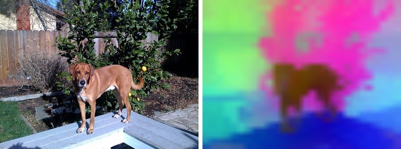
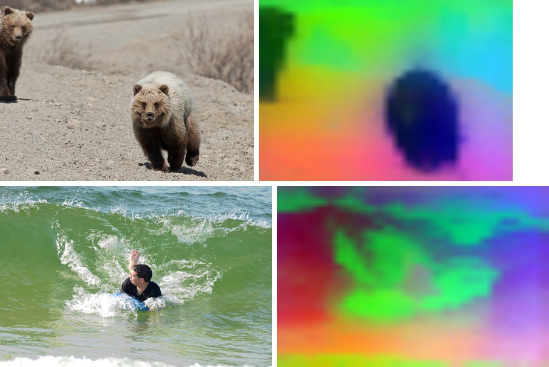

# DINOv3

<div style="background:#fff4e5; border:1px solid #f0dcc0; border-radius:3px; padding:12px 16px; color:#4a3a26;">
<b>Gated weights:</b> DINOv3 is not redistributed on the kerasformers release page.
Accept the license at <a href="https://huggingface.co/facebook/dinov3-vits16-pretrain-lvd1689m" style="color:#1a5c8a;">facebook/dinov3-*</a>,
then authenticate with <code>huggingface-cli login</code> or <code>export HF_TOKEN=...</code>.
The first <code>from_weights</code> call downloads the checkpoint, converts it, and caches
the result under <code>~/.cache/kerasformers/</code>; later calls load from that cache.
</div>
<br>

DINOv3 pushes [DINOv2](dinov2.md)'s self-supervised features further, on 1.7 B images, and
adds two architectural pieces aimed squarely at **dense features**: register tokens, extra
learned tokens that soak up the global-information artifacts that otherwise show up as
high-norm outlier patches, and rotary position embeddings, which encode position by
rotating queries and keys rather than adding a learned table. It also ships a ConvNeXt
line for a convolutional alternative.

Like the earlier DINOs these are backbones, not task models. The figures below PCA the
patch features to three RGB components; the register tokens make the resulting maps
noticeably cleaner than DINOv2's.

**Paper**: [DINOv3: Self-Supervised Visual Representation Learning at Scale](https://arxiv.org/abs/2508.10104)

## API

### DinoV3ViTModel

```python
DinoV3ViTModel(as_backbone=False, patch_size=16, embed_dim=768, depth=12,
               num_heads=12, mlp_ratio=4.0, use_swiglu=False,
               num_register_tokens=4, layer_scale_init=1.0, rope_theta=100.0,
               query_bias=True, key_bias=False, value_bias=True,
               hidden_act="gelu", mlp_bias=True, layer_norm_eps=1e-5,
               include_normalization=True, normalization_mode="imagenet",
               image_size=224, input_tensor=None, name="DinoV3ViTModel")
```

The DINOv3 Vision Transformer with RoPE and register tokens. **This is the main backbone
class.**

**Parameters**

- **as_backbone** (`bool`, *optional*, defaults to `False`): return a list of intermediate feature maps instead of the final token sequence.
- **patch_size** (`int`, *optional*, defaults to `16`): pixels per patch.
- **embed_dim** / **depth** / **num_heads** (`int`, *optional*): transformer width, blocks, and heads. Filled in by `from_weights` from the variant config.
- **use_swiglu** (`bool`, *optional*, defaults to `False`): SwiGLU MLP instead of GELU, used by the larger variants.
- **num_register_tokens** (`int`, *optional*, defaults to `4`): learned register tokens inserted after `[CLS]`. The token layout is `[CLS, registers..., patches...]`.
- **rope_theta** (`float`, *optional*, defaults to `100.0`): rotary position embedding base. Position is applied on the fly, so there is no learned position table to interpolate.
- **layer_scale_init**, **query_bias** / **key_bias** / **value_bias**, **hidden_act**, **mlp_bias**, **layer_norm_eps**: block-level knobs, all set from the variant config.
- **include_normalization** (`bool`, *optional*, defaults to `True`): normalize inside the model, so you feed raw `[0, 255]` pixels.
- **image_size** (`int` or `tuple`, *optional*, defaults to `224`): input resolution the model is built for.
- **input_tensor** (`dict`, *optional*): pre-existing input tensors to build on.
- **name** (`str`, *optional*, defaults to `"DinoV3ViTModel"`): model name.

**Call** `model(pixel_values, training=False)` with raw `[0, 255]` pixels. **Returns** the
token sequence `(B, 1 + num_register_tokens + num_patches, embed_dim)`. With
`as_backbone=True`, a list of intermediate tensors.

### DinoV3ConvNeXtModel

```python
DinoV3ConvNeXtModel(as_backbone=False, depths=None, projection_dim=None,
                    include_normalization=True, normalization_mode="imagenet",
                    image_size=224, input_tensor=None, name="DinoV3ConvNeXtModel")
```

The DINOv3 ConvNeXt backbone, a convolutional alternative. **Returns** the final spatial
feature map (`(B, 7, 7, 768)` for the tiny variant under `channels_last`), or with
`as_backbone=True` the per-stage maps.

## Preprocessing

There is no separate image processor. Both models carry `include_normalization=True`, so
feed **raw `[0, 255]` pixels** resized to the model's `image_size`; normalization happens
inside. Pass `include_normalization=False` if you have already normalized.

## Model Variants

| Variant id | Backbone | Patch | Params |
|---|---|---|---:|
| `dinov3_vits16` | ViT-S | 16 | ~21 M |
| `dinov3_vitb16` | ViT-B | 16 | ~86 M |
| `dinov3_vitl16` | ViT-L | 16 | ~300 M |
| `dinov3_convnext_tiny` | ConvNeXt-T | n/a | ~29 M |
| `dinov3_convnext_small` | ConvNeXt-S | n/a | ~50 M |
| `dinov3_convnext_base` | ConvNeXt-B | n/a | ~89 M |
| `dinov3_convnext_large` | ConvNeXt-L | n/a | ~198 M |

## Basic Usage: Feature Extraction



Run the backbone, drop the `[CLS]` **and the register tokens**, then PCA the patch
features to three components. The dog, the foliage, and the deck each take a distinct
colour.

```python
import keras
import numpy as np
import torch
from PIL import Image
from kerasformers.models.dino_v3 import DinoV3ViTModel

size, patch, registers = 448, 16, 4
model = DinoV3ViTModel.from_weights("dinov3_vits16", image_size=size)

image = Image.open("assets/data/coco_dog_yard.jpg").convert("RGB")
x = np.asarray(image.resize((size, size)))[None].astype("float32")   # raw [0, 255]

with torch.no_grad():
    tokens = model(x, training=False)
tokens = np.asarray(keras.ops.convert_to_numpy(tokens))[0]
print(tokens.shape)   # (1 + registers + num_patches, embed_dim)

# PCA the patch tokens (drop the CLS token and the register tokens) to RGB.
grid = size // patch
prefix = 1 + registers
patches = tokens[prefix:prefix + grid * grid].reshape(grid * grid, -1).astype("float64")
patches -= patches.mean(0, keepdims=True)
proj = patches @ np.linalg.svd(patches, full_matrices=False)[2][:3].T
proj = proj.reshape(grid, grid, 3)
lo, hi = proj.min((0, 1)), proj.max((0, 1))
proj = (proj - lo) / (hi - lo + 1e-8)

vis = Image.fromarray((proj * 255).astype("uint8")).resize(image.size, Image.BILINEAR)
vis.save("assets/dinov3_pca.jpg")
```

```
(789, 384)
```

`789 = 1 + 4 + 28 * 28`: the `[CLS]` token, four register tokens, and a 28x28 patch grid
at 448/16. **Forgetting to drop the register tokens shifts every patch by four and
scrambles the map**, so always slice from `1 + num_register_tokens`.

> Use `torch.no_grad()` on the torch backend. These are pure forward passes; autograd
> would retain every intermediate for nothing.

### Batch Processing Multiple Images

Stack images that share a size into one batch:



```python
import keras
import numpy as np
import torch
from PIL import Image
from kerasformers.models.dino_v3 import DinoV3ViTModel

size = 448
model = DinoV3ViTModel.from_weights("dinov3_vits16", image_size=size)

paths = ["assets/data/coco_bear_cub.jpg", "assets/data/coco_surfer.jpg"]
batch = np.stack(
    [np.asarray(Image.open(p).convert("RGB").resize((size, size)), "float32")
     for p in paths]
)   # (2, 448, 448, 3)

with torch.no_grad():
    tokens = model(batch, training=False)
print(np.asarray(keras.ops.convert_to_numpy(tokens)).shape)   # (2, 789, 384)
```

```
(2, 789, 384)
```

The bear cub lifts off the gravel and the surfer out of the breaking wave, each as a
single coherent region.

## Intermediate Features

`as_backbone=True` returns intermediate feature maps for feeding a DPT-style neck or a
segmentation head:

```python
model = DinoV3ViTModel.from_weights("dinov3_vits16", as_backbone=True, image_size=size)
features = model(x, training=False)   # x from above, at 448
print(len(features), features[-1].shape)   # (1, 789, 384) per map
```

`DinoV3ConvNeXtModel(as_backbone=True)` gives the convolutional stage maps instead.

## Data Format

The ViT works in token space, so it is layout-agnostic. `DinoV3ConvNeXtModel` reads
`keras.config.image_data_format()` when it is **constructed** and returns
`channels_last` or `channels_first` spatial maps accordingly.

## Input Resolution

Any size that is a **multiple of the patch size, 16**, works. DINOv3 uses rotary position
embeddings computed on the fly, so unlike DINO and DINOv2 there is no learned position
table to interpolate: a new resolution just works, on the release or `hf:` path alike.
The figures here use `image_size=448`.

## Loading Fine-tuned and Community Weights

Any Hugging Face repo whose `model_type` is `"dinov3_vit"` or `"dinov3_convnext"` loads
with the `hf:` prefix (the base checkpoints are gated; see the banner above).

```python
from kerasformers.models.dino_v3 import DinoV3ViTModel

model = DinoV3ViTModel.from_weights("hf:facebook/dinov3-vits16-pretrain-lvd1689m")
model = DinoV3ViTModel.from_weights("hf:<user>/dinov3-finetuned")

# Architecture only, randomly initialized
model = DinoV3ViTModel.from_weights("dinov3_vits16", load_weights=False)
```

See also [DINO](dino.md) and [DINOv2](dinov2.md), the earlier self-supervised backbones
this builds on.
