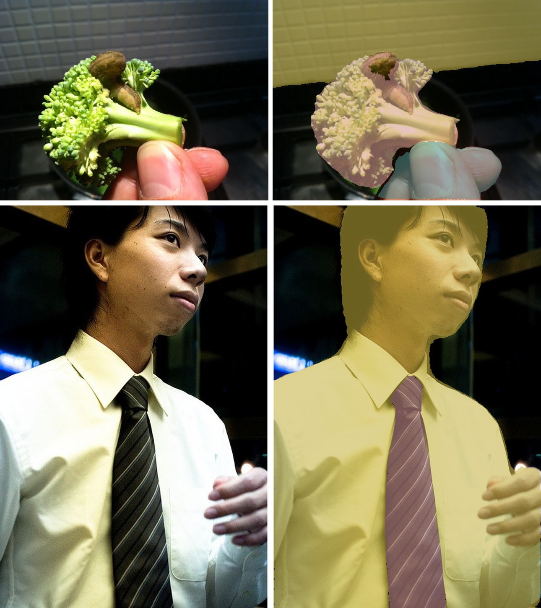

# EoMT

<div style="background:#dff0d8; border:1px solid #cfe6bf; border-radius:3px; padding:12px 16px; color:#2a3a26;">
<b>Weights:</b> the pretrained weights for the EoMT model are hosted on the
kerasformers <a href="https://github.com/IMvision12/KerasFormers/releases/tag/eomt" style="color:#1a5c8a;">eomt</a>
release tag, and download automatically the first time you call
<code>from_weights(...)</code>.
</div>
<br>

EoMT (Encoder-only Mask Transformer) takes the opposite direction from the MaskFormer line. Where [Mask2Former](mask2former.md) adds a pixel decoder, a transformer decoder and multi-scale deformable attention on top of its backbone, EoMT deletes all of it.

The claim in the title is the design: a plain ViT already computes everything segmentation needs. Concatenate learned query tokens onto the patch tokens, run them through the **same** ViT blocks, and read masks and classes off the query tokens at the end. No decoder, no pixel decoder, no deformable attention. The result is far simpler and, at large scale, competitive.

**Paper**: [Your ViT is Secretly an Image Segmentation Model](https://arxiv.org/abs/2503.19108)

## API

### EoMTUniversalSegment

```python
EoMTUniversalSegment(hidden_dim=1024, num_hidden_layers=24, num_heads=16,
                     depths=4, num_queries=200, num_classes=133,
                     layerscale_value=1e-05, patch_size=16,
                     num_register_tokens=4, num_upscale_blocks=2,
                     mlp_ratio=4, ..., name="EoMTUniversalSegment")
```

A ViT with query tokens appended, plus the mask and class heads.
**This is the class for segmentation.**

Architecture arguments are filled in by `from_weights` from the variant config. The
ones worth knowing:

- **num_queries** (`int`, *optional*, defaults to `200`): query tokens appended to the patch sequence, the ceiling on segments per image.
- **num_classes** (`int`, *optional*, defaults to `133`): COCO panoptic's vocabulary. `150` for the ADE20K variant.
- **depths** (`int`, *optional*, defaults to `4`): how many of the final blocks the queries participate in.
- **num_hidden_layers** / **hidden_dim** / **num_heads**: the ViT itself, small through large.
- **num_register_tokens** (`int`, *optional*, defaults to `4`): DINOv2-style register tokens.
- **patch_size** (`int`, *optional*, defaults to `16`): ViT patch size.

**Call** `model(pixel_values, training=False)`. **Returns** a `dict`:

- **class_logits** (`(B, num_queries, num_classes + 1)`): one class distribution per query.
- **mask_logits** (`(B, num_queries, H/4, W/4)`): one binary mask logit map per query.

Note the key names differ from the MaskFormer family's `class_queries_logits` /
`masks_queries_logits`, so EoMT carries its own post-processors rather than sharing
theirs.

### EoMTModel

The ViT trunk without the segmentation heads.

## Preprocessing

### EoMTImageProcessor

```python
EoMTImageProcessor(target_size=640, image_mean=None, image_std=None,
                   data_format=None)
```

Resizes the longest edge to `target_size` preserving aspect ratio, pads to a square
canvas, rescales, and normalizes.

**Parameters**

- **target_size** (`int`, *optional*, defaults to `640`): square canvas edge. `512` for the ADE20K variant.
- **image_mean** / **image_std** (`tuple`, *optional*): normalization statistics.
- **data_format** (`str`, *optional*): `"channels_last"` or `"channels_first"`.

EoMT ships **all three** post-processors, the most complete surface of any segmenter
here:

```python
processor.post_process_semantic_segmentation(outputs, target_size, label_names=None)
processor.post_process_instance_segmentation(outputs, target_size, threshold=0.5, label_names=None)
processor.post_process_panoptic_segmentation(outputs, target_size, threshold=0.8,
                                             mask_threshold=0.5,
                                             overlap_mask_area_threshold=0.8,
                                             stuff_classes=None, label_names=None)
```

All three take singular `target_size`. Semantic returns a `dict` with **segmentation**
and **class_names**; instance and panoptic return **segmentation** plus
**segments_info**. Names default to COCO panoptic's 133 classes.

## Model Variants

| Variant id                       | ViT   | Task     | Training set  | Resolution |
|----------------------------------|-------|----------|---------------|-----------:|
| `eomt_small_coco_panoptic_640`   | Small | panoptic | COCO          |        640 |
| `eomt_base_coco_panoptic_640`    | Base  | panoptic | COCO          |        640 |
| `eomt_large_coco_panoptic_640`   | Large | panoptic | COCO          |        640 |
| `eomt_large_coco_instance_640`   | Large | instance | COCO          |        640 |
| `eomt_large_ade20k_semantic_512` | Large | semantic | ADE20K        |        512 |

## Basic Usage: Panoptic Segmentation


Each figure is the original image beside the predicted segmentation overlaid on it.


```python
import keras
import numpy as np
from PIL import Image
from kerasformers.models.eomt import EoMTImageProcessor, EoMTUniversalSegment

model = EoMTUniversalSegment.from_weights("eomt_small_coco_panoptic_640")
processor = EoMTImageProcessor()

image = Image.open("assets/data/coco_produce.jpg").convert("RGB")
output = model(processor(image)["pixel_values"], training=False)
# output["class_logits"]: (1, 200, 134)
# output["mask_logits"]:  (1, 200, 160, 160)

result = processor.post_process_panoptic_segmentation(
    output, target_size=(image.height, image.width)
)
seg = np.asarray(keras.ops.convert_to_numpy(result["segmentation"]))

for s in result["segments_info"]:
    print(f"{s['label_name']:30s} {int((seg == s['id']).sum())} px")
```

```
stuff: food-other-merged        160728 px
things: bowl                    27419 px
things: broccoli                20754 px
stuff: paper-merged             14280 px
stuff: sky-other-merged         6076 px
things: carrot                  4052 px
things: carrot                  4029 px
things: carrot                  3878 px
things: carrot                  3275 px
things: carrot                  952 px
things: carrot                  826 px
```

**Six separate carrots**, each its own segment. That is the payoff of instance-aware
segmentation: a semantic model would return one merged `carrot` region and you could
not count them.

### Batch Processing Multiple Images



Post-process one image at a time, since each has its own target size:

```python
import keras
import numpy as np
from PIL import Image
from kerasformers.models.eomt import EoMTImageProcessor, EoMTUniversalSegment

model = EoMTUniversalSegment.from_weights("eomt_small_coco_panoptic_640")
processor = EoMTImageProcessor()

paths = ["assets/data/coco_broccoli.jpg", "assets/data/coco_man_tie.jpg"]

for path in paths:
    image = Image.open(path).convert("RGB")
    output = model(processor(image)["pixel_values"], training=False)
    result = processor.post_process_panoptic_segmentation(
        output, target_size=(image.height, image.width)
    )
    seg = np.asarray(keras.ops.convert_to_numpy(result["segmentation"]))
    print(f"\n{path}")
    for s in result["segments_info"]:
        print(f"  {s['label_name']:26s} {int((seg == s['id']).sum())} px")
```

```
assets/data/coco_broccoli.jpg
  stuff: wall-other              103770 px
  things: broccoli               67479 px
  things: person                 30868 px

assets/data/coco_man_tie.jpg
  things: person                 174225 px
  things: tie                    25473 px
```

The `tie` is separated from the `person` wearing it, rather than absorbed into one
region.

## Other Tasks

The same output works for instance and semantic segmentation:

```python
# Instance: things only, one segment per object
result = processor.post_process_instance_segmentation(
    output, target_size=(image.height, image.width), threshold=0.5,
)

# Semantic: one region per class, instances merged
result = processor.post_process_semantic_segmentation(
    output, target_size=(image.height, image.width),
)
```

A panoptic checkpoint post-processed as instance drops the stuff classes; post-processed
as semantic it merges the six carrots into one region.

## Data Format

**Both the model and the processor support `channels_last` and `channels_first`.**

| | How it picks the format |
|---|---|
| Processors | A `data_format` kwarg, per instance. `None` (the default) resolves to `keras.config.image_data_format()`. |
| Models | Read `keras.config.image_data_format()` when they are **constructed**. There is no `data_format` argument. |

The post-processors emit `(H, W)` label maps and segment metadata, so they take no
`data_format` kwarg.

## Loading Fine-tuned and Community Weights

Any Hugging Face repo whose `model_type` is `"eomt"` loads with the `hf:` prefix.

```python
from kerasformers.models.eomt import EoMTUniversalSegment

model = EoMTUniversalSegment.from_weights("hf:tue-mps/coco_panoptic_eomt_large_640")
model = EoMTUniversalSegment.from_weights("hf:<user>/eomt-finetuned")

# Architecture only, randomly initialized
model = EoMTUniversalSegment.from_weights(
    "eomt_small_coco_panoptic_640", load_weights=False,
)
```

See also [Mask2Former](mask2former.md) for the decoder-heavy approach EoMT argues
against.
