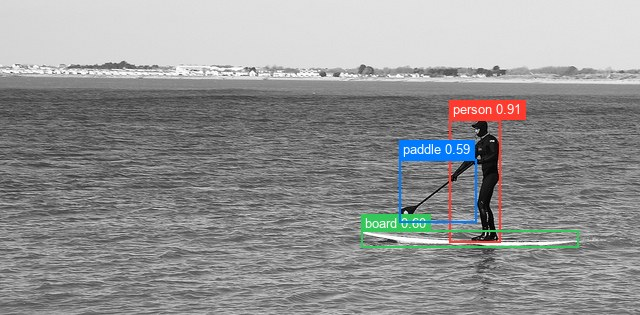
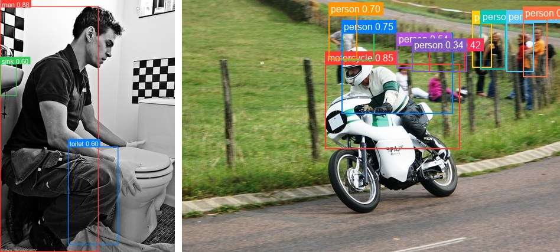

# Grounding DINO

<div style="background:#dff0d8; border:1px solid #cfe6bf; border-radius:3px; padding:12px 16px; color:#2a3a26;">
<b>Weights:</b> the pretrained weights for the Grounding DINO model are hosted on the
kerasformers <a href="https://github.com/IMvision12/KerasFormers/releases/tag/grounding_dino" style="color:#1a5c8a;">grounding_dino</a>
release tag, and download automatically the first time you call
<code>from_weights(...)</code>.
</div>
<br>

Grounding DINO detects objects named by a free-text prompt rather than a fixed label set. A Swin image backbone and a BERT text encoder are fused by a cross-modality encoder, query proposals are selected by image-text similarity, and boxes are refined DINO-style across six decoder layers. Every output box is scored against the prompt's tokens, so the "classes" are whatever you asked for.

Unlike [OWL-ViT](owlvit.md) and [OWLv2](owlv2.md), which score each patch independently against CLIP-style embeddings, Grounding DINO fuses the two modalities throughout the encoder. That generally makes it stronger on phrases and on objects that need context to disambiguate, at a higher compute cost.

**Paper**: [Grounding DINO: Marrying DINO with Grounded Pre-Training for Open-Set Object Detection](https://arxiv.org/abs/2303.05499)

## API

### GroundingDinoForObjectDetection

```python
GroundingDinoForObjectDetection(..., d_model=256, decoder_layers=6,
                                num_queries=900, max_text_len=256,
                                name="GroundingDinoForObjectDetection")
```

The detector: backbone, cross-modality encoder, decoder, and the contrastive class and
box heads. **This is the class for open-set detection.**

Architecture arguments are filled in by `from_weights` from the variant config. The
ones worth knowing:

- **decoder_layers** (`int`, *optional*, defaults to `6`): decoder depth. All six share one bbox head.
- **num_queries** (`int`, *optional*, defaults to `900`): decoder queries, the ceiling on detections per image.
- **max_text_len** (`int`, *optional*, defaults to `256`): prompt token budget the contrastive head pads to.
- **d_model** (`int`, *optional*, defaults to `256`): transformer width.

**Call** `model(inputs)` with the processor's output dict. **Returns** a `dict`:

- **logits** (`(B, num_queries, max_text_len)`): per-query similarity against each prompt token position.
- **pred_boxes** (`(B, num_queries, 4)`): normalized `(cx, cy, w, h)` in `[0, 1]`.
- **last_hidden_state** (`(B, num_queries, d_model)`): final decoder features.

Unlike the closed-set detectors, this is a **subclassed** model, so it accepts varying
input shapes from call to call. No rebuilding to change resolution.

> **Wrap inference in `torch.no_grad()` on the torch backend.** Without it, autograd
> retains every encoder intermediate and the deformable-attention gathers push
> allocation past 14 GB, which will exhaust an 8 GB card even on a single image.

### GroundingDinoModel

```python
GroundingDinoModel(..., name="GroundingDinoModel")
```

The backbone and cross-modality encoder/decoder without detection heads. Use it for
fused image-text features.

### GroundingDinoTextModel / GroundingDinoTokenizer

The BERT text tower and its WordPiece tokenizer, available separately when you only
need the text side.

## Preprocessing

### GroundingDinoProcessor

```python
GroundingDinoProcessor(hf_id=None, shortest_edge=800, longest_edge=1333,
                       tokenizer=None, image_processor=None, variant=None)
```

Tokenizer and image processor behind one callable.

**Parameters**

- **shortest_edge** (`int`, *optional*, defaults to `800`): resize target for the short side.
- **longest_edge** (`int`, *optional*, defaults to `1333`): cap for the long side, preserving aspect ratio.
- **variant** (`str`, *optional*): release variant, used to pick the matching `tokenizer.json`.
- **tokenizer** / **image_processor** (*optional*): pre-built components.

**Call** `processor(images=..., text=...)`. `text` accepts a list of label strings, or a
list of such lists for a batch. **Returns** a `dict` with **input_ids**,
**attention_mask**, **token_type_ids**, **pixel_values**, and **pixel_mask**.

Labels are lowercased and joined into a single `". "`-separated prompt ending in `"."`,
the convention the model was trained on.

**post_process_object_detection**

```python
processor.post_process_object_detection(outputs, threshold=0.3,
                                        target_sizes=None, input_ids=None)
```

Sigmoids the token scores, keeps queries above `threshold`, and converts boxes to pixel
`(x0, y0, x1, y1)` scaled to `target_sizes`. Omitting `target_sizes` leaves boxes
normalized.

**Returns** a list with one `dict` per image holding **scores**, **labels**, and
**boxes**, plus **text_labels** when `input_ids` is supplied.

`labels` is the prompt-**token position** each query matched, which is what the open-set
head actually predicts. This matches the reference implementation's schema. Passing
`input_ids` additionally decodes those positions back to strings.

## Prompt Phrasing

Two habits make a large difference, and both are easy to get wrong:

**Drop the articles.** A query matches a single token, not a span, so in `"a paddle"`
the article can outscore the noun and the detection comes back labelled `"a"`. Removing
articles fixes the label *and* raises the score substantially:

```
["a person", "a paddle", "a paddle board"]  ->  a 0.738, person 0.732, paddle 0.405
["person", "paddle", "board"]               ->  person 0.911, board 0.603, paddle 0.588
```

**Prefer single words.** Because a query matches one token, a multi-word phrase like
"paddle board" is reported by whichever of its tokens scored highest. Use `"board"`
rather than `"paddle board"` when a single word will do.

## Model Variants

| Variant id            | Image backbone | HF original                       |
|-----------------------|----------------|-----------------------------------|
| `grounding_dino_tiny` | Swin-Tiny      | `IDEA-Research/grounding-dino-tiny` |
| `grounding_dino_base` | Swin-Base      | `IDEA-Research/grounding-dino-base` |

Both use the same BERT text encoder and a 6-layer decoder with 900 queries.

## Basic Usage: Open-Set Detection



```python
import torch
from PIL import Image
from kerasformers.models.grounding_dino import (
    GroundingDinoForObjectDetection, GroundingDinoProcessor,
)

model = GroundingDinoForObjectDetection.from_weights("grounding_dino_tiny")
processor = GroundingDinoProcessor.from_weights("grounding_dino_tiny")

image = Image.open("assets/data/coco_paddleboard.jpg").convert("RGB")

# No articles: in "a paddle" the "a" can outscore the noun.
inputs = processor(images=image, text=["person", "paddle", "board"])

with torch.no_grad():          # see the memory note above
    output = model(inputs)
# output["logits"]:     (1, 900, 256)
# output["pred_boxes"]: (1, 900, 4)

results = processor.post_process_object_detection(
    output, threshold=0.3,
    target_sizes=[(image.height, image.width)],
    input_ids=inputs["input_ids"],
)[0]

detections = sorted(
    zip(results["scores"], results["text_labels"], results["boxes"]),
    key=lambda d: -float(d[0]),
)
for score, name, box in detections:
    print(f"{name:8s} {float(score):.3f}  {[round(float(v)) for v in box]}")
```

```
person   0.911  [449, 119, 500, 242]
board    0.603  [361, 230, 578, 247]
paddle   0.588  [399, 159, 476, 222]
```

Note that "paddle" and "board" are not COCO categories. This is the point of an open-set
detector: a closed-set model can offer at best "surfboard" here, and nothing at all for
the paddle.

### Batch Processing Multiple Images

Pass a list of images and a list of label lists. The prompts do not have to match
across images:



```python
import torch
from PIL import Image
from kerasformers.models.grounding_dino import (
    GroundingDinoForObjectDetection, GroundingDinoProcessor,
)

model = GroundingDinoForObjectDetection.from_weights("grounding_dino_tiny")
# Batching a portrait with a landscape pads to the union of both. At the default
# 800/1333 that is ~29k tokens per image, enough to exhaust an 8 GB card.
processor = GroundingDinoProcessor.from_weights(
    "grounding_dino_tiny", shortest_edge=600, longest_edge=1000,
)

paths = ["assets/data/coco_bathroom.jpg", "assets/data/coco_motorcycle.jpg"]
images = [Image.open(p).convert("RGB") for p in paths]
texts = [["man", "toilet", "sink"], ["motorcycle", "helmet", "person"]]

inputs = processor(images=images, text=texts)

with torch.no_grad():
    output = model(inputs)

results = processor.post_process_object_detection(
    output, threshold=0.3,
    target_sizes=[(im.height, im.width) for im in images],
    input_ids=inputs["input_ids"],
)

for path, result in zip(paths, results):
    print(f"\n{path}")
    detections = sorted(
        zip(result["scores"], result["text_labels"], result["boxes"]),
        key=lambda d: -float(d[0]),
    )
    for score, name, box in detections:
        print(f"  {name:11s} {float(score):.3f}  {[round(float(v)) for v in box]}")
```

```
assets/data/coco_bathroom.jpg
  man         0.883  [1, 15, 249, 639]
  sink        0.602  [0, 162, 41, 243]
  toilet      0.598  [172, 372, 299, 620]

assets/data/coco_motorcycle.jpg
  motorcycle  0.852  [242, 108, 470, 252]
  helmet      0.846  [271, 55, 325, 102]
  person      0.752  [270, 55, 458, 192]
  person      0.703  [248, 25, 296, 100]
  person      0.536  [363, 76, 390, 115]
  person      0.461  [491, 39, 524, 114]
  person      0.443  [505, 38, 548, 117]
  person      0.420  [418, 86, 479, 121]
  person      0.410  [549, 38, 595, 121]
  person      0.369  [577, 32, 618, 130]
  person      0.335  [389, 86, 482, 121]
```

`helmet` is not a COCO category, and neither is the distinction it draws from the
rider wearing it. The long tail of low-scoring `person` boxes on the second image is
the crowd of spectators behind the rider.

Images are resized preserving aspect ratio and then padded to the batch's largest size,
with `pixel_mask` marking the real pixels. That is why batching mixed aspect ratios
works here without any manual stacking.

## Input Resolution

Grounding DINO is **subclassed**, not Functional, so one built model handles any input
size. Change the resolution on the processor alone:

```python
processor = GroundingDinoProcessor.from_weights(
    "grounding_dino_tiny", shortest_edge=480, longest_edge=800,
)
```

The default 800/1333 follows the reference implementation. Lowering it is the main lever
if memory is tight, since the deformable-attention cost grows with the token count: 800
on the short side gives roughly 20k tokens for a landscape image.

## Data Format

**Both the model and the processor support `channels_last` and `channels_first`.**

| | How it picks the format |
|---|---|
| Processors | A `data_format` kwarg, per instance. `None` (the default) resolves to `keras.config.image_data_format()`. |
| Models | Read `keras.config.image_data_format()` when they are **constructed**. There is no `data_format` argument. |

Set the global format before constructing the model and both sides agree:

```python
import keras

keras.config.set_image_data_format("channels_first")

model = GroundingDinoForObjectDetection.from_weights("grounding_dino_tiny")
processor = GroundingDinoProcessor.from_weights("grounding_dino_tiny")
```

Detections are identical under either layout; only the tensor shape changes. The
post-processor emits `xyxy` pixel boxes and token positions, so it takes no
`data_format` kwarg.

## Loading Fine-tuned and Community Weights

Any Hugging Face repo whose `model_type` is `"grounding-dino"` loads directly with the
`hf:` prefix.

```python
from kerasformers.models.grounding_dino import GroundingDinoForObjectDetection

# The original IDEA-Research checkpoints
model = GroundingDinoForObjectDetection.from_weights("hf:IDEA-Research/grounding-dino-tiny")

# Somebody's fine-tune
model = GroundingDinoForObjectDetection.from_weights("hf:<user>/grounding-dino-finetune")
```

No shape arguments are needed. The architecture is read from the repo's `config.json`.
Both model classes accept `hf:`, as do `GroundingDinoProcessor`,
`GroundingDinoImageProcessor`, and `GroundingDinoTokenizer`:

```python
processor = GroundingDinoProcessor.from_weights("hf:IDEA-Research/grounding-dino-tiny")
```

Loading `hf:IDEA-Research/grounding-dino-tiny` and the `grounding_dino_tiny` release
variant produces identical outputs, since they are the same checkpoint by two routes.
