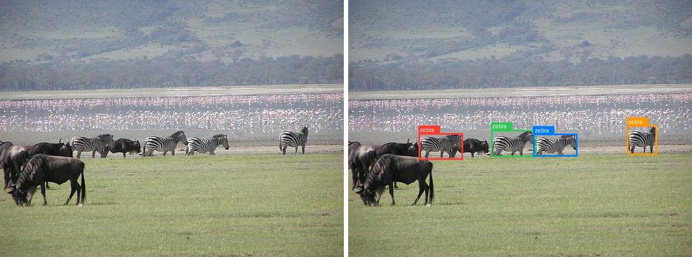
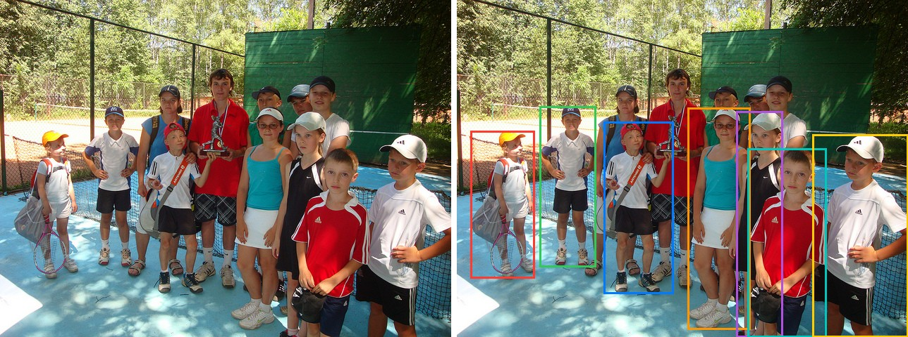
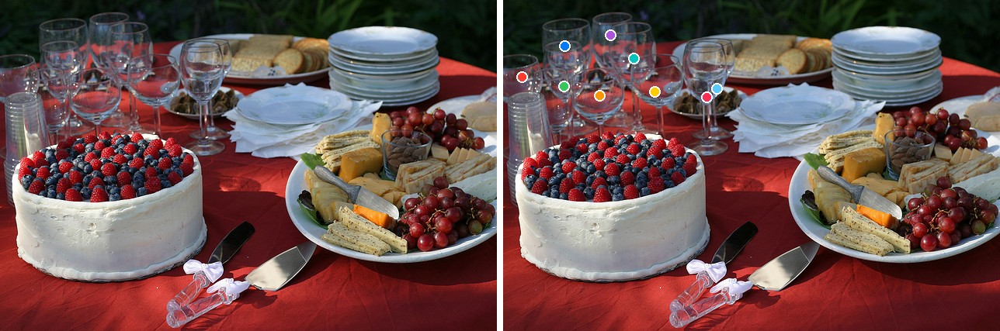
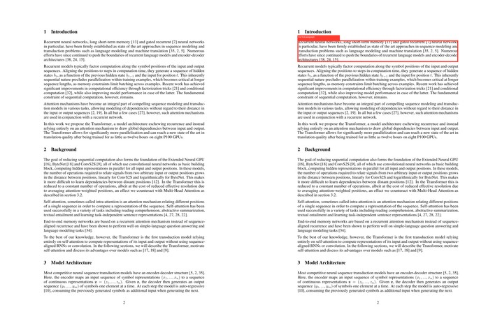
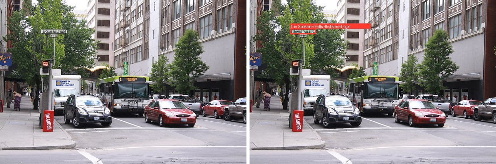
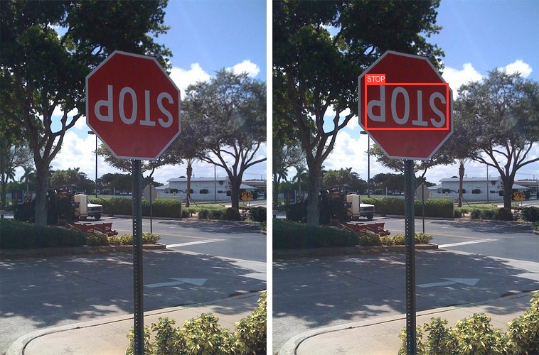

# LocateAnything

<div style="background:#dff0d8; border:1px solid #cfe6bf; border-radius:3px; padding:12px 16px; color:#2a3a26;">
<b>Weights:</b> the pretrained weights for LocateAnything-3B are hosted on the
kerasformers <a href="https://github.com/IMvision12/KerasFormers/releases/tag/locate" style="color:#1a5c8a;">locate</a>
release tag, and download automatically the first time you call
<code>from_weights(...)</code>.
</div>
<br>

LocateAnything-3B is NVIDIA's visual-grounding VLM: a native-resolution **MoonViT**
vision tower and a small connector feed a **Qwen2.5-3B** decoder, and the model answers
in **boxes and points** rather than prose. One checkpoint covers a whole family of
grounding tasks, chosen entirely by the instruction you give it: detection, multi-object
referring, pointing, layout grounding, GUI/text grounding, and OCR.

Coordinates come out as **quantized `[0, 1000]` tokens**, not spelled-out digits, and the
model uses **Parallel Box Decoding (PBD)** to emit a whole box in a couple of steps
instead of one digit at a time. Divide a coordinate by 1000 and multiply by the image
width or height to get pixels.

**Model card**: [nvidia/LocateAnything-3B](https://huggingface.co/nvidia/LocateAnything-3B)

## API

| Class | What it is |
|---|---|
| `LocateAnythingGenerate` | the full model with the tied LM head and `generate`. **This is the one you want.** |
| `LocateAnythingModel` | backbone only (no LM head). |
| `LocateAnythingVisionModel` | the MoonViT tower alone. |
| `LocateAnythingProcessor` | image + text to model inputs. |
| `LocateAnythingTokenizer` | Qwen2.5 BPE extended with the grounding tokens, plus `parse_*`. |
| `LocateAnythingImageProcessor` | the native-resolution MoonViT patch preprocessor. |

`from_weights("locateanything_3b")` loads any of them. The 3B decoder is large; load it in
bf16 (`load_dtype="bfloat16"`) unless you have the memory for fp32.

### Building an instruction

```python
from kerasformers.models.locateanything import locate_prompt

locate_prompt("detection", "car")   # -> "Locate all the instances ...: car."
```

`locate_prompt(task, text)` returns the verbatim instruction string for each task. The
tasks are `detection`, `referring`, `phrase_grounding`, `pointing`, `layout`,
`text_grounding`, and `ocr`; `text` fills the category or phrase (a list is joined with
the model's `</c>` separator) and is ignored by `ocr`.

### Reading the answer

The tokenizer turns the generated ids into structured results:

- **parse_boxes(ids)** -> `[[x1, y1, x2, y2], ...]` in `[0, 1000]`. Use for detection.
- **parse_points(ids)** -> `[[x, y], ...]` in `[0, 1000]`. Use for pointing.
- **parse_grounding(ids)** -> `[{"label": str | None, "box"/"point": [...]}, ...]`, pairing each `<ref>` label with the box or point that follows. Use for referring, layout, text grounding, and OCR.

## Shared Setup

Every task below reuses one loaded model, processor, and a tiny helper that scales a
`[0, 1000]` box to pixels for drawing:

```python
import os
os.environ["KERAS_BACKEND"] = "torch"   # or "jax" / "tensorflow"

import keras
import numpy as np
from PIL import Image, ImageDraw
from kerasformers.models.locateanything import (
    LocateAnythingGenerate, LocateAnythingProcessor, locate_prompt,
)

model = LocateAnythingGenerate.from_weights("locateanything_3b", load_dtype="bfloat16")
processor = LocateAnythingProcessor.from_weights("locateanything_3b")

def run(task, image, text="", **gen):
    prompt = locate_prompt(task, text)
    inputs = processor(conversation=[{
        "role": "user",
        "content": [{"type": "image", "image": image}, {"type": "text", "text": prompt}],
    }])
    out = model.generate(**inputs, max_new_tokens=192,
                         tokenizer=processor.tokenizer, **gen)
    return np.asarray(keras.ops.convert_to_numpy(out))[0].tolist()   # generated ids

def to_px(box, w, h):
    return [box[0] / 1000 * w, box[1] / 1000 * h, box[2] / 1000 * w, box[3] / 1000 * h]
```

## Detection



Give a category and get every instance of it. The answer is a flat list of boxes, so read
it with `parse_boxes`.

```python
image = Image.open("assets/data/coco_herd_field.jpg").convert("RGB")
ids = run("detection", image, "zebra")

boxes = processor.tokenizer.parse_boxes(ids)
print(len(boxes), boxes[0])
```

```
4 [205, 519, 333, 621]
```

Four zebras, each box in the `[0, 1000]` grid, and the wildebeest in the same frame are
left out. Pass a list of categories to detect several at once,
`locate_prompt("detection", ["zebra", "wildebeest"])`.

## Multi-Object Referring



Referring returns every instance that matches a phrase, each paired with its label, so
read it with `parse_grounding`. The phrase can describe the instances rather than name a
category, which is what separates it from plain detection.

```python
image = Image.open("assets/data/coco_children_pool.jpg").convert("RGB")
ids = run("referring", image, "a child wearing a cap")

for r in processor.tokenizer.parse_grounding(ids):
    print(r["label"], r["box"])
```

```
a child wearing a cap [31, 388, 173, 827]
a child wearing a cap [184, 315, 309, 792]
a child wearing a cap [325, 362, 481, 871]
a child wearing a cap [512, 319, 650, 979]
a child wearing a cap [619, 331, 723, 1000]
a child wearing a cap [645, 440, 819, 1000]
a child wearing a cap [788, 398, 1000, 1000]
```

Seven of the children come back and the bare-headed ones are skipped, out of a group of
more than a dozen. Use `phrase_grounding` instead when you want a **single** best instance
rather than all of them.

## Pointing



Pointing returns coordinates instead of boxes, a `<box>` carrying two numbers rather than
four, so read it with `parse_points`.

```python
image = Image.open("assets/data/coco_buffet.jpg").convert("RGB")
ids = run("pointing", image, "a wine glass")

points = processor.tokenizer.parse_points(ids)
print(len(points), points[0])
```

```
9 [38, 234]
```

Nine glasses, one point each, in the `[0, 1000]` grid, picked out of a crowded table
without touching the cake, plates, or platter. Pointing scales to counts that would be
tedious to box: `"a strawberry on the cake"` on the same image returns 47 points.

## Layout Grounding



Layout grounding locates the single region that matches a description, which is what you
use to pick a block out of a document page, a caption, a paragraph, a section. Here it
finds the first paragraph on the second page of *Attention Is All You Need*.

```python
image = Image.open("assets/data/attention_paper_p2.jpg").convert("RGB")
ids = run("layout", image, "the first paragraph")

print(processor.tokenizer.parse_grounding(ids))
```

```
[{'label': 'the first paragraph', 'box': [176, 126, 823, 193]}]
```

Name a section instead, `"the Background section"`, and it returns the tight box around
that heading (`[176, 460, 309, 474]`) rather than the whole block.

## GUI / Text Grounding



`text_grounding` locates a named piece of text or a named UI element, which is how GUI
grounding ("select the crop tool") works: point the same call at a screenshot and name
the control.

```python
image = Image.open("assets/data/coco_city_bus.jpg").convert("RGB")
ids = run("text_grounding", image, "the Spokane Falls Blvd street sign")

print(processor.tokenizer.parse_grounding(ids))
```

```
[{'label': 'the Spokane Falls Blvd street sign.', 'box': [166, 175, 270, 208]}]
```

It picks the one named sign out of a street full of text. Asking for `"the DON'T WALK
sign"` instead returns `[167, 364, 200, 406]`, the signal head below it.

## OCR



OCR detects every piece of text and returns each string with its box. The prompt takes no
argument.

```python
image = Image.open("assets/data/coco_stop_sign.jpg").convert("RGB")
ids = run("ocr", image)

for r in processor.tokenizer.parse_grounding(ids):
    print(repr(r["label"]), r["box"])
```

```
'STOP' [348, 235, 660, 364]
```

The sign is mounted upside down and the model still reads it, returning the one text
region in the frame with its box. On a scene with more signage it returns one entry per
piece of text the same way.

## Drawing the Results

The figures above overlay the parsed boxes and points on the original. The box variant:

```python
def draw(image, results):
    out = image.convert("RGB").copy()
    d, (w, h) = ImageDraw.Draw(out), out.size
    for r in results:
        if "point" in r:
            x, y = r["point"][0] / 1000 * w, r["point"][1] / 1000 * h
            d.ellipse([x - 6, y - 6, x + 6, y + 6], fill=(255, 59, 48))
        else:
            d.rectangle(to_px(r["box"], w, h), outline=(255, 59, 48), width=3)
            if r.get("label"):
                d.text((r["box"][0] / 1000 * w, r["box"][1] / 1000 * h - 12), r["label"])
    return out

draw(image, processor.tokenizer.parse_grounding(ids)).save("assets/locate_result.jpg")
```

## Decoding Modes

LocateAnything emits coordinates as quantized `[0, 1000]` tokens and can decode a box in
parallel (PBD) instead of one token at a time. `generate` exposes three modes through
`generation_mode`:

| Mode | What it does |
|---|---|
| `"hybrid"` (default) | multi-token box prediction with an autoregressive fallback; the fastest that stays faithful. |
| `"fast"` | multi-token prediction only. Fewest steps, occasionally coarser. |
| `"slow"` | pure autoregressive. The reference behaviour, one token per step. |

The `run` helper from the shared setup forwards any extra keyword to `generate`:

```python
image = Image.open("assets/data/coco_herd_field.jpg").convert("RGB")
ids = run("detection", image, "zebra", generation_mode="fast")
boxes = processor.tokenizer.parse_boxes(ids)   # parse exactly as before
```

The vision tower runs once and is cached across the decoding steps, so the per-box cost is
dominated by the decoder, which is what the parallel modes cut. The modes trade steps for
fidelity, so keep the default `hybrid` unless you have measured that `fast` is good enough
for your inputs.

## Several Images

Because MoonViT keeps every image at its native resolution, the cleanest way to process
several images is to loop, one grounding call each, which also lets each image carry a
different task:

```python
jobs = [
    ("detection", "coco_herd_field.jpg", "zebra"),
    ("pointing", "coco_buffet.jpg", "a wine glass"),
]
for task, name, text in jobs:
    ids = run(task, Image.open(f"assets/data/{name}").convert("RGB"), text)
    print(name, processor.tokenizer.parse_grounding(ids))
```

```
coco_herd_field.jpg [{'label': 'zebra', 'box': [205, 519, 333, 621]}, ...]
coco_buffet.jpg [{'label': 'a wine glass', 'point': [38, 234]}, ...]
```

> **LocateAnything is a grounding specialist, not a chat model.** Its decoder is trained
> to emit boxes and points, and free-form questions come back garbled. Keep the prompts to
> the grounding tasks above; for general vision-language chat use a model built for it,
> such as [Qwen3-VL](qwen3_vl.md).

## Lower Memory

The 3B decoder loads in bf16 or weight-only quantized. See [quantization.md](quantization.md):

```python
model = LocateAnythingGenerate.from_weights(
    "locateanything_3b", quantization="int8", low_memory=True, load_dtype="bfloat16"
)
```

## Data Format

Coordinates are always returned in the `[0, 1000]` grid, independent of
`keras.config.image_data_format()`. The MoonViT tower keeps each image at its native
resolution (up to `in_token_limit` patches), so images of different sizes batch without
padding to a common shape.

See also [kimi_k25.md](kimi_k25.md), which shares the MoonViT vision tower.
