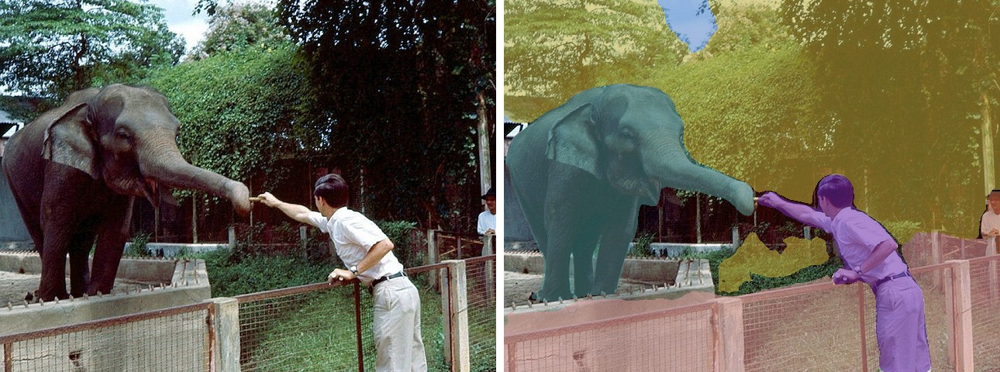
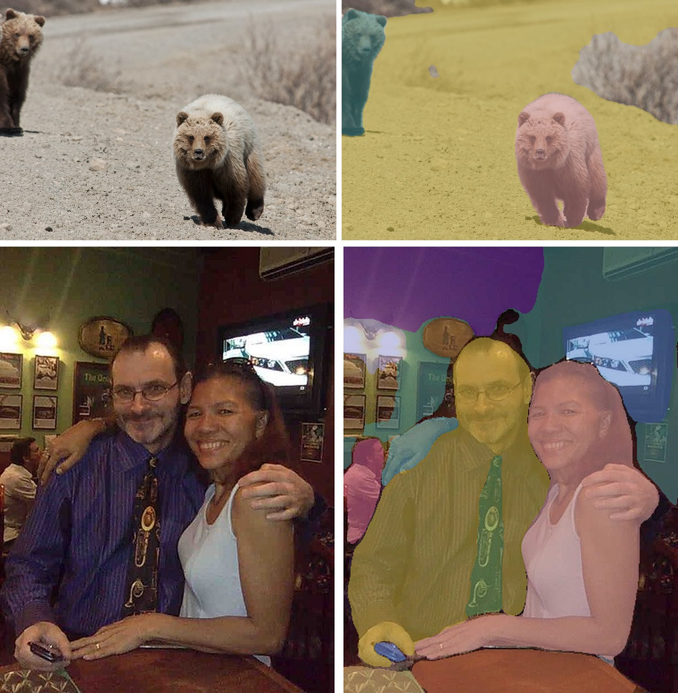

# Mask2Former

<div style="background:#dff0d8; border:1px solid #cfe6bf; border-radius:3px; padding:12px 16px; color:#2a3a26;">
<b>Weights:</b> the pretrained weights for the Mask2Former model are hosted on the
kerasformers <a href="https://github.com/IMvision12/KerasFormers/releases/tag/mask2former" style="color:#1a5c8a;">mask2former</a>
release tag, and download automatically the first time you call
<code>from_weights(...)</code>.
</div>
<br>

Mask2Former keeps [MaskFormer](maskformer.md)'s formulation, a fixed set of (mask, class) query predictions, and fixes the part that made it slow to train: attention.

In MaskFormer each query attends over the entire image, most of which is irrelevant to the region it will eventually own. Mask2Former uses **masked attention**, restricting each query's cross-attention to the area inside its own predicted mask from the previous layer. Queries specialize sooner, training converges faster, and accuracy improves across all three segmentation tasks. It also feeds the decoder multi-scale features in a round-robin so small objects are not lost.

**Paper**: [Masked-attention Mask Transformer for Universal Image Segmentation](https://arxiv.org/abs/2112.01527)

## API

### Mask2FormerUniversalSegment

```python
Mask2FormerUniversalSegment(..., name="Mask2FormerUniversalSegment")
```

Swin backbone, multi-scale deformable pixel decoder, and the masked-attention
transformer decoder. **This is the class for segmentation.**

Architecture arguments are filled in by `from_weights` from the variant config.

**Call** `model(pixel_values, training=False)`. **Returns** a `dict`:

- **class_queries_logits** (`(B, 100, num_classes + 1)`): one class distribution per query, with a trailing "no object" column.
- **masks_queries_logits** (`(B, 100, H/4, W/4)`): one binary mask logit map per query.

The output format is identical to MaskFormer's, which is why both share the same
post-processors.

### Mask2FormerModel

```python
Mask2FormerModel(backbone_embed_dim=96, backbone_depths=(2, 2, 6, 2),
                 backbone_num_heads=(3, 6, 12, 24), backbone_window_size=12,
                 hidden_dim=256, mask_feature_size=256, encoder_num_layers=6,
                 ..., name="Mask2FormerModel")
```

The backbone and pixel decoder without the query heads.

## Preprocessing

### Mask2FormerImageProcessor

```python
Mask2FormerImageProcessor(target_size=384, image_mean=None, image_std=None,
                          data_format=None)
```

Resizes the longest edge to `target_size` preserving aspect ratio, pads to a square
canvas, rescales, and normalizes with ImageNet statistics.

**Parameters**

- **target_size** (`int`, *optional*, defaults to `384`): square canvas edge, matching the model's `image_size`.
- **image_mean** / **image_std** (`tuple`, *optional*): defaults to the ImageNet statistics.
- **data_format** (`str`, *optional*): `"channels_last"` or `"channels_first"`.

**post_process_panoptic_segmentation**

```python
processor.post_process_panoptic_segmentation(outputs, target_size,
                                             threshold=0.8, mask_threshold=0.5,
                                             overlap_mask_area_threshold=0.8,
                                             stuff_classes=None,
                                             label_names=None)
```

Resolves the queries into one non-overlapping map. **Returns** a `dict` with
**segmentation** `(H, W)` `int32` (`-1` where nothing survived) and **segments_info**
entries carrying `id`, `label_id`, `label_name`, and `score`.

**post_process_semantic_segmentation**

```python
processor.post_process_semantic_segmentation(outputs, target_sizes=None,
                                             label_names=None)
```

Fuses queries by class. Takes **`target_sizes`** (a list) and returns a list of
`(H, W)` arrays, unlike the panoptic method's singular `target_size`.

Both delegate to MaskFormer's implementations, since the output format is the same.
`label_names` defaults to the label set matching the head width.

## Model Variants

| Variant id                            | Backbone   | Task      | Training set |
|---------------------------------------|------------|-----------|--------------|
| `mask2former-swin-tiny-coco-instance`  | Swin-Tiny  | instance  | COCO         |
| `mask2former-swin-small-coco-instance` | Swin-Small | instance  | COCO         |
| `mask2former-swin-base-coco-instance`  | Swin-Base  | instance  | COCO         |
| `mask2former-swin-large-coco-instance` | Swin-Large | instance  | COCO         |
| `mask2former-swin-tiny-coco-panoptic`  | Swin-Tiny  | panoptic  | COCO         |
| `mask2former-swin-tiny-ade-semantic`   | Swin-Tiny  | semantic  | ADE20K       |

The task suffix is what the checkpoint was **trained** for. The architecture is the
same in every case, so a panoptic checkpoint can still be post-processed semantically,
but a checkpoint trained for instance segmentation has no stuff classes to offer.

## Basic Usage: Panoptic Segmentation



Each figure is the original image beside the predicted segmentation overlaid on it.


```python
import keras
import numpy as np
from PIL import Image
from kerasformers.models.mask2former import (
    Mask2FormerImageProcessor, Mask2FormerUniversalSegment,
)

model = Mask2FormerUniversalSegment.from_weights("mask2former-swin-tiny-coco-panoptic")
processor = Mask2FormerImageProcessor()

image = Image.open("assets/data/coco_elephant_trainer.jpg").convert("RGB")
output = model(processor(image)["pixel_values"], training=False)
# output["class_queries_logits"]: (1, 100, 134)
# output["masks_queries_logits"]: (1, 100, 96, 96)

result = processor.post_process_panoptic_segmentation(
    output, target_size=(image.height, image.width)
)
seg = np.asarray(keras.ops.convert_to_numpy(result["segmentation"]))

for s in result["segments_info"]:
    print(f"{s['label_name']:28s} {int((seg == s['id']).sum())} px  score {s['score']:.3f}")
```

```
stuff: window-blind             138787 px
stuff: window-other             65415 px
things: elephant                47346 px
things: person                  18440 px
stuff: fence-merged             3434 px
things: person                  1311 px
```

Two separate `person` segments, one large and one small, each with its own id. A
semantic model would merge them into a single `person` region.

### Batch Processing Multiple Images



Post-process one image at a time, since each has its own target size:

```python
import keras
import numpy as np
from PIL import Image
from kerasformers.models.mask2former import (
    Mask2FormerImageProcessor, Mask2FormerUniversalSegment,
)

model = Mask2FormerUniversalSegment.from_weights("mask2former-swin-tiny-coco-panoptic")
processor = Mask2FormerImageProcessor()

paths = ["assets/data/coco_bear_cub.jpg", "assets/data/coco_couple.jpg"]

for path in paths:
    image = Image.open(path).convert("RGB")
    output = model(processor(image)["pixel_values"], training=False)
    result = processor.post_process_panoptic_segmentation(
        output, target_size=(image.height, image.width)
    )
    seg = np.asarray(keras.ops.convert_to_numpy(result["segmentation"]))
    print(f"\n{path}")
    for s in result["segments_info"][:6]:
        print(f"  {s['label_name']:28s} {int((seg == s['id']).sum())} px")
```

```
assets/data/coco_bear_cub.jpg
  stuff: dirt-merged               213329 px
  things: bear                     35128 px
  things: bear                     14020 px

assets/data/coco_couple.jpg
  things: person                   42659 px
  things: person                   40521 px
  stuff: wall-other-merged         24970 px
  stuff: tree-merged               18400 px
  things: tv                       10321 px
  things: dining table             10061 px
```

The first image finds **two bears**, one in the foreground and a smaller one behind,
as separate segments. The second yields 13 segments in total, including a `tie`, a
`handbag`, a `clock` and a `cell phone` alongside the two people.

## Data Format

**Both the model and the processor support `channels_last` and `channels_first`.**

| | How it picks the format |
|---|---|
| Processors | A `data_format` kwarg, per instance. `None` (the default) resolves to `keras.config.image_data_format()`. |
| Models | Read `keras.config.image_data_format()` when they are **constructed**. There is no `data_format` argument. |

The post-processors emit `(H, W)` label maps and segment metadata, so they take no
`data_format` kwarg.

## Loading Fine-tuned and Community Weights

Any Hugging Face repo whose `model_type` is `"mask2former"` loads with the `hf:` prefix.

```python
from kerasformers.models.mask2former import Mask2FormerUniversalSegment

model = Mask2FormerUniversalSegment.from_weights(
    "hf:facebook/mask2former-swin-tiny-coco-panoptic"
)
model = Mask2FormerUniversalSegment.from_weights("hf:<user>/mask2former-finetuned")

# Architecture only, randomly initialized
model = Mask2FormerUniversalSegment.from_weights(
    "mask2former-swin-tiny-coco-panoptic", load_weights=False,
)
```

See also [MaskFormer](maskformer.md), the predecessor whose post-processors this model
shares, and [OneFormer](oneformer.md), which conditions one checkpoint on the task.
