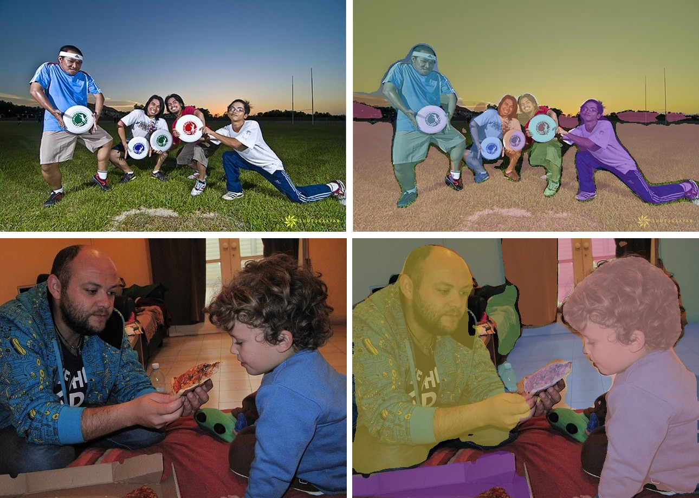

# MaskFormer

<div style="background:#dff0d8; border:1px solid #cfe6bf; border-radius:3px; padding:12px 16px; color:#2a3a26;">
<b>Weights:</b> the pretrained weights for the MaskFormer model are hosted on the
kerasformers <a href="https://github.com/IMvision12/KerasFormers/releases/tag/maskformer" style="color:#1a5c8a;">maskformer</a>
release tag, and download automatically the first time you call
<code>from_weights(...)</code>.
</div>
<br>

MaskFormer's insight is in its title: per-pixel classification is not the only way to segment. Instead of labelling every pixel independently, it predicts a fixed set of **binary masks**, each paired with one class. A DETR-style transformer decoder turns 100 learned queries into 100 (mask, class) pairs, and how you combine them decides the task.

Fuse the masks by class and you get semantic segmentation. Keep them separate and resolve overlaps and you get panoptic. One trained model, both outputs, which is what "universal segmentation" means here.

**Paper**: [Per-Pixel Classification is Not All You Need for Semantic Segmentation](https://arxiv.org/abs/2107.06278)

## API

### MaskFormerUniversalSegment

```python
MaskFormerUniversalSegment(backbone_embed_dim=96, backbone_depths=(2, 2, 6, 2),
                           backbone_num_heads=(3, 6, 12, 24),
                           backbone_window_size=7, fpn_feature_size=256,
                           mask_feature_size=256, decoder_d_model=256, ...,
                           name="MaskFormerUniversalSegment")
```

Swin backbone, pixel decoder, and transformer decoder producing per-query masks and
classes. **This is the class for segmentation.**

Architecture arguments are filled in by `from_weights` from the variant config. The
ones worth knowing:

- **backbone_embed_dim** (`int`, *optional*, defaults to `96`): Swin width. `128` for the base variants.
- **backbone_depths** (`tuple`, *optional*, defaults to `(2, 2, 6, 2)`): Swin stage depths.
- **backbone_window_size** (`int`, *optional*, defaults to `7`): Swin attention window. `12` for base.
- **mask_feature_size** (`int`, *optional*, defaults to `256`): width of the per-pixel embedding the masks are dotted against.

**Call** `model(pixel_values, training=False)`. **Returns** a `dict`:

- **class_queries_logits** (`(B, 100, num_classes + 1)`): one class distribution per query, with a trailing "no object" column.
- **masks_queries_logits** (`(B, 100, H/4, W/4)`): one binary mask logit map per query.

Neither is usable directly: the post-processors fuse them into a label map.

### MaskFormerModel

The backbone and pixel decoder without the query heads.

## Preprocessing

### MaskFormerImageProcessor

```python
MaskFormerImageProcessor(target_size=None, image_mean=None, image_std=None,
                         data_format=None, variant=None)
```

Resizes the longest edge to `target_size` preserving aspect ratio, pads to a square
canvas, rescales, and normalizes with ImageNet statistics.

> **Prefer `MaskFormerImageProcessor.from_weights(variant)`.** The COCO checkpoints
> build at 384 and the ADE ones at 512, so a fixed default mismatches the model for one
> of the two and the forward pass raises on shape.

**Parameters**

- **variant** (`str`, *optional*): release variant whose resolution to adopt.
- **target_size** (`int`, *optional*): square canvas edge, overriding `variant`. Falls back to `512`.
- **image_mean** / **image_std** (`tuple`, *optional*): defaults to the ImageNet statistics.
- **data_format** (`str`, *optional*): `"channels_last"` or `"channels_first"`.

**post_process_panoptic_segmentation**

```python
processor.post_process_panoptic_segmentation(outputs, target_size,
                                             threshold=0.8, mask_threshold=0.5,
                                             overlap_mask_area_threshold=0.8,
                                             stuff_classes=None,
                                             label_names=None)
```

Resolves the 100 queries into one non-overlapping map. **Returns** a `dict`:

- **segmentation** (`(H, W)` `int32`): the segment id per pixel, `-1` where nothing survived.
- **segments_info**: one entry per segment with `id`, `label_id`, `label_name`, and `score`.

`label_names` defaults to the label set matching the head width, so COCO panoptic's 133
classes resolve automatically.

**post_process_semantic_segmentation**

```python
processor.post_process_semantic_segmentation(outputs, target_sizes=None,
                                             label_names=None)
```

Fuses queries by class instead. Note this one takes **`target_sizes`** (a list) and
returns a list of `(H, W)` arrays, unlike the panoptic method's singular `target_size`.

## Model Variants

| Variant id                   | Backbone   | Training set   | Resolution |
|------------------------------|------------|----------------|-----------:|
| `maskformer-swin-tiny-coco`  | Swin-Tiny  | COCO panoptic  |        384 |
| `maskformer-swin-small-coco` | Swin-Small | COCO panoptic  |        384 |
| `maskformer-swin-base-coco`  | Swin-Base  | COCO panoptic  |        384 |
| `maskformer-swin-tiny-ade`   | Swin-Tiny  | ADE20K         |        512 |
| `maskformer-swin-base-ade`   | Swin-Base  | ADE20K         |        512 |

The COCO variants use the 133-class panoptic vocabulary, which splits into `things`
(countable objects) and `stuff` (amorphous regions like sea or grass).

## Basic Usage: Panoptic Segmentation


Each figure is the original image beside the predicted segmentation overlaid on it.


```python
import keras
import numpy as np
from PIL import Image
from kerasformers.models.maskformer import (
    MaskFormerImageProcessor, MaskFormerUniversalSegment,
)

model = MaskFormerUniversalSegment.from_weights("maskformer-swin-tiny-coco")
processor = MaskFormerImageProcessor.from_weights("maskformer-swin-tiny-coco")  # 384

image = Image.open("assets/data/coco_surfer_wave.jpg").convert("RGB")
output = model(processor(image)["pixel_values"], training=False)
# output["class_queries_logits"]: (1, 100, 134)
# output["masks_queries_logits"]: (1, 100, 96, 96)

result = processor.post_process_panoptic_segmentation(
    output, target_size=(image.height, image.width)
)
seg = np.asarray(keras.ops.convert_to_numpy(result["segmentation"]))

for s in result["segments_info"]:
    area = int((seg == s["id"]).sum())
    print(f"{s['label_name']:22s} {area} px  score {s['score']:.3f}")
```

```
stuff: sea             253647 px
things: person         9075 px
things: surfboard      3853 px
```

The `stuff:` and `things:` prefixes come from COCO panoptic's vocabulary. `sea` is
stuff, a region with no instance identity; `person` and `surfboard` are things, and two
surfers would be two separate segments rather than one merged region. That distinction
is exactly what semantic segmentation cannot express.

### Batch Processing Multiple Images



Post-process one image at a time, since each has its own target size:

```python
import keras
import numpy as np
from PIL import Image
from kerasformers.models.maskformer import (
    MaskFormerImageProcessor, MaskFormerUniversalSegment,
)

model = MaskFormerUniversalSegment.from_weights("maskformer-swin-tiny-coco")
processor = MaskFormerImageProcessor.from_weights("maskformer-swin-tiny-coco")

paths = ["assets/data/coco_frisbee.jpg", "assets/data/coco_pizza_kid.jpg"]

for path in paths:
    image = Image.open(path).convert("RGB")
    output = model(processor(image)["pixel_values"], training=False)
    result = processor.post_process_panoptic_segmentation(
        output, target_size=(image.height, image.width)
    )
    seg = np.asarray(keras.ops.convert_to_numpy(result["segmentation"]))
    print(f"\n{path}")
    for s in result["segments_info"][:6]:
        print(f"  {s['label_name']:26s} {int((seg == s['id']).sum())} px")
```

```
assets/data/coco_frisbee.jpg
  stuff: fence-merged               68765 px
  stuff: grass-merged               48836 px
  things: person                    13086 px
  things: person                    9910 px
  things: person                    2822 px
  things: person                    2274 px

assets/data/coco_pizza_kid.jpg
  things: person                    88764 px
  things: person                    74544 px
  stuff: wall-other-merged          24413 px
  stuff: cardboard                  18209 px
  stuff: floor-other-merged         17554 px
  stuff: door-stuff                 13612 px
```

The frisbee image yields 14 segments in total, including **five separate `person`
entries and four separate `frisbee` entries**. Every one is its own segment with its own
id, which is the whole point of panoptic over semantic.

## Data Format

**Both the model and the processor support `channels_last` and `channels_first`.**

| | How it picks the format |
|---|---|
| Processors | A `data_format` kwarg, per instance. `None` (the default) resolves to `keras.config.image_data_format()`. |
| Models | Read `keras.config.image_data_format()` when they are **constructed**. There is no `data_format` argument. |

The post-processors emit `(H, W)` label maps and segment metadata, so they take no
`data_format` kwarg.

## Custom Class Names

A model fine-tuned on your own dataset predicts your class indices:

```python
result = processor.post_process_panoptic_segmentation(
    output, target_size=(image.height, image.width),
    label_names=["background", "road", "building"],
)
```

Without it the post-processor picks COCO panoptic, ADE20K, or Cityscapes names from the
head width, and falls back to `class_57` placeholders when the width matches none of
them.

## Loading Fine-tuned and Community Weights

Any Hugging Face repo whose `model_type` is `"maskformer"` loads with the `hf:` prefix.

```python
from kerasformers.models.maskformer import MaskFormerUniversalSegment

model = MaskFormerUniversalSegment.from_weights("hf:facebook/maskformer-swin-tiny-coco")
model = MaskFormerUniversalSegment.from_weights("hf:<user>/maskformer-finetuned")

# Architecture only, randomly initialized
model = MaskFormerUniversalSegment.from_weights(
    "maskformer-swin-tiny-coco", load_weights=False,
)
```

See also [Mask2Former](mask2former.md), the direct successor with masked attention, and
[OneFormer](oneformer.md), which adds task conditioning to the same idea.
