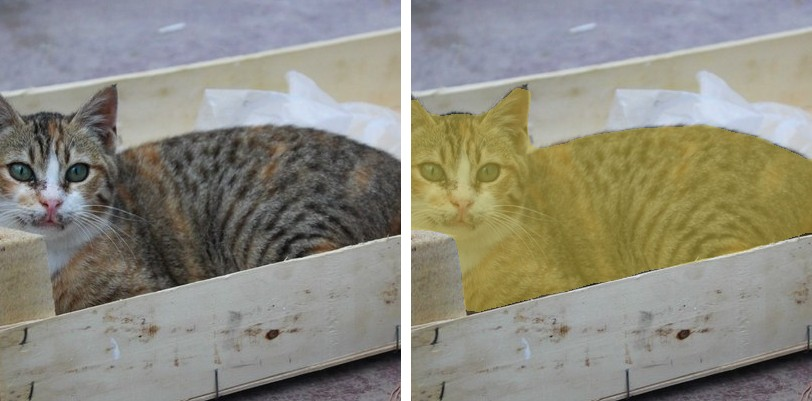
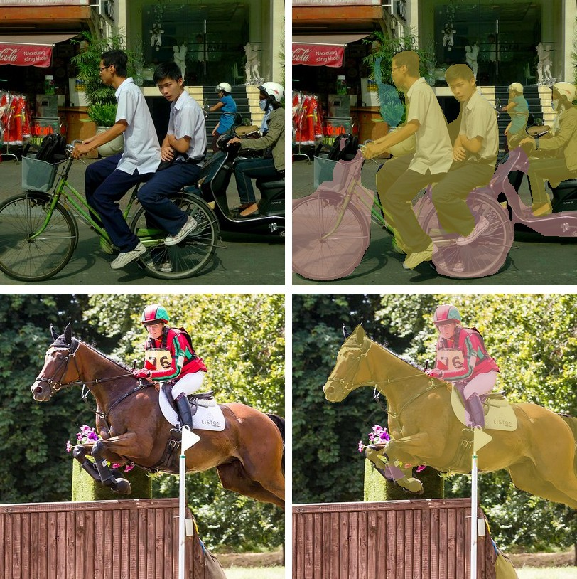

# MobileViT

<div style="background:#dff0d8; border:1px solid #cfe6bf; border-radius:3px; padding:12px 16px; color:#2a3a26;">
<b>Weights:</b> the pretrained weights for the MobileViT model are hosted on the
kerasformers <a href="https://github.com/IMvision12/KerasFormers/releases/tag/mobilevit" style="color:#1a5c8a;">mobilevit</a>
release tag, and download automatically the first time you call
<code>from_weights(...)</code>.
</div>
<br>

MobileViT interleaves MobileNetV2 inverted-residual blocks with small transformer blocks. The convolutions carry local detail cheaply, and the transformer blocks give global context where it is worth paying for, so the model stays mobile-sized without giving up long-range receptive field.

The library exposes it for two tasks: ImageNet classification, and semantic segmentation via a DeepLabV3 head bolted onto the same backbone. **The two use different resolutions**, 256 for classification and 512 for segmentation, which is the one practical trap here. See [Input Resolution](#input-resolution).

**Paper**: [MobileViT: Light-weight, General-purpose, and Mobile-friendly Vision Transformer](https://arxiv.org/abs/2110.02178)

For the second-generation model with separable self-attention, see
[MobileViTV2](mobilevitv2.md).

## API

### MobileViTSemanticSegment

```python
MobileViTSemanticSegment(initial_dims=16, head_dims=320,
                         block_dims=(16, 24, 48, 64, 80),
                         expansion_ratio=(2.0, 2.0, 2.0, 2.0, 2.0),
                         attention_dims=(None, None, 64, 80, 96),
                         image_size=512, output_stride=16,
                         atrous_rates=(6, 12, 18), aspp_out_channels=512,
                         num_classes=21, input_tensor=None,
                         name="MobileViTSemanticSegment")
```

The MobileViT backbone plus a DeepLabV3 ASPP head. **This is the class for semantic
segmentation.**

**Parameters**

- **num_classes** (`int`, *optional*, defaults to `21`): Pascal VOC's 20 classes plus background.
- **image_size** (`int`, *optional*, defaults to `512`): segmentation resolution, not the classification 256.
- **output_stride** (`int`, *optional*, defaults to `16`): backbone downsampling, reduced from 32 so the head keeps spatial detail.
- **atrous_rates** (`tuple`, *optional*, defaults to `(6, 12, 18)`): ASPP dilation rates.
- **aspp_out_channels** (`int`, *optional*, defaults to `512`): ASPP width.
- **block_dims** / **attention_dims** / **expansion_ratio** (`tuple`, *optional*): backbone widths, filled in by `from_weights` from the variant config.
- **input_tensor** (`dict`, *optional*): pre-existing input tensors to build on.

**Call** `model(pixel_values, training=False)`. **Returns** a tensor of shape
`(B, H/16, W/16, num_classes)`: per-pixel class logits at the head's stride, upsampled
by the post-processor.

### MobileViTImageClassify

```python
MobileViTImageClassify(initial_dims=16, head_dims=640,
                       block_dims=(32, 64, 96, 128, 160), image_size=256,
                       include_normalization=True,
                       normalization_mode="zero_to_one", num_classes=1000,
                       name="MobileViTImageClassify")
```

The classification head, at 256. `include_normalization=True` means the model expects
raw `[0, 255]` pixels and normalizes internally.

### MobileViTModel

The backbone alone, for features.

## Preprocessing

### MobileViTImageProcessor

```python
MobileViTImageProcessor(size=None, crop_size=None, resample="bilinear",
                        do_resize=True, do_center_crop=True, do_rescale=True,
                        rescale_factor=1/255, do_flip_channel_order=True,
                        return_tensor=True, data_format=None, variant=None)
```

Resizes the shortest edge, center-crops, rescales, and flips RGB to BGR.

> **Prefer `MobileViTImageProcessor.from_weights(variant)`.** The classification and
> segmentation checkpoints train at different resolutions, and the bare constructor
> gives the classification pair (288/256). Passing a `*_deeplabv3` variant resolves the
> segmentation pair (544/512) instead.

**Parameters**

- **variant** (`str`, *optional*): release variant whose resolution to adopt. Ignored when `size` and `crop_size` are given.
- **size** (`dict`, *optional*): `{"shortest_edge": int}`, defaults to the variant's crop plus 32.
- **crop_size** (`dict`, *optional*): `{"height": int, "width": int}`, defaults to the variant's `image_size`.
- **do_flip_channel_order** (`bool`, *optional*, defaults to `True`): convert RGB to BGR, which these checkpoints expect.
- **do_center_crop** (`bool`, *optional*, defaults to `True`): center-crop after resizing.
- **data_format** (`str`, *optional*): `"channels_last"` or `"channels_first"`. Defaults to `keras.config.image_data_format()`.

Note there is **no mean/std normalization**: MobileViT was trained on rescaled `[0, 1]`
BGR input.

**post_process_semantic_segmentation**

```python
processor.post_process_semantic_segmentation(outputs, target_size=None,
                                             label_names=None, data_format=None)
```

Takes the per-pixel argmax and upsamples the label map to `target_size`. **Returns** a
`dict` with **segmentation** `(H, W)`, **unique_classes**, and **class_names**
(Pascal VOC unless `label_names` is given).

## Model Variants

Segmentation, for `MobileViTSemanticSegment.from_weights`:

| Variant id                | Backbone      | Classes | Resolution |
|---------------------------|---------------|--------:|-----------:|
| `mobilevit_xxs_deeplabv3` | MobileViT-XXS |      21 |        512 |
| `mobilevit_xs_deeplabv3`  | MobileViT-XS  |      21 |        512 |
| `mobilevit_s_deeplabv3`   | MobileViT-S   |      21 |        512 |

Classification, for `MobileViTImageClassify.from_weights`:

| Variant id                  | Backbone      | Classes | Resolution |
|-----------------------------|---------------|--------:|-----------:|
| `mobilevit_xxs_cvnets_in1k` | MobileViT-XXS |    1000 |        256 |
| `mobilevit_xs_cvnets_in1k`  | MobileViT-XS  |    1000 |        256 |
| `mobilevit_s_cvnets_in1k`   | MobileViT-S   |    1000 |        256 |

## Basic Usage: Semantic Segmentation



Each figure is the original image beside the predicted segmentation overlaid on it.


```python
import keras
import numpy as np
from PIL import Image
from kerasformers.models.mobilevit import (
    MobileViTImageProcessor, MobileViTSemanticSegment,
)

model = MobileViTSemanticSegment.from_weights("mobilevit_s_deeplabv3")
processor = MobileViTImageProcessor.from_weights("mobilevit_s_deeplabv3")

image = Image.open("assets/data/hf_cat_2.jpg").convert("RGB")

# The processor resizes the shortest edge then center-crops, so the model only
# sees the middle of the frame. Post-process to that region, not the full image.
w, h = image.size
scale = processor.size["shortest_edge"] / min(w, h)
cw, ch = processor.crop_size["width"], processor.crop_size["height"]
left, top = (round(w * scale) - cw) // 2, (round(h * scale) - ch) // 2
box = (round(left / scale), round(top / scale),
       round((left + cw) / scale), round((top + ch) / scale))
seen = image.crop(box)

output = model(processor(image)["pixel_values"], training=False)
# output: (1, 32, 32, 21)   stride-16 logits

result = processor.post_process_semantic_segmentation(
    output, target_size=(seen.height, seen.width)
)
seg = np.asarray(keras.ops.convert_to_numpy(result["segmentation"]))

for cid, name in zip(result["unique_classes"], result["class_names"]):
    print(f"{name:14s} {int((seg == int(cid)).sum())} px")
```

```
background     103914 px
cat            56887 px
```

This is the image `apple/deeplabv3-mobilevit-small` uses on its model card. **Both cats
come back as a single `cat` region**, not two: semantic segmentation labels pixels, not
instances. For separate per-animal masks you need an instance or panoptic model such as
[Mask2Former](mask2former.md) or [EoMT](eomt.md).

**The center crop is the thing to watch here.** For this 640x480 image the
processor resizes the shortest edge to 544, then keeps only the middle
512x512, discarding roughly 29% of the width. Passing the original
`(height, width)` as `target_size` stretches that crop back across the whole frame
and every region lands visibly off-target. Cropping to `box` first, as above, keeps
the overlay aligned with what the network actually saw.

Set `do_center_crop=False` and resize to a square yourself if you would rather the
model see the entire frame, at the cost of distorting the aspect ratio.

### Batch Processing Multiple Images



```python
import keras
import numpy as np
from PIL import Image
from kerasformers.models.mobilevit import (
    MobileViTImageProcessor, MobileViTSemanticSegment,
)

model = MobileViTSemanticSegment.from_weights("mobilevit_s_deeplabv3")
processor = MobileViTImageProcessor.from_weights("mobilevit_s_deeplabv3")


def seen_box(image):
    """The region the center crop keeps, in original coordinates."""
    w, h = image.size
    scale = processor.size["shortest_edge"] / min(w, h)
    cw, ch = processor.crop_size["width"], processor.crop_size["height"]
    left, top = (round(w * scale) - cw) // 2, (round(h * scale) - ch) // 2
    return (round(left / scale), round(top / scale),
            round((left + cw) / scale), round((top + ch) / scale))


paths = ["assets/data/coco_bicycles.jpg", "assets/data/coco_horse_jump.jpg"]
images = [Image.open(p).convert("RGB") for p in paths]

outputs = model(processor(paths)["pixel_values"], training=False)   # (2, 32, 32, 21)

for path, image, logits in zip(paths, images, outputs):
    seen = image.crop(seen_box(image))
    result = processor.post_process_semantic_segmentation(
        logits[None], target_size=(seen.height, seen.width)
    )
    seg = np.asarray(keras.ops.convert_to_numpy(result["segmentation"]))
    print(f"\n{path}")
    for cid, name in zip(result["unique_classes"], result["class_names"]):
        print(f"  {name:12s} {int((seg == int(cid)).sum())} px")
```

```
assets/data/coco_bicycles.jpg
  background   86924 px
  person       41345 px
  bicycle      30648 px
  potted plant 1884 px

assets/data/coco_horse_jump.jpg
  background   111740 px
  horse        39652 px
  person       9409 px
```

Between them these two exercise five VOC classes: `person`, `bicycle`, `potted plant`,
and `horse` cleanly separated from its rider. Every image is resized to the same square,
so stacking is always safe.

## Input Resolution

MobileViT is Functional, so the input shape is fixed at construction, and the model and
processor must agree. `from_weights` on both handles it:

| task | model builds at | processor emits |
|---|---:|---:|
| classification (`*_cvnets_in1k`) | 256 | 288 resize, 256 crop |
| segmentation (`*_deeplabv3`) | 512 | 544 resize, 512 crop |

These are the reference values, and the resize target is always the crop plus 32. To
run at another size, set it on both:

```python
model = MobileViTSemanticSegment.from_weights("mobilevit_s_deeplabv3", image_size=384)
processor = MobileViTImageProcessor(
    size={"shortest_edge": 416}, crop_size={"height": 384, "width": 384},
)
```

## Data Format

**Both the model and the processor support `channels_last` and `channels_first`.**

| | How it picks the format |
|---|---|
| Processors | A `data_format` kwarg, per instance. `None` (the default) resolves to `keras.config.image_data_format()`. |
| Models | Read `keras.config.image_data_format()` when they are **constructed**. There is no `data_format` argument. |

`post_process_semantic_segmentation` also takes `data_format`, since it needs to know
which axis holds the classes. It always returns `(H, W)`.

## Loading Fine-tuned and Community Weights

Any Hugging Face repo whose `model_type` is `"mobilevit"` loads with the `hf:` prefix.

```python
from kerasformers.models.mobilevit import MobileViTSemanticSegment

model = MobileViTSemanticSegment.from_weights("hf:apple/deeplabv3-mobilevit-small")
model = MobileViTSemanticSegment.from_weights("hf:<user>/mobilevit-finetuned-on-my-data")

# Architecture only, randomly initialized
model = MobileViTSemanticSegment.from_weights("mobilevit_s_deeplabv3", load_weights=False)
```

All four model classes accept `hf:`, as does `MobileViTImageProcessor`.

See also [MobileViTV2](mobilevitv2.md) for the separable-attention successor.
