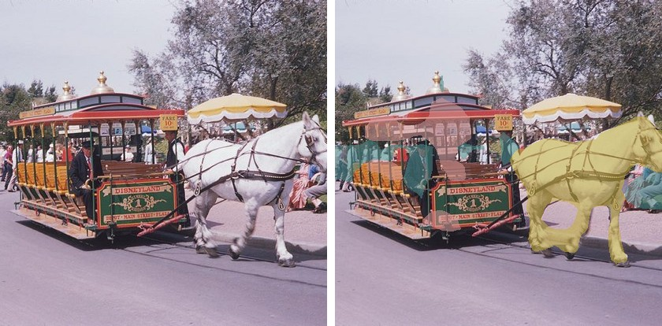
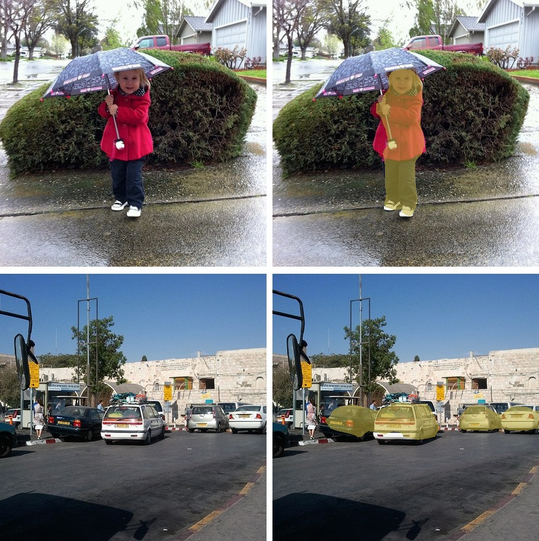

# MobileViTV2

<div style="background:#dff0d8; border:1px solid #cfe6bf; border-radius:3px; padding:12px 16px; color:#2a3a26;">
<b>Weights:</b> the pretrained weights for the MobileViTV2 model are hosted on the
kerasformers <a href="https://github.com/IMvision12/KerasFormers/releases/tag/mobilevitv2" style="color:#1a5c8a;">mobilevitv2</a>
release tag, and download automatically the first time you call
<code>from_weights(...)</code>.
</div>
<br>

MobileViTV2 keeps [MobileViT](mobilevit.md)'s convolution-and-transformer layout and replaces multi-head self-attention with **separable self-attention**. Standard attention costs O(k²) in the token count; the separable form computes a single context vector from the keys and broadcasts it, which is O(k). On a mobile CPU that is the difference between a latency budget met and missed.

The other simplification is the size knob. V1 has three hand-designed widths (XXS, XS, S); V2 has one architecture scaled by a single `multiplier` from 0.5 to 2.0.

**Paper**: [Separable Self-attention for Mobile Vision Transformers](https://arxiv.org/abs/2206.02680)

## API

### MobileViTV2SemanticSegment

```python
MobileViTV2SemanticSegment(multiplier=1.0, image_size=512, output_stride=16,
                           atrous_rates=(6, 12, 18), aspp_out_channels=512,
                           aspp_dropout_prob=0.1, num_classes=21,
                           input_tensor=None,
                           name="MobileViTV2SemanticSegment")
```

The MobileViTV2 backbone plus a DeepLabV3 ASPP head. **This is the class for semantic
segmentation.**

**Parameters**

- **multiplier** (`float`, *optional*, defaults to `1.0`): width scale. The single size lever, 0.5 to 2.0.
- **num_classes** (`int`, *optional*, defaults to `21`): Pascal VOC's 20 classes plus background.
- **image_size** (`int`, *optional*, defaults to `512`): segmentation resolution, not the classification 256.
- **output_stride** (`int`, *optional*, defaults to `16`): backbone downsampling, reduced from 32 so the head keeps spatial detail.
- **atrous_rates** (`tuple`, *optional*, defaults to `(6, 12, 18)`): ASPP dilation rates.
- **aspp_out_channels** (`int`, *optional*, defaults to `512`): ASPP width.
- **aspp_dropout_prob** (`float`, *optional*, defaults to `0.1`): head dropout, active only during training.
- **input_tensor** (`dict`, *optional*): pre-existing input tensors to build on.

**Call** `model(pixel_values, training=False)`. **Returns** a tensor of shape
`(B, H/16, W/16, num_classes)`: per-pixel class logits at the head's stride.

### MobileViTV2ImageClassify

```python
MobileViTV2ImageClassify(multiplier=1.0, image_size=256,
                         include_normalization=True,
                         normalization_mode="zero_to_one", num_classes=1000,
                         name="MobileViTV2ImageClassify")
```

The classification head, at 256 (or 384 for the `*_384` variants).
`include_normalization=True` means the model expects raw `[0, 255]` pixels.

### MobileViTV2Model

The backbone alone, for features.

## Preprocessing

### MobileViTV2ImageProcessor

```python
MobileViTV2ImageProcessor(size=None, crop_size=None, resample="bilinear",
                          do_resize=True, do_center_crop=True,
                          do_rescale=True, rescale_factor=1/255,
                          do_flip_channel_order=True, return_tensor=True,
                          data_format=None, variant=None)
```

Identical to [MobileViT's processor](mobilevit.md#mobilevitimageprocessor); the
reference ships one class for both generations. Resizes the shortest edge,
center-crops, rescales, and flips RGB to BGR. No mean/std normalization.

> **Prefer `MobileViTV2ImageProcessor.from_weights(variant)`.** Classification trains at
> 256 (or 384) and segmentation at 512, so the bare constructor is wrong for one of
> them. Passing the variant resolves the right pair.

**post_process_semantic_segmentation**

```python
processor.post_process_semantic_segmentation(outputs, target_size=None,
                                             label_names=None, data_format=None)
```

Takes the per-pixel argmax and upsamples to `target_size`. **Returns** a `dict` with
**segmentation** `(H, W)`, **unique_classes**, and **class_names**.

## Model Variants

Segmentation, for `MobileViTV2SemanticSegment.from_weights`:

| Variant id                 | Multiplier | Classes | Resolution |
|----------------------------|-----------:|--------:|-----------:|
| `mobilevitv2_100_deeplabv3`|        1.0 |      21 |        512 |
| `mobilevitv2_150_deeplabv3`|        1.5 |      21 |        512 |

Classification, for `MobileViTV2ImageClassify.from_weights`, thirteen variants from
`mobilevitv2_050_cvnets_in1k` through `mobilevitv2_200_cvnets_in22k_ft_in1k_384`. The
number is the multiplier times 100; `in22k_ft_in1k` variants pretrain on ImageNet-22k,
and the `_384` suffix marks a 384 rather than 256 resolution.

## Basic Usage: Semantic Segmentation



Each figure is the original image beside the predicted segmentation overlaid on it.


```python
import keras
import numpy as np
from PIL import Image
from kerasformers.models.mobilevitv2 import (
    MobileViTV2ImageProcessor, MobileViTV2SemanticSegment,
)

model = MobileViTV2SemanticSegment.from_weights("mobilevitv2_100_deeplabv3")
processor = MobileViTV2ImageProcessor.from_weights("mobilevitv2_100_deeplabv3")

image = Image.open("assets/data/coco_horse_trolley.jpg").convert("RGB")

# The processor resizes the shortest edge then center-crops, so the model only
# sees the middle of the frame. Post-process to that region, not the full image.
w, h = image.size
scale = processor.size["shortest_edge"] / min(w, h)
cw, ch = processor.crop_size["width"], processor.crop_size["height"]
left, top = (round(w * scale) - cw) // 2, (round(h * scale) - ch) // 2
box = (round(left / scale), round(top / scale),
       round((left + cw) / scale), round((top + ch) / scale))
seen = image.crop(box)

output = model(processor(image)["pixel_values"], training=False)
# output: (1, 32, 32, 21)   stride-16 logits

result = processor.post_process_semantic_segmentation(
    output, target_size=(seen.height, seen.width)
)
seg = np.asarray(keras.ops.convert_to_numpy(result["segmentation"]))

for cid, name in zip(result["unique_classes"], result["class_names"]):
    print(f"{name:14s} {int((seg == int(cid)).sum())} px")
```

```
background     139291 px
horse          18166 px
person         6991 px
train          7362 px
```

**The center crop is the thing to watch here.** For this 640x440 image the
processor resizes the shortest edge to 544, then keeps only the middle
512x512, discarding roughly 35% of the width. Passing the original
`(height, width)` as `target_size` stretches that crop back across the whole frame
and every region lands visibly off-target. Cropping to `box` first, as above, keeps
the overlay aligned with what the network actually saw.

Set `do_center_crop=False` and resize to a square yourself if you would rather the
model see the entire frame, at the cost of distorting the aspect ratio.

### Batch Processing Multiple Images



```python
import keras
import numpy as np
from PIL import Image
from kerasformers.models.mobilevitv2 import (
    MobileViTV2ImageProcessor, MobileViTV2SemanticSegment,
)

model = MobileViTV2SemanticSegment.from_weights("mobilevitv2_100_deeplabv3")
processor = MobileViTV2ImageProcessor.from_weights("mobilevitv2_100_deeplabv3")


def seen_box(image):
    """The region the center crop keeps, in original coordinates."""
    w, h = image.size
    scale = processor.size["shortest_edge"] / min(w, h)
    cw, ch = processor.crop_size["width"], processor.crop_size["height"]
    left, top = (round(w * scale) - cw) // 2, (round(h * scale) - ch) // 2
    return (round(left / scale), round(top / scale),
            round((left + cw) / scale), round((top + ch) / scale))


paths = ["assets/data/coco_child_umbrella.jpg", "assets/data/coco_parking.jpg"]
images = [Image.open(p).convert("RGB") for p in paths]

outputs = model(processor(paths)["pixel_values"], training=False)   # (2, 32, 32, 21)

for path, image, logits in zip(paths, images, outputs):
    seen = image.crop(seen_box(image))
    result = processor.post_process_semantic_segmentation(
        logits[None], target_size=(seen.height, seen.width)
    )
    seg = np.asarray(keras.ops.convert_to_numpy(result["segmentation"]))
    print(f"\n{path}")
    for cid, name in zip(result["unique_classes"], result["class_names"]):
        print(f"  {name:12s} {int((seg == int(cid)).sum())} px")
```

```
assets/data/coco_child_umbrella.jpg
  background   187762 px
  person       13999 px
  car          739 px

assets/data/coco_parking.jpg
  background   187762 px
  car          13537 px
  person       190 px
```

Both images resolve cleanly against the VOC vocabulary: the child is `person`, the
parked cars are `car`, and a car behind the hedge in the first image is picked up at
980 pixels.

Worth knowing where this vocabulary runs out. VOC has 20 classes, so anything outside
them (an elephant, a laptop, a traffic light) comes back as `background`, with no
confidence score to signal the model had nothing to say. Reach for
[SegFormer](segformer.md)'s 150 ADE20K classes when the scene contains things VOC never
named.

## Input Resolution

MobileViTV2 is Functional, so the input shape is fixed at construction and the model
and processor must agree. `from_weights` on both handles it:

| task | model builds at | processor emits |
|---|---:|---:|
| classification | 256 (384 for `_384`) | crop + 32 resize |
| segmentation | 512 | 544 resize, 512 crop |

## Data Format

**Both the model and the processor support `channels_last` and `channels_first`.**

| | How it picks the format |
|---|---|
| Processors | A `data_format` kwarg, per instance. `None` (the default) resolves to `keras.config.image_data_format()`. |
| Models | Read `keras.config.image_data_format()` when they are **constructed**. There is no `data_format` argument. |

`post_process_semantic_segmentation` also takes `data_format`, since it needs to know
which axis holds the classes. It always returns `(H, W)`.

## Loading Fine-tuned and Community Weights

Any Hugging Face repo whose `model_type` is `"mobilevitv2"` loads with the `hf:` prefix.

```python
from kerasformers.models.mobilevitv2 import MobileViTV2SemanticSegment

model = MobileViTV2SemanticSegment.from_weights("hf:shehan97/mobilevitv2-1.0-voc-deeplabv3")
model = MobileViTV2SemanticSegment.from_weights("hf:<user>/mobilevitv2-finetuned")

# Architecture only, randomly initialized
model = MobileViTV2SemanticSegment.from_weights(
    "mobilevitv2_100_deeplabv3", load_weights=False,
)
```

All four model classes accept `hf:`, as does `MobileViTV2ImageProcessor`.
