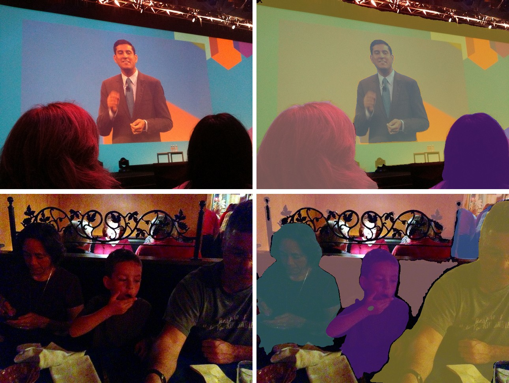

# OneFormer

<div style="background:#dff0d8; border:1px solid #cfe6bf; border-radius:3px; padding:12px 16px; color:#2a3a26;">
<b>Weights:</b> the pretrained weights for the OneFormer model are hosted on the
kerasformers <a href="https://github.com/IMvision12/KerasFormers/releases/tag/oneformer" style="color:#1a5c8a;">oneformer</a>
release tag, and download automatically the first time you call
<code>from_weights(...)</code>.
</div>
<br>

[MaskFormer](maskformer.md) and [Mask2Former](mask2former.md) are universal in architecture but not in training: each checkpoint is trained for one task, which is why you pick between `-instance`, `-panoptic` and `-semantic` weights.

OneFormer removes that split. It trains **one** model on all three tasks jointly, conditioned on a text token that names the task. At inference you pass `task="semantic"`, `"instance"` or `"panoptic"` to the same weights and the model behaves accordingly. That token is why the processor is a composite of an image processor **and a tokenizer**, unlike every other segmenter here.

**Paper**: [OneFormer: One Transformer to Rule Universal Image Segmentation](https://arxiv.org/abs/2211.06220)

## API

### OneFormerUniversalSegment

```python
OneFormerUniversalSegment(..., name="OneFormerUniversalSegment")
```

Swin backbone, pixel decoder, and the task-conditioned transformer decoder.
**This is the class for segmentation.**

Architecture arguments are filled in by `from_weights` from the variant config.

**Call** `model(inputs)` with the processor's output dict, which must include
`task_inputs`. **Returns** a `dict`:

- **class_queries_logits** (`(B, num_queries, num_classes + 1)`): one class distribution per query.
- **masks_queries_logits** (`(B, num_queries, H/4, W/4)`): one binary mask logit map per query.

### OneFormerModel

```python
OneFormerModel(backbone_embed_dim=96, backbone_depths=(2, 2, 6, 2),
               backbone_num_heads=(3, 6, 12, 24), backbone_window_size=7,
               hidden_dim=256, mask_feature_size=256, encoder_num_layers=6,
               ..., name="OneFormerModel")
```

The backbone and pixel decoder without the query heads.

## Preprocessing

### OneFormerProcessor

```python
OneFormerProcessor(variant=None, target_size=None, task_seq_len=77,
                   tokenizer=None, hf_id=None, tokenizer_file=None,
                   image_processor=None)
```

An `OneFormerImageProcessor` and an `OneFormerTokenizer` behind one callable. The
tokenizer exists to encode the task string.

**Parameters**

- **variant** (`str`, *optional*): release variant, used to pick the matching `tokenizer.json` and resolution.
- **target_size** (`int`, *optional*): square canvas edge.
- **task_seq_len** (`int`, *optional*, defaults to `77`): padded length of the task token sequence.
- **tokenizer** / **image_processor** (*optional*): pre-built components.

**Call** `processor(images=..., task="panoptic")`. **Returns** a `dict`:

- **pixel_values** (`(B, S, S, 3)`): the padded square canvas.
- **task_inputs** (`(B, 77)`): the tokenized task prompt.

> **The keyword is `task`, not `task_inputs`.** `task_inputs` is what comes *out* of the
> processor; `task` is what you pass *in*. Accepted values are `"semantic"`,
> `"instance"` and `"panoptic"`.

**post_process_panoptic_segmentation** / **post_process_semantic_segmentation**

```python
processor.post_process_panoptic_segmentation(outputs, target_size, threshold=0.8, ...)
processor.post_process_semantic_segmentation(outputs, target_sizes=None, label_names=None)
```

Same signatures and return shapes as [MaskFormer's](maskformer.md#preprocessing), which
they delegate to since the output format is identical. Note the panoptic method takes
singular `target_size` and the semantic one plural `target_sizes`.

`label_names` defaults to the label set matching the head width, so the ADE20K variants
resolve ADE names and the COCO one resolves COCO panoptic names.

## Model Variants

| Variant id                     | Backbone   | Training set | Classes |
|--------------------------------|------------|--------------|--------:|
| `oneformer_ade20k_swin_tiny`   | Swin-Tiny  | ADE20K       |     150 |
| `oneformer_ade20k_swin_large`  | Swin-Large | ADE20K       |     150 |
| `oneformer_coco_swin_large`    | Swin-Large | COCO         |     133 |
| `oneformer_cityscapes_swin_large` | Swin-Large | Cityscapes |      19 |

Each checkpoint handles all three tasks; the training set determines the vocabulary,
not the task.

## Basic Usage: Universal Segmentation


Each figure is the original image beside the predicted segmentation overlaid on it.


```python
import keras
import numpy as np
import torch
from PIL import Image
from kerasformers.models.oneformer import (
    OneFormerProcessor, OneFormerUniversalSegment,
)

model = OneFormerUniversalSegment.from_weights("oneformer_ade20k_swin_tiny")
processor = OneFormerProcessor.from_weights("oneformer_ade20k_swin_tiny")

image = Image.open("assets/data/coco_office.jpg").convert("RGB")

# The task is an argument, not a property of the checkpoint.
inputs = processor(images=image, task="panoptic")
# inputs["pixel_values"]: (1, 512, 512, 3)
# inputs["task_inputs"]:  (1, 77)

with torch.no_grad():
    output = model(inputs)

result = processor.post_process_panoptic_segmentation(
    output, target_size=(image.height, image.width)
)
seg = np.asarray(keras.ops.convert_to_numpy(result["segmentation"]))

for s in result["segments_info"]:
    print(f"{s['label_name']:16s} {int((seg == s['id']).sum())} px  score {s['score']:.3f}")
```

```
wall             58625 px
person           35824 px
```

Switching task needs no new weights:

```python
inputs = processor(images=image, task="semantic")
with torch.no_grad():
    output = model(inputs)
maps = processor.post_process_semantic_segmentation(
    output, target_sizes=[(image.height, image.width)]
)
```

### Batch Processing Multiple Images



Post-process one image at a time, since each has its own target size:

```python
import keras
import numpy as np
import torch
from PIL import Image
from kerasformers.models.oneformer import (
    OneFormerProcessor, OneFormerUniversalSegment,
)

model = OneFormerUniversalSegment.from_weights("oneformer_ade20k_swin_tiny")
processor = OneFormerProcessor.from_weights("oneformer_ade20k_swin_tiny")

paths = ["assets/data/coco_presentation.jpg", "assets/data/coco_movie_snacks.jpg"]

for path in paths:
    image = Image.open(path).convert("RGB")
    inputs = processor(images=image, task="panoptic")
    with torch.no_grad():
        output = model(inputs)
    result = processor.post_process_panoptic_segmentation(
        output, target_size=(image.height, image.width)
    )
    seg = np.asarray(keras.ops.convert_to_numpy(result["segmentation"]))
    print(f"\n{path}")
    for s in result["segments_info"]:
        print(f"  {s['label_name']:14s} {int((seg == s['id']).sum())} px")
```

```
assets/data/coco_presentation.jpg
  wall           165124 px
  person         50825 px
  person         32068 px
  person         29041 px
  person         243 px

assets/data/coco_movie_snacks.jpg
  person         83436 px
  wall           53731 px
  person         50572 px
  person         37063 px
  person         8181 px
  windowpane     3580 px
```

Four separate `person` segments in the first image and four in the second, each with
its own id, including one at 243 pixels. ADE20K has no `things:` / `stuff:` prefix,
unlike COCO panoptic, so names are bare.

## Data Format

**Both the model and the processor support `channels_last` and `channels_first`.**

| | How it picks the format |
|---|---|
| Processors | A `data_format` kwarg on the image processor. `None` (the default) resolves to `keras.config.image_data_format()`. |
| Models | Read `keras.config.image_data_format()` when they are **constructed**. There is no `data_format` argument. |

The post-processors emit `(H, W)` label maps and segment metadata, so they take no
`data_format` kwarg.

## Loading Fine-tuned and Community Weights

Any Hugging Face repo whose `model_type` is `"oneformer"` loads with the `hf:` prefix.

```python
from kerasformers.models.oneformer import OneFormerUniversalSegment

model = OneFormerUniversalSegment.from_weights("hf:shi-labs/oneformer_ade20k_swin_tiny")
model = OneFormerUniversalSegment.from_weights("hf:<user>/oneformer-finetuned")

# Architecture only, randomly initialized
model = OneFormerUniversalSegment.from_weights(
    "oneformer_ade20k_swin_tiny", load_weights=False,
)
```

`OneFormerProcessor` and `OneFormerTokenizer` accept `hf:` too, so the task tokenizer
comes from the same repo.

See also [Mask2Former](mask2former.md), whose architecture this builds on, and
[EoMT](eomt.md), which strips the decoder out entirely.
