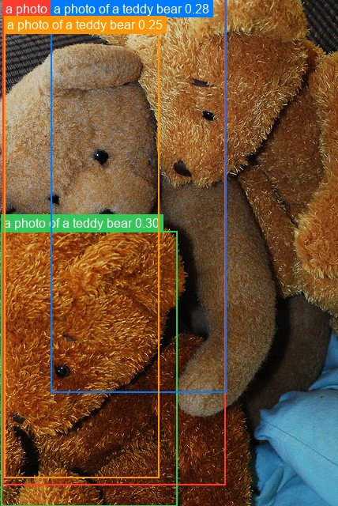
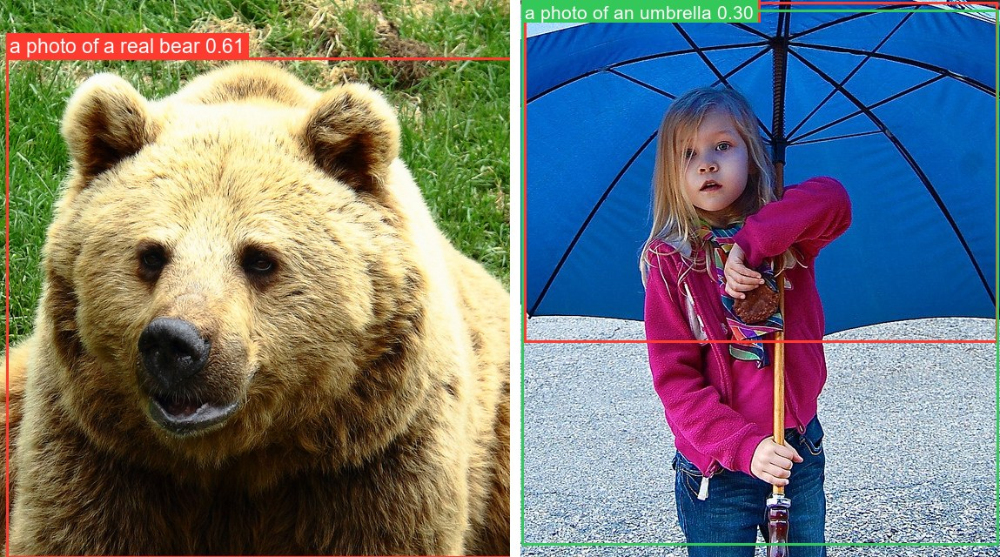

# OWLv2

<div style="background:#dff0d8; border:1px solid #cfe6bf; border-radius:3px; padding:12px 16px; color:#2a3a26;">
<b>Weights:</b> the pretrained weights for the OWLv2 model are hosted on the
kerasformers <a href="https://github.com/IMvision12/KerasFormers/releases/tag/owlv2" style="color:#1a5c8a;">owlv2</a>
release tag, and download automatically the first time you call
<code>from_weights(...)</code>.
</div>
<br>

OWLv2 keeps [OWL-ViT](owlvit.md)'s dual-tower skeleton and per-patch detection head, and scales it with self-training on web image-text pairs. It adds an **objectness head**, a learned "is this patch an object at all" score that is independent of the text queries, which improves ranking when several queries compete for the same region.

It also changes preprocessing in a way that matters at the API level: OWLv2 **pads images to a square** before resizing, where OWL-ViT resizes directly. That affects how you call the post-processor, see [Target Sizes](#target-sizes-the-padding-trap).

**Paper**: [Scaling Open-Vocabulary Object Detection](https://arxiv.org/abs/2306.09683)

## API

### Owlv2Detect

```python
Owlv2Detect(vision_image_size, vision_patch_size, vision_hidden_dim,
            vision_intermediate_size, vision_num_layers, vision_num_heads,
            text_hidden_dim, text_intermediate_size, text_num_heads,
            projection_dim, text_num_layers=12, ..., name="Owlv2Detect")
```

The detector: vision and text encoders plus per-patch class, box, and objectness heads.
**This is the class for open-vocabulary detection.**

The architecture arguments are all filled in by `from_weights` from the variant config.

**Call** `model({"input_ids": ..., "pixel_values": ...})`. **Returns** a `dict` whose
main entries are:

- **logits** (`(B, num_patches, num_queries)`): similarity of each patch to each text query.
- **objectness_logits** (`(B, num_patches)`): query-independent objectness score.
- **pred_boxes** (`(B, num_patches, 4)`): normalized `(cx, cy, w, h)` in `[0, 1]`.

### Owlv2Model

```python
Owlv2Model(..., name="Owlv2Model")
```

The vision and text encoders without detection heads, returning `image_embeds` and
`text_embeds`.

### Owlv2VisionModel / Owlv2TextModel

```python
Owlv2VisionModel(vision_image_size, vision_patch_size, vision_hidden_dim,
                 vision_intermediate_size, vision_num_layers, vision_num_heads,
                 image_size=None, input_tensor=None, name="Owlv2VisionModel")

Owlv2TextModel(text_hidden_dim, text_intermediate_size, text_num_heads,
               text_num_layers=12, text_max_position_embeddings=16,
               text_vocab_size=49408, text_input_shape=None,
               input_tensor=None, name="Owlv2TextModel")
```

Either tower on its own.

## Preprocessing

### Owlv2Processor

```python
Owlv2Processor(size=None, resample="bicubic", do_rescale=True,
               rescale_factor=1/255, do_pad=True, do_normalize=True,
               image_mean=(0.48145466, 0.4578275, 0.40821073),
               image_std=(0.26862954, 0.26130258, 0.27577711), ...)
```

Tokenizer and image processor behind one callable. **Call**
`processor(text=..., images=...)`, where `text` is a list of query lists, one per image.
**Returns** a `dict` with **input_ids**, **attention_mask**, and **pixel_values**.

### Owlv2ImageProcessor

```python
Owlv2ImageProcessor(size=None, resample="bicubic", do_rescale=True,
                    rescale_factor=1/255, do_pad=True, do_normalize=True,
                    image_mean=None, image_std=None, return_tensor=True,
                    data_format=None)
```

Pads to a square, resizes to the variant's resolution, rescales, and normalizes with
CLIP statistics.

- **do_pad** (`bool`, *optional*, defaults to `True`): pad to a square before resizing. This is the difference from OWL-ViT and it changes the coordinate frame of the predicted boxes.

**post_process_object_detection**

```python
image_processor.post_process_object_detection(outputs, threshold=0.1,
                                              target_sizes=None, text_labels=None)
```

Sigmoids the similarity scores, keeps candidates above `threshold`, and scales boxes to
`target_sizes`. **Returns** a list with one `dict` per image holding **scores**,
**labels**, **boxes**, and **text_labels** when queries were supplied.

## Target Sizes: the padding trap

Because OWLv2 pads to a square before resizing, predicted boxes are normalized to the
**padded square**, not to the original image. Passing the natural `(height, width)`
therefore squashes one axis.

Pass `max(h, w)` for both dimensions instead:

```python
side = max(image.height, image.width)
results = image_processor.post_process_object_detection(
    output, threshold=0.15, target_sizes=[(side, side)], text_labels=[prompts],
)[0]
```

The difference is not subtle. On a 640×480 image, checking the same two remote controls
against a closed-set detector's boxes:

```
target_sizes=(480, 640)  ->  [38, 54, 175, 89]    [338, 57, 371, 142]   wrong
target_sizes=(640, 640)  ->  [38, 73, 175, 119]   [338, 77, 371, 190]   correct
ground truth             ->  [40, 73, 176, 118]   [334, 77, 372, 188]
```

The padded-square version lands within a pixel or two; the natural-size version
compresses everything vertically. [OWL-ViT](owlvit.md) is **not** affected, since it
resizes without padding.

## Model Variants

| Variant id                     | Vision tower               | Image size | HF original                            |
|--------------------------------|----------------------------|-----------:|----------------------------------------|
| `owlv2-base-patch16`           | ViT-B/16, 12L, 768 hidden  |    960×960 | `google/owlv2-base-patch16`            |
| `owlv2-base-patch16-ensemble`  | ViT-B/16, 12L, 768 hidden  |    960×960 | `google/owlv2-base-patch16-ensemble`   |
| `owlv2-base-patch16-finetuned` | ViT-B/16, 12L, 768 hidden  |    960×960 | `google/owlv2-base-patch16-finetuned`  |
| `owlv2-large-patch14`          | ViT-L/14, 24L, 1024 hidden | 1008×1008  | `google/owlv2-large-patch14`           |
| `owlv2-large-patch14-ensemble` | ViT-L/14, 24L, 1024 hidden | 1008×1008  | `google/owlv2-large-patch14-ensemble`  |
| `owlv2-large-patch14-finetuned`| ViT-L/14, 24L, 1024 hidden | 1008×1008  | `google/owlv2-large-patch14-finetuned` |

The `-ensemble` variants come from an ensemble of self-training runs and are usually the
better default; `-finetuned` adds supervised detection fine-tuning. The text tower is
fixed across variants: 12 layers, vocab 49408, max query length 16.

## Basic Usage: Open-Vocabulary Detection



```python
from PIL import Image
from kerasformers.models.owlv2 import (
    Owlv2Detect, Owlv2ImageProcessor, Owlv2Processor,
)

model = Owlv2Detect.from_weights("owlv2-base-patch16")
processor = Owlv2Processor.from_weights("owlv2-base-patch16")
image_processor = Owlv2ImageProcessor()

image = Image.open("assets/data/coco_teddy_bears.jpg").convert("RGB")
prompts = [
    "a photo of a teddy bear",
    "a photo of a real bear",
    "a photo of a laptop",
]

inputs = processor(text=[prompts], images=image)
output = model({
    "input_ids": inputs["input_ids"],
    "pixel_values": inputs["pixel_values"],
})

# OWLv2 pads to a square, so scale by max(h, w), not (h, w).
side = max(image.height, image.width)
results = image_processor.post_process_object_detection(
    output, threshold=0.15,
    target_sizes=[(side, side)],
    text_labels=[prompts],
)[0]

detections = sorted(
    zip(results["scores"], results["text_labels"], results["boxes"]),
    key=lambda d: -float(d[0]),
)
for score, name, box in detections:
    print(f"{name:26s} {float(score):.3f}  {[round(float(v)) for v in box]}")
```

```
a photo of a teddy bear    0.305  [4, -10, 426, 613]
a photo of a teddy bear    0.304  [1, 292, 334, 640]
a photo of a teddy bear    0.277  [96, -10, 428, 496]
a photo of a teddy bear    0.248  [8, 41, 301, 604]
```

Four overlapping bears, and neither the "real bear" nor the "laptop" query fires. The
distinction between a teddy bear and a real bear is exactly the kind of thing a
closed-set COCO detector cannot express, since it only has one `teddy bear` class.

Scores sit lower than OWL-ViT's on this image because the bears overlap heavily and
each candidate patch splits similarity across several instances. Boxes can extend past
the image bounds (`-10` above); clip if you need strict bounds.

### Batch Processing Multiple Images

Pass one query list per image, and one `target_sizes` entry per image, each squared:



```python
from PIL import Image
from kerasformers.models.owlv2 import (
    Owlv2Detect, Owlv2ImageProcessor, Owlv2Processor,
)

model = Owlv2Detect.from_weights("owlv2-base-patch16")
processor = Owlv2Processor.from_weights("owlv2-base-patch16")
image_processor = Owlv2ImageProcessor()

paths = ["assets/data/coco_bear.jpg", "assets/data/coco_girl_umbrella.jpg"]
images = [Image.open(p).convert("RGB") for p in paths]
prompts = [["a photo of a real bear", "a photo of a teddy bear"],
           ["a photo of an umbrella", "a photo of a person"]]

inputs = processor(text=prompts, images=images)
# input_ids (4, 16) -> 2 images x 2 queries;  pixel_values (2, 960, 960, 3)
output = model({
    "input_ids": inputs["input_ids"],
    "pixel_values": inputs["pixel_values"],
})

sizes = [(max(im.height, im.width),) * 2 for im in images]
results = image_processor.post_process_object_detection(
    output, threshold=0.15, target_sizes=sizes, text_labels=prompts,
)

for path, result in zip(paths, results):
    print(f"\n{path}")
    detections = sorted(
        zip(result["scores"], result["text_labels"], result["boxes"]),
        key=lambda d: -float(d[0]),
    )
    for score, name, box in detections:
        print(f"  {name:26s} {float(score):.3f}  {[round(float(v)) for v in box]}")
```

```
assets/data/coco_bear.jpg
  a photo of a real bear     0.614  [7, 66, 588, 641]

assets/data/coco_girl_umbrella.jpg
  a photo of an umbrella     0.405  [4, 2, 548, 393]
  a photo of an umbrella     0.301  [1, 11, 549, 626]
```

The first image resolves to the **real** bear and not the teddy bear, the reverse of
the single-image example above. That contrast is only expressible because the label
set is an argument.

`input_ids` is `(num_images × num_queries, max_length)`, flattened across images, which
is why the count is 4 for two images with two queries each.

## Data Format

**Both the models and the processors support `channels_last` and `channels_first`.**
Neither is hard-coded to a layout.

| | How it picks the format |
|---|---|
| Processors | A `data_format` kwarg, per instance. `None` (the default) resolves to `keras.config.image_data_format()`. |
| Models | Read `keras.config.image_data_format()` when they are **constructed**. There is no `data_format` argument. |

### Overriding the processor only

```python
Owlv2ImageProcessor(data_format="channels_last")("photo.jpg")
# {"pixel_values": (1, 960, 960, 3)}

Owlv2ImageProcessor(data_format="channels_first")("photo.jpg")
# {"pixel_values": (1, 3, 960, 960)}
```

### Switching the whole pipeline

```python
import keras

keras.config.set_image_data_format("channels_first")

model = Owlv2Detect.from_weights("owlv2-base-patch16")
processor = Owlv2Processor.from_weights("owlv2-base-patch16")
```

Detections are the same under either layout. Set it once at the top of a script, since
already-built models keep the layout they were constructed with.

The post-processor emits `xyxy` pixel boxes and query indices, so it takes no
`data_format` kwarg.

## Loading Fine-tuned and Community Weights

Any Hugging Face repo whose `model_type` is `"owlv2"` loads directly with the `hf:`
prefix.

```python
from kerasformers.models.owlv2 import Owlv2Detect

# The original Google checkpoints
model = Owlv2Detect.from_weights("hf:google/owlv2-base-patch16-ensemble")

# Somebody's fine-tune
model = Owlv2Detect.from_weights("hf:<user>/owlv2-finetuned-on-my-data")

# Architecture only, randomly initialized
model = Owlv2Detect.from_weights("owlv2-base-patch16", load_weights=False)
```

No shape arguments are needed. The architecture is read from the repo's `config.json`.
All five model classes accept `hf:`, as do `Owlv2Processor` and `Owlv2ImageProcessor`:

```python
processor = Owlv2Processor.from_weights("hf:google/owlv2-base-patch16")
```

Loading `hf:google/owlv2-base-patch16` and the `owlv2-base-patch16` release variant
produces identical outputs, since they are the same checkpoint by two routes.
