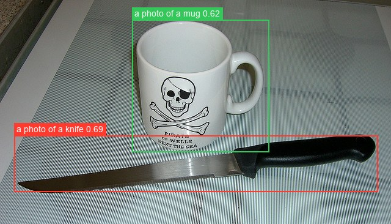
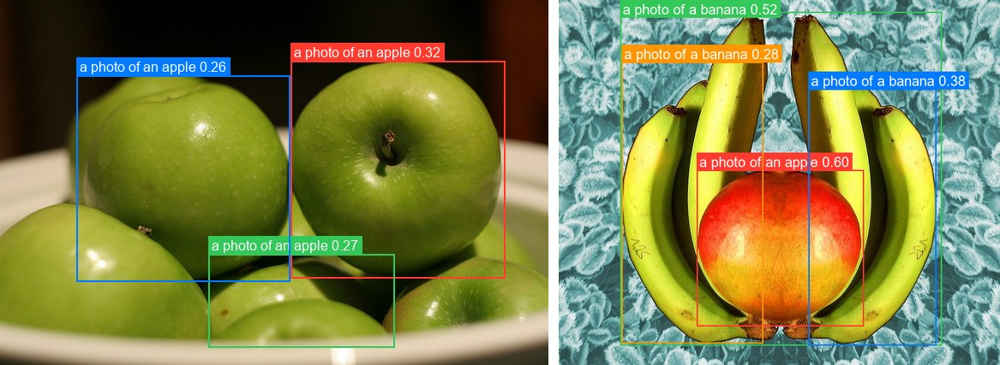

# OWL-ViT

<div style="background:#dff0d8; border:1px solid #cfe6bf; border-radius:3px; padding:12px 16px; color:#2a3a26;">
<b>Weights:</b> the pretrained weights for the OWL-ViT model are hosted on the
kerasformers <a href="https://github.com/IMvision12/KerasFormers/releases/tag/owlvit" style="color:#1a5c8a;">owlvit</a>
release tag, and download automatically the first time you call
<code>from_weights(...)</code>.
</div>
<br>

OWL-ViT detects objects described by free text, with no fixed class list. It starts from a CLIP-style vision and text encoder, then drops CLIP's pooling and attaches a lightweight box head to **every patch token**. Each patch becomes a detection candidate, scored by cosine similarity against your text queries rather than against a learned classifier.

The practical consequence is that the label set is an argument, not a property of the checkpoint. You can ask for "a mug" and "a knife" on one image and something else on the next, with no retraining.

**Paper**: [Simple Open-Vocabulary Object Detection with Vision Transformers](https://arxiv.org/abs/2205.06230)

## API

### OwlViTDetect

```python
OwlViTDetect(vision_image_size, vision_patch_size, vision_hidden_dim,
             vision_intermediate_size, vision_num_layers, vision_num_heads,
             text_hidden_dim, text_intermediate_size, text_num_heads,
             projection_dim, text_num_layers=12, ...,
             name="OwlViTDetect")
```

The detector: vision and text encoders plus the per-patch class and box heads.
**This is the class for open-vocabulary detection.**

The architecture arguments are all filled in by `from_weights` from the variant config,
so you rarely pass them by hand.

**Call** `model({"input_ids": ..., "pixel_values": ...})`. **Returns** a `dict` whose
main entries are:

- **logits** (`(B, num_patches, num_queries)`): similarity of each patch to each text query.
- **pred_boxes** (`(B, num_patches, 4)`): normalized `(cx, cy, w, h)` in `[0, 1]`.

Note the shape: one candidate per **patch**, not a fixed query budget. For a
768×768 patch-32 model that is 576 candidates, nearly all of which the threshold drops.

### OwlViTModel

```python
OwlViTModel(..., name="OwlViTModel")
```

The vision and text encoders without detection heads, returning `image_embeds` and
`text_embeds`. Use it for CLIP-style embedding work.

### OwlViTVisionModel / OwlViTTextModel

```python
OwlViTVisionModel(vision_image_size, vision_patch_size, vision_hidden_dim,
                  vision_intermediate_size, vision_num_layers, vision_num_heads,
                  image_size=None, input_tensor=None, name="OwlViTVisionModel")

OwlViTTextModel(text_hidden_dim, text_intermediate_size, text_num_heads,
                text_num_layers=12, text_max_position_embeddings=16,
                text_vocab_size=49408, text_input_shape=None,
                input_tensor=None, name="OwlViTTextModel")
```

Either tower on its own, when you only need one side.

## Preprocessing

### OwlViTProcessor

```python
OwlViTProcessor(size=None, resample="bicubic", do_rescale=True,
                rescale_factor=1/255, do_normalize=True,
                image_mean=(0.48145466, 0.4578275, 0.40821073),
                image_std=(0.26862954, 0.26130258, 0.27577711), ...)
```

Tokenizer and image processor behind one callable. **Call**
`processor(text=..., images=...)`, where `text` is a list of query lists, one per image.
**Returns** a `dict` with **input_ids**, **attention_mask**, and **pixel_values**.

### OwlViTImageProcessor

```python
OwlViTImageProcessor(size=None, resample="bicubic", do_rescale=True,
                     rescale_factor=1/255, do_normalize=True, image_mean=None,
                     image_std=None, return_tensor=True, data_format=None)
```

Resizes to the variant's square resolution, rescales, and normalizes with CLIP
statistics. **Call** `processor(images)` with a path, PIL image, array, or list.

**post_process_object_detection**

```python
image_processor.post_process_object_detection(outputs, threshold=0.1,
                                              target_sizes=None, text_labels=None)
```

Sigmoids the similarity scores, keeps candidates above `threshold`, and converts boxes
to pixel `(x0, y0, x1, y1)` scaled to `target_sizes`.

- **text_labels** (`list` of `list` of `str`, *optional*): the query strings per image, used to populate `text_labels` in the result.

**Returns** a list with one `dict` per image, holding **scores**, **labels** (winning
query index), **boxes**, and **text_labels** when queries were supplied.

> **OWL-ViT resizes without preserving aspect ratio**, so `target_sizes` is simply the
> image's `(height, width)`. This differs from [OWLv2](owlv2.md), which pads to a square
> first and needs `max(h, w)` instead.

## Model Variants

| Variant id            | Vision tower              | Image size | HF original                  |
|-----------------------|---------------------------|-----------:|------------------------------|
| `owlvit-base-patch32` | ViT-B/32, 12L, 768 hidden |    768×768 | `google/owlvit-base-patch32`  |
| `owlvit-base-patch16` | ViT-B/16, 12L, 768 hidden |    768×768 | `google/owlvit-base-patch16`  |
| `owlvit-large-patch14`| ViT-L/14, 24L, 1024 hidden|    840×840 | `google/owlvit-large-patch14` |

The text tower is fixed across variants: 12 layers, vocab 49408, max query length 16.
Smaller patches mean more candidates and better small-object recall, at more compute.

## Basic Usage: Open-Vocabulary Detection



```python
from PIL import Image
from kerasformers.models.owlvit import (
    OwlViTDetect, OwlViTImageProcessor, OwlViTProcessor,
)

model = OwlViTDetect.from_weights("owlvit-base-patch32")
processor = OwlViTProcessor.from_weights("owlvit-base-patch32")
image_processor = OwlViTImageProcessor()

image = Image.open("assets/coco/coco_mug_knife.jpg").convert("RGB")
prompts = ["a photo of a mug", "a photo of a knife", "a photo of an apple"]

inputs = processor(text=[prompts], images=image)
output = model({
    "input_ids": inputs["input_ids"],
    "pixel_values": inputs["pixel_values"],
})

results = image_processor.post_process_object_detection(
    output, threshold=0.1,
    target_sizes=[(image.height, image.width)],
    text_labels=[prompts],
)[0]

detections = sorted(
    zip(results["scores"], results["text_labels"], results["boxes"]),
    key=lambda d: -float(d[0]),
)
for score, name, box in detections:
    print(f"{name:22s} {float(score):.3f}  {[round(float(v)) for v in box]}")
```

```
a photo of a knife     0.694  [23, 221, 618, 313]
a photo of a mug       0.618  [216, 32, 440, 248]
```

The apple query returns nothing, which is the correct answer: absent classes simply
score below threshold, no "background" class needed.

Two things about thresholds here. `0.1` is much lower than a closed-set detector's
`0.5`, because these are cosine similarities passed through a sigmoid rather than
calibrated class probabilities. And prompt phrasing matters: "a photo of a X" is the
CLIP-style template these checkpoints were trained against, and generally beats a bare
noun.

### Batch Processing Multiple Images

Pass one query list per image. The prompts do not have to match across images:



```python
from PIL import Image
from kerasformers.models.owlvit import (
    OwlViTDetect, OwlViTImageProcessor, OwlViTProcessor,
)

model = OwlViTDetect.from_weights("owlvit-base-patch32")
processor = OwlViTProcessor.from_weights("owlvit-base-patch32")
image_processor = OwlViTImageProcessor()

paths = ["assets/coco/coco_apples.jpg", "assets/coco/coco_bananas.jpg"]
images = [Image.open(p).convert("RGB") for p in paths]
prompts = [["a photo of an apple", "a photo of a banana"],
           ["a photo of a banana", "a photo of an apple"]]

inputs = processor(text=prompts, images=images)
# input_ids (4, 16) -> 2 images x 2 queries;  pixel_values (2, 768, 768, 3)
output = model({
    "input_ids": inputs["input_ids"],
    "pixel_values": inputs["pixel_values"],
})

results = image_processor.post_process_object_detection(
    output, threshold=0.25,
    target_sizes=[(im.height, im.width) for im in images],
    text_labels=prompts,
)

for path, result in zip(paths, results):
    print(f"
{path}")
    detections = sorted(
        zip(result["scores"], result["text_labels"], result["boxes"]),
        key=lambda d: -float(d[0]),
    )
    for score, name, box in detections:
        print(f"  {name:22s} {float(score):.3f}  {[round(float(v)) for v in box]}")
```

```
assets/coco/coco_apples.jpg
  a photo of an apple    0.317  [339, 71, 589, 325]
  a photo of an apple    0.267  [243, 297, 460, 406]
  a photo of an apple    0.256  [89, 88, 338, 329]

assets/coco/coco_bananas.jpg
  a photo of an apple    0.597  [200, 247, 442, 474]
  a photo of a banana    0.520  [89, 17, 555, 502]
  a photo of a banana    0.376  [362, 129, 547, 502]
  a photo of a banana    0.277  [91, 90, 296, 499]
```

The threshold is `0.25` here rather than the `0.1` used above: open-vocabulary
scores are uncalibrated similarities, and at `0.1` this pair returns sixteen heavily
overlapping boxes. Raising the bar is the main knob for readable output.

Note the top hit on the second image is **an apple**, correctly picked out from among
the bananas surrounding it.

`input_ids` is `(num_images × num_queries, max_length)`, flattened across images, which
is why the count is 4 for two images with two queries each. Boxes may extend slightly
past the image bounds (`-2` above); clip them if your downstream code needs strict
bounds.

## Data Format

**Both the models and the processors support `channels_last` and `channels_first`.**
Neither is hard-coded to a layout.

| | How it picks the format |
|---|---|
| Processors | A `data_format` kwarg, per instance. `None` (the default) resolves to `keras.config.image_data_format()`. |
| Models | Read `keras.config.image_data_format()` when they are **constructed**. There is no `data_format` argument. |

### Overriding the processor only

```python
OwlViTImageProcessor(data_format="channels_last")("photo.jpg")
# {"pixel_values": (1, 768, 768, 3)}

OwlViTImageProcessor(data_format="channels_first")("photo.jpg")
# {"pixel_values": (1, 3, 768, 768)}
```

### Switching the whole pipeline

```python
import keras

keras.config.set_image_data_format("channels_first")

model = OwlViTDetect.from_weights("owlvit-base-patch32")
processor = OwlViTProcessor.from_weights("owlvit-base-patch32")
```

Detections are the same under either layout. Set it once at the top of a script, since
already-built models keep the layout they were constructed with.

The post-processor emits `xyxy` pixel boxes and query indices, so it takes no
`data_format` kwarg.

## Loading Fine-tuned and Community Weights

Any Hugging Face repo whose `model_type` is `"owlvit"` loads directly with the `hf:`
prefix.

```python
from kerasformers.models.owlvit import OwlViTDetect

# The original Google checkpoints
model = OwlViTDetect.from_weights("hf:google/owlvit-base-patch32")

# Somebody's fine-tune
model = OwlViTDetect.from_weights("hf:<user>/owlvit-finetuned-on-my-data")

# Architecture only, randomly initialized
model = OwlViTDetect.from_weights("owlvit-base-patch32", load_weights=False)
```

No shape arguments are needed. The architecture is read from the repo's `config.json`.
All five model classes accept `hf:`, as do `OwlViTProcessor` and
`OwlViTImageProcessor`:

```python
processor = OwlViTProcessor.from_weights("hf:google/owlvit-base-patch32")
```

Loading `hf:google/owlvit-base-patch32` and the `owlvit-base-patch32` release variant
produces identical outputs, since they are the same checkpoint by two routes.

See also [OWLv2](owlv2.md), which scales this recipe with self-training and adds an
objectness head.
