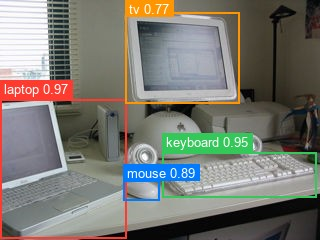

# RF-DETR

**Paper**: [RF-DETR: Neural Architecture Search for Real-Time Detection Transformers](https://arxiv.org/abs/2511.09554)

RF-DETR is a real-time object detection model based on the DETR framework, using neural architecture search to find efficient configurations and a DINOv2 backbone. It comes in multiple size variants to balance speed and accuracy for different deployment scenarios.

## Available Variants

| Variant | Resolution | Notes |
|---|---|---|
| `rfdetr-nano` | 384px | smallest |
| `rfdetr-small` | 512px | |
| `rfdetr-medium` | 576px | |
| `rfdetr-base` | 560px | 29M params |
| `rfdetr-large` | 704px | |

## Basic Usage

```python
from kerasformers.models.rf_detr import RFDETRDetect

# RF-DETR Base (kerasformers release, COCO pre-trained)
model = RFDETRDetect.from_weights("rfdetr-base")

# Other variants
model = RFDETRDetect.from_weights("rfdetr-nano")
model = RFDETRDetect.from_weights("rfdetr-small")
model = RFDETRDetect.from_weights("rfdetr-medium")
model = RFDETRDetect.from_weights("rfdetr-large")

# Or load the original Roboflow checkpoints straight from the HuggingFace Hub
model = RFDETRDetect.from_weights("hf:Roboflow/rf-detr-base")

# Untrained
model = RFDETRDetect.from_weights("rfdetr-base", load_weights=False)
```

> The five `rfdetr-*` variants correspond to the Hub checkpoints
> `Roboflow/rf-detr-{nano,small,medium,base,large}`.
> `from_weights("hf:Roboflow/rf-detr-...")` reads the repo's `config.json` and
> safetensors directly (via `huggingface_hub`, no `transformers` dependency) and
> converts them to Keras on the fly: the architecture and weights are identical
> to the kerasformers release variants above.

## Example Inference

```python
from kerasformers.models.rf_detr import RFDETRDetect, RFDETRImageProcessor
from PIL import Image

model = RFDETRDetect.from_weights("rfdetr-base")

image = Image.open("image.jpg")
original_size = image.size[::-1]  # (H, W)

# Preprocess: rescale, ImageNet normalize, resize to the variant's resolution
processor = RFDETRImageProcessor.from_weights("rfdetr-base")
inputs = processor(image)

# Inference
output = model(inputs["pixel_values"], training=False)
# output["logits"]: (1, 300, 91), class logits per query
# output["pred_boxes"]:  (1, 300, 4), normalized (cx, cy, w, h)

# Post-process: sigmoid, top-K selection, convert boxes to pixel coords
results = processor.post_process_object_detection(output, threshold=0.5, target_sizes=[original_size])
for score, label, box in zip(results[0]["scores"], results[0]["label_names"], results[0]["boxes"]):
    print(f"{label}: {score:.2f} at [{box[0]:.0f}, {box[1]:.0f}, {box[2]:.0f}, {box[3]:.0f}]")

# Output:
# tv: 0.94 at [6, 166, 155, 263]
# person: 0.88 at [415, 157, 463, 298]
# chair: 0.86 at [293, 219, 353, 317]
# vase: 0.81 at [166, 233, 187, 267]
# chair: 0.81 at [366, 219, 418, 319]
```

### Data format

The image processor accepts a `data_format=None` kwarg. The default (`None`) resolves to `keras.config.image_data_format()`; pass `"channels_first"` or `"channels_last"` to override per-call without touching global state.

```python
# follow the global config (the default)
processor = RFDETRImageProcessor()
inputs = processor("photo.jpg")

# force channels_first for this call only
processor = RFDETRImageProcessor(data_format="channels_first")
inputs = processor("photo.jpg")
```

Detection post-processors emit boxes in `xyxy` pixel coordinates and class indices: there is no spatial channel axis to interpret, so they don't take a `data_format` kwarg. See `docs/utils.md` for the families that do.

## Full Inference with Visualization

```python
import os
os.environ["KERAS_BACKEND"] = "torch"

import numpy as np
from PIL import Image
import matplotlib
matplotlib.use("Agg")
import matplotlib.pyplot as plt

from kerasformers.models.rf_detr import RFDETRDetect, RFDETRImageProcessor

model = RFDETRDetect.from_weights("rfdetr-base")

img = Image.open("image.jpg").convert("RGB")
original_size = img.size[::-1]  # (H, W)

processor = RFDETRImageProcessor.from_weights("rfdetr-base")
inputs = processor(img)
output = model(inputs["pixel_values"], training=False)

results = processor.post_process_object_detection(output, threshold=0.5, target_sizes=[original_size])

COLORS = plt.cm.tab10.colors

fig, ax = plt.subplots(1, 1, figsize=(10, 7))
ax.imshow(np.array(img))

for i, (score, label, box) in enumerate(zip(results[0]["scores"], results[0]["label_names"], results[0]["boxes"])):
    color = COLORS[i % len(COLORS)]
    x1, y1, x2, y2 = box
    rect = plt.Rectangle((x1, y1), x2 - x1, y2 - y1, linewidth=2, edgecolor=color, facecolor="none")
    ax.add_patch(rect)
    ax.text(x1, y1 - 5, f"{label}: {score:.2f}", fontsize=11, color="white",
            bbox=dict(boxstyle="round,pad=0.2", facecolor=color, alpha=0.8))

ax.set_title("RF-DETR Object Detection", fontsize=16)
ax.axis("off")
plt.tight_layout()
fig.savefig("rf_detr_output.jpg", bbox_inches="tight", dpi=120)
plt.close(fig)
```



## Custom Dataset Usage

When using a model fine-tuned on a custom dataset, pass your class names to the post-processor via `label_names`:

```python
MY_CLASSES = ["cat", "dog", "bird"]

results = processor.post_process_object_detection(output, threshold=0.5,
    target_sizes=[original_size], label_names=MY_CLASSES)
```

If `label_names` is not provided, COCO class names are used by default.

## Instance Segmentation

`RFDETRInstanceSegment` adds a mask head on top of the same DINOv2 backbone + deformable
decoder. It returns per-query masks alongside the detection outputs. Seven
checkpoints are available (sourced from the `Roboflow/rf-detr-seg-*` Hub repos):

| Variant | Resolution | Queries | Decoder layers |
|---|---|---|---|
| `rfdetr-seg-preview` | 432px | 200 | 4 |
| `rfdetr-seg-nano` | 312px | 100 | 4 |
| `rfdetr-seg-small` | 384px | 100 | 4 |
| `rfdetr-seg-medium` | 432px | 200 | 5 |
| `rfdetr-seg-large` | 504px | 300 | 5 |
| `rfdetr-seg-xlarge` | 624px | 300 | 6 |
| `rfdetr-seg-xxlarge` | 768px | 300 | 6 |

```python
from kerasformers.models.rf_detr import RFDETRInstanceSegment, RFDETRImageProcessor

# kerasformers release, or load the Roboflow checkpoint from the Hub:
model = RFDETRInstanceSegment.from_weights("rfdetr-seg-small")
model = RFDETRInstanceSegment.from_weights("hf:Roboflow/rf-detr-seg-small")

processor = RFDETRImageProcessor.from_weights("rfdetr-seg-small")
inputs = processor("image.jpg")
out = model(inputs["pixel_values"], training=False)
# out["logits"]: (1, 100, 91), class logits per query
# out["pred_boxes"]:  (1, 100, 4), normalized (cx, cy, w, h)
# out["pred_masks"]:  (1, 100, 96, 96), mask logits (resolution // 4)
```

Masks are emitted at `resolution // mask_downsample_ratio` (ratio `4`). The image
processor provides a one-call post-processor that mirrors
`post_process_object_detection` (sigmoid scoring + top-K + boxes in xyxy pixel
coords) and additionally upsamples + thresholds each kept query's mask to the
original image size:

```python
img = Image.open("image.jpg").convert("RGB")
orig_h, orig_w = img.size[::-1]
out = model(processor(img)["pixel_values"], training=False)

results = processor.post_process_instance_segmentation(
    out, threshold=0.5, target_sizes=[(orig_h, orig_w)]
)
for name, score, mask in zip(results[0]["label_names"],
                              results[0]["scores"],
                              results[0]["masks"]):
    print(f"{name}: {score:.2f}, {int(mask.sum())} mask px")
# results[0]["masks"] is (num_detections, H, W) bool: one binary mask per detection
```

`RFDETRInstanceSegment` is validated to match `transformers.RfDetrForInstanceSegmentation`
(logits / boxes / masks cosine ≈ 1.0 across all 7 seg variants).
