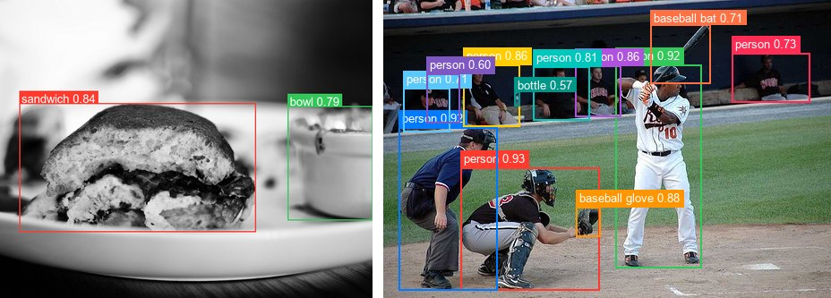
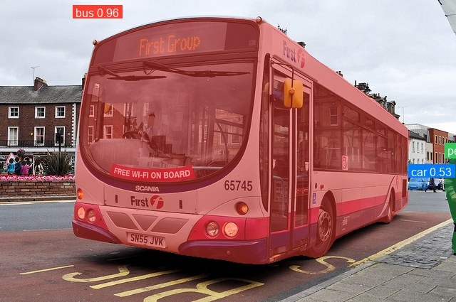

# RF-DETR

<div style="background:#dff0d8; border:1px solid #cfe6bf; border-radius:3px; padding:12px 16px; color:#2a3a26;">
<b>Weights:</b> the pretrained weights for the RF-DETR model are hosted on the
kerasformers <a href="https://github.com/IMvision12/KerasFormers/releases/tag/rf-detr" style="color:#1a5c8a;">rf-detr</a>
release tag, and download automatically the first time you call
<code>from_weights(...)</code>.
</div>
<br>

RF-DETR is Roboflow's real-time DETR, built on a windowed DINOv2 backbone with a lightweight deformable decoder. The configurations came out of a neural architecture search, which is why the variants differ along several axes at once (resolution, patch size, window count, decoder depth) rather than just scaling width.

Two things distinguish it from the RT-DETR family: it uses a **pretrained ViT backbone** rather than a CNN, and each variant trains at **its own resolution** rather than a shared 640. That second point matters in practice, see [Input Resolution](#input-resolution).

**Paper**: [RF-DETR: Neural Architecture Search for Real-Time Detection Transformers](https://arxiv.org/abs/2511.09554)

## API

### RFDETRDetect

```python
RFDETRDetect(hidden_dim=256, backbone_hidden_size=384, backbone_num_heads=6,
             backbone_num_layers=12, backbone_mlp_ratio=4,
             backbone_use_swiglu=False, num_register_tokens=0,
             out_feature_indexes=None, patch_size=14, num_windows=4,
             positional_encoding_size=37, resolution=560, dec_layers=3,
             sa_nheads=8, ca_nheads=16, dec_n_points=2, num_queries=300,
             num_classes=91, two_stage=True, bbox_reparam=True,
             lite_refpoint_refine=True, group_detr=13, dim_feedforward=2048,
             image_size=None, input_tensor=None, name="RFDETRDetect")
```

The detector: DINOv2 backbone, deformable decoder, and class and box heads.
**This is the class for object detection.**

Most parameters are architecture dimensions that `from_weights` fills in from the
variant config. The ones worth knowing:

- **num_classes** (`int`, *optional*, defaults to `91`): COCO's 91-index label space.
- **num_queries** (`int`, *optional*, defaults to `300`): decoder queries. Also a lower bound on usable resolution, see [Input Resolution](#input-resolution).
- **resolution** (`int`, *optional*, defaults to `560`): the variant's native training resolution.
- **image_size** (`int` or `tuple`, *optional*): input shape the model is built for. Defaults to `resolution`.
- **patch_size** (`int`, *optional*, defaults to `14`): DINOv2 patch size. `16` for every variant except base.
- **num_windows** (`int`, *optional*, defaults to `4`): windows per spatial dimension in the windowed-attention blocks. `2` for every variant except base.
- **positional_encoding_size** (`int`, *optional*, defaults to `37`): side of the learned position-encoding grid, interpolated to the actual patch grid at build time.
- **dec_layers** (`int`, *optional*, defaults to `3`): decoder depth, 2 to 4 depending on variant.
- **two_stage** (`bool`, *optional*, defaults to `True`): initialize queries from encoder proposals.
- **bbox_reparam** (`bool`, *optional*, defaults to `True`): reparameterized box regression.
- **group_detr** (`int`, *optional*, defaults to `13`): query groups used during training; inference uses one.
- **input_tensor** (`dict`, *optional*): pre-existing input tensors to build on.
- **name** (`str`, *optional*, defaults to `"RFDETRDetect"`): model name.

**Call** `model(pixel_values, training=False)`. **Returns** a `dict`:

- **logits** (`(B, num_queries, num_classes)`): per-query class logits, sigmoid-activated downstream.
- **pred_boxes** (`(B, num_queries, 4)`): normalized `(cx, cy, w, h)` in `[0, 1]`.

### RFDETRInstanceSegment

```python
RFDETRInstanceSegment(..., patch_size=12, num_windows=2,
                      positional_encoding_size=32, resolution=384, dec_layers=4,
                      num_queries=100, mask_downsample_ratio=4,
                      intermediate_size=1024, seg_activation="gelu",
                      name="RFDETRInstanceSegment")
```

Adds a mask head to the same backbone and decoder, predicting one mask per query.
**Parameters** match [RFDETRDetect](#rfdetrdetect) plus:

- **mask_downsample_ratio** (`int`, *optional*, defaults to `4`): masks are emitted at `resolution // ratio`.
- **intermediate_size** (`int`, *optional*, defaults to `1024`): width of the mask head.
- **seg_activation** (`str`, *optional*, defaults to `"gelu"`): mask-head activation.

**Returns** a `dict` with **logits**, **pred_boxes**, and **pred_masks**
`(B, num_queries, H // ratio, W // ratio)` of mask logits.

### RFDetrModel

```python
RFDetrModel(..., name="RFDetrModel")
```

The backbone and decoder without heads. **Parameters** match
[RFDETRDetect](#rfdetrdetect), minus `num_classes`.

## Preprocessing

### RFDETRImageProcessor

```python
RFDETRImageProcessor(size=None, resample="bilinear", do_rescale=True,
                     rescale_factor=1/255, do_normalize=True, image_mean=None,
                     image_std=None, return_tensor=True, data_format=None,
                     variant=None)
```

Resizes to a fixed square, rescales to `[0, 1]`, and normalizes with ImageNet
statistics.

> **Prefer `RFDETRImageProcessor.from_weights(variant)`.** Every variant trains at its
> own resolution, and the bare constructor gives rfdetr-base's 560, which is wrong for
> every other variant. `from_weights` reads the right size from the model config.

**Parameters**

- **variant** (`str`, *optional*): release variant whose resolution to adopt, for example `"rfdetr-nano"`. Ignored when `size` is given.
- **size** (`dict`, *optional*): target size, overriding `variant`. Defaults to the variant's resolution, or `{"height": 560, "width": 560}` when neither is given.
- **resample** (`str`, *optional*, defaults to `"bilinear"`): resize interpolation.
- **do_rescale** (`bool`, *optional*, defaults to `True`): scale pixels to `[0, 1]`.
- **rescale_factor** (`float`, *optional*, defaults to `1/255`): the rescaling factor.
- **do_normalize** (`bool`, *optional*, defaults to `True`): apply ImageNet normalization. RF-DETR does normalize, unlike RT-DETR and D-FINE.
- **image_mean** (`tuple`, *optional*, defaults to `(0.485, 0.456, 0.406)`): per-channel mean.
- **image_std** (`tuple`, *optional*, defaults to `(0.229, 0.224, 0.225)`): per-channel std.
- **return_tensor** (`bool`, *optional*, defaults to `True`): return backend tensors rather than numpy.
- **data_format** (`str`, *optional*): `"channels_last"` or `"channels_first"`. Defaults to `keras.config.image_data_format()`.

**Call** `processor(image)` with a path, a PIL image, an array, or a **list** of any
mix of those. **Returns** a `dict`:

- **pixel_values** (`(B, H, W, 3)`): preprocessed images, in the configured data format.

The same processor serves detection and segmentation: preprocessing is identical, only
the target size and the post-processor differ.

**post_process_object_detection**

```python
processor.post_process_object_detection(outputs, threshold=0.5,
                                        num_top_queries=300, target_sizes=None,
                                        label_names=None)
```

Applies sigmoid, takes the top scoring query/class pairs, converts boxes to pixel
`(x0, y0, x1, y1)`, and filters by `threshold`. **Returns** a list with one `dict` per
image holding **scores**, **labels**, **label_names**, and **boxes**.

**post_process_instance_segmentation**

```python
processor.post_process_instance_segmentation(outputs, threshold=0.5,
                                             num_top_queries=300,
                                             target_sizes=None,
                                             label_names=None,
                                             mask_threshold=0.5)
```

As above, plus **masks**: boolean masks upsampled to each `target_sizes` entry and
thresholded at `mask_threshold`.

## Model Variants

Detection, for `RFDETRDetect.from_weights`:

| Variant id      | Resolution | Patch | Windows | Decoder layers |
|-----------------|-----------:|------:|--------:|---------------:|
| `rfdetr-nano`   |        384 |    16 |       2 |              2 |
| `rfdetr-small`  |        512 |    16 |       2 |              3 |
| `rfdetr-medium` |        576 |    16 |       2 |              4 |
| `rfdetr-base`   |        560 |    14 |       4 |              3 |
| `rfdetr-large`  |        704 |    16 |       2 |              4 |

Instance segmentation, for `RFDETRInstanceSegment.from_weights`, sourced from the
`Roboflow/rf-detr-seg-*` repos:

| Variant id           | Resolution | Queries | Decoder layers |
|----------------------|-----------:|--------:|---------------:|
| `rfdetr-seg-preview` |        432 |     200 |              4 |
| `rfdetr-seg-nano`    |        312 |     100 |              4 |
| `rfdetr-seg-small`   |        384 |     100 |              4 |
| `rfdetr-seg-medium`  |        432 |     200 |              5 |
| `rfdetr-seg-large`   |        504 |     300 |              5 |
| `rfdetr-seg-xlarge`  |        624 |     300 |              6 |
| `rfdetr-seg-xxlarge` |        768 |     300 |              6 |

## Basic Usage: Object Detection


```python
from PIL import Image
from kerasformers.models.rf_detr import RFDETRDetect, RFDETRImageProcessor

model = RFDETRDetect.from_weights("rfdetr-nano")
processor = RFDETRImageProcessor.from_weights("rfdetr-nano")   # resolves 384

image = Image.open("assets/data/coco_fairground_ride.jpg").convert("RGB")
inputs = processor(image)

output = model(inputs["pixel_values"], training=False)
# output["logits"]:     (1, 300, 91)
# output["pred_boxes"]: (1, 300, 4)

results = processor.post_process_object_detection(
    output, threshold=0.5, target_sizes=[(image.height, image.width)]
)[0]

# Queries come back in the model's own order, so sort by score for readability.
detections = sorted(
    zip(results["scores"], results["label_names"], results["boxes"]),
    key=lambda d: -float(d[0]),
)
for score, name, box in detections:
    print(f"{name:14s} {float(score):.3f}  {[round(float(v)) for v in box]}")
```

```
person         0.745  [148, 135, 223, 190]
person         0.726  [62, 215, 185, 356]
person         0.705  [221, 155, 281, 211]
person         0.685  [136, 183, 264, 379]
person         0.522  [205, 196, 271, 272]
person         0.504  [138, 182, 212, 249]
```

Using `from_weights` on **both** the model and the processor is what keeps their
resolutions in agreement. A bare `RFDETRImageProcessor()` emits 560 while
`RFDETRDetect.from_weights("rfdetr-nano")` builds at 384, and the mismatch raises.

### Batch Processing Multiple Images

Pass a list of images and one `target_sizes` entry per image:



```python
from PIL import Image
from kerasformers.models.rf_detr import RFDETRDetect, RFDETRImageProcessor

model = RFDETRDetect.from_weights("rfdetr-nano")
processor = RFDETRImageProcessor.from_weights("rfdetr-nano")

paths = ["assets/data/coco_sandwich.jpg", "assets/data/coco_baseball.jpg"]
images = [Image.open(p).convert("RGB") for p in paths]

inputs = processor(paths)                                  # (2, 384, 384, 3)
output = model(inputs["pixel_values"], training=False)

results = processor.post_process_object_detection(
    output, threshold=0.5,
    target_sizes=[(im.height, im.width) for im in images],
)

for path, result in zip(paths, results):
    print(f"\n{path}")
    detections = sorted(
        zip(result["scores"], result["label_names"], result["boxes"]),
        key=lambda d: -float(d[0]),
    )
    for score, name, box in detections:
        print(f"  {name:12s} {float(score):.3f}  {[round(float(v)) for v in box]}")
```

```
assets/data/coco_sandwich.jpg
  sandwich     0.841  [33, 177, 439, 398]
  bowl         0.787  [494, 182, 640, 378]

assets/data/coco_baseball.jpg
  person       0.933  [86, 187, 241, 324]
  person       0.925  [259, 72, 355, 299]
  person       0.924  [17, 142, 127, 324]
  baseball glove 0.880  [215, 231, 242, 264]
  person       0.864  [214, 73, 265, 130]
  person       0.858  [89, 72, 152, 141]
  person       0.806  [167, 74, 230, 134]
  person       0.733  [389, 59, 476, 114]
  person       0.712  [22, 98, 74, 147]
  baseball bat 0.709  [298, 27, 365, 93]
  person       0.602  [48, 82, 85, 137]
  bottle       0.574  [146, 102, 152, 118]
```

Every image is resized to the same square, so stacking is always safe.

## Instance Segmentation

`RFDETRInstanceSegment` predicts a mask per query alongside the class and box. The
post-processor upsamples masks to the original image size and thresholds them.



```python
import numpy as np
from PIL import Image
from kerasformers.models.rf_detr import RFDETRImageProcessor, RFDETRInstanceSegment

model = RFDETRInstanceSegment.from_weights("rfdetr-seg-small")
processor = RFDETRImageProcessor.from_weights("rfdetr-seg-small")   # resolves 384

image = Image.open("assets/data/coco_bus.jpg").convert("RGB")
output = model(processor(image)["pixel_values"], training=False)
# output["logits"]:     (1, 100, 91)
# output["pred_boxes"]: (1, 100, 4)
# output["pred_masks"]: (1, 100, 96, 96)     resolution // mask_downsample_ratio

result = processor.post_process_instance_segmentation(
    output, threshold=0.5, target_sizes=[(image.height, image.width)]
)[0]
# result keys: boxes, label_names, labels, masks, scores

scores = np.asarray(result["scores"])
masks = np.asarray(result["masks"])
for i in np.argsort(-scores):
    print(f"{result['label_names'][i]:14s} {float(scores[i]):.3f}  "
          f"area {int(masks[i].sum())}")
print("masks:", masks.shape)
```

```
bus            0.965  area 130280
person         0.787  area 1217
car            0.535  area 454
masks: (3, 425, 640)
```

Masks come back already upsampled to the image size, one per surviving instance, as
booleans. `pred_masks` in the raw output is at `resolution // 4` (96×96 for a 384
variant), so the post-processor does the upsample and threshold for you.

Note the spread in `area`: the bus covers 130280 pixels while the distant car covers
454. When compositing several instances, paint the largest first so small objects are
not buried, the same ordering [DETR's panoptic section](detr.md#rendering-the-masks)
needs.

## Input Resolution

RF-DETR is Functional, so the input shape is fixed at construction. Both the model and
the processor must agree, which `from_weights` handles. To run at another resolution,
set it on both:

```python
model = RFDETRDetect.from_weights("rfdetr-nano", resolution=512, image_size=512)
processor = RFDETRImageProcessor(size={"height": 512, "width": 512})
```

Pretrained weights load fine at a non-native size, because the learned DINOv2 position
grid is interpolated to the actual patch grid at build time. But RF-DETR has **two hard
constraints** that its siblings do not:

| rule | why |
|---|---|
| `(side / patch_size)² >= num_queries` | two-stage selection needs at least `num_queries` patch tokens |
| `(side / patch_size) % num_windows == 0` | windowed attention partitions the patch grid |

For `rfdetr-nano` (patch 16, windows 2, 300 queries) that means **multiples of 32 at or
above 288**:

```
256  16x16=256 patches   FAIL  (256 < 300 queries)
288  18x18=324 patches   OK    laptop 0.96, keyboard 0.95, mouse 0.89, tv 0.78
304  19x19=361 patches   FAIL  (19 is odd, window partition breaks)
320  20x20=400 patches   OK    laptop 0.97, keyboard 0.94, mouse 0.89, tv 0.76
384  24x24=576 patches   OK    laptop 0.96, keyboard 0.96, mouse 0.88, tv 0.74  <- native
512  32x32=1024 patches  OK    laptop 0.96, keyboard 0.96, mouse 0.89, tv 0.71
```

224 fails both ways: it gives only 196 tokens for 300 queries. The error names both
numbers (`300 ... cannot be broadcasted to 196`). This is architectural rather than a
kerasformers limitation, the reference implementation raises `selected index k out of
range` on the same input.

## Custom Class Names

A model fine-tuned on your own dataset predicts your class indices, not COCO's:

```python
MY_CLASSES = ["cat", "dog", "bird"]

results = processor.post_process_object_detection(
    output, threshold=0.5, target_sizes=[(image.height, image.width)],
    label_names=MY_CLASSES,
)
```

Without it the post-processor falls back to COCO's 91 names. The integer `labels` are
unaffected.

## Data Format

**Both the models and the processors support `channels_last` and `channels_first`.**
Neither is hard-coded to a layout, so the whole pipeline runs either way.

| | How it picks the format |
|---|---|
| Processors | A `data_format` kwarg, per instance. `None` (the default) resolves to `keras.config.image_data_format()`. |
| Models | Read `keras.config.image_data_format()` when they are **constructed**. There is no `data_format` argument. |

### Overriding the processor only

```python
RFDETRImageProcessor(data_format="channels_last")("photo.jpg")
# {"pixel_values": (1, 560, 560, 3)}

RFDETRImageProcessor(data_format="channels_first")("photo.jpg")
# {"pixel_values": (1, 3, 560, 560)}
```

### Switching the whole pipeline

```python
import keras

keras.config.set_image_data_format("channels_first")

model = RFDETRDetect.from_weights("rfdetr-nano")
processor = RFDETRImageProcessor.from_weights("rfdetr-nano")
```

Detections are the same under either layout. Only the tensor shape changes. Set it once
at the top of a script, since already-built models keep the layout they were
constructed with.

The detection post-processor emits `xyxy` pixel boxes and class indices, so it takes no
`data_format` kwarg. Masks from `post_process_instance_segmentation` are returned as
`(N, H, W)` regardless of layout.

## Loading Fine-tuned and Community Weights

Any Hugging Face repo whose `model_type` is `"rf_detr"` loads directly with the `hf:`
prefix, including the Roboflow checkpoints and arbitrary fine-tunes.

```python
from kerasformers.models.rf_detr import RFDETRDetect, RFDETRInstanceSegment

# Upstream release
model = RFDETRDetect.from_weights("hf:Roboflow/rf-detr-nano")
seg = RFDETRInstanceSegment.from_weights("hf:Roboflow/rf-detr-seg-small")

# Somebody's fine-tune
model = RFDETRDetect.from_weights("hf:<user>/rfdetr-finetuned-on-my-data")

# Architecture only, randomly initialized
model = RFDETRDetect.from_weights("rfdetr-nano", load_weights=False)
```

No shape arguments are needed. The architecture is read from the repo's `config.json`
and mapped onto the constructor. All three model classes accept `hf:`, as does
`RFDETRImageProcessor`:

```python
processor = RFDETRImageProcessor.from_weights("hf:Roboflow/rf-detr-nano")
```

Loading `hf:Roboflow/rf-detr-nano` and the `rfdetr-nano` release variant produces
identical outputs, since they are the same checkpoint by two routes.
