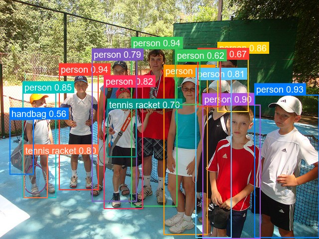
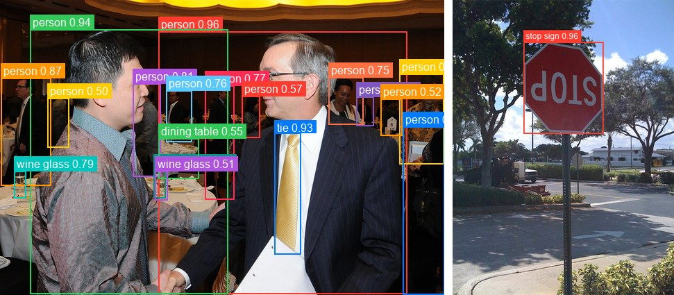

# RT-DETR

<div style="background:#dff0d8; border:1px solid #cfe6bf; border-radius:3px; padding:12px 16px; color:#2a3a26;">
<b>Weights:</b> the pretrained weights for the RT-DETR model are hosted on the
kerasformers <a href="https://github.com/IMvision12/KerasFormers/releases/tag/rt-detr" style="color:#1a5c8a;">rt-detr</a>
release tag, and download automatically the first time you call
<code>from_weights(...)</code>.
</div>
<br>

RT-DETR was the first DETR-style detector to beat YOLO on the real-time speed/accuracy tradeoff. It pairs a ResNet-vd backbone with a hybrid encoder that decouples intra-scale attention from cross-scale fusion, then feeds IoU-aware selected queries into a deformable decoder.

The practical appeal is that it is **NMS-free**. YOLO's latency depends on how many boxes survive to non-maximum suppression, which varies per image and per threshold. RT-DETR emits a fixed 300 queries and does no suppression, so inference cost is constant and there is no NMS threshold to tune.

**Paper**: [DETRs Beat YOLOs on Real-time Object Detection](https://arxiv.org/abs/2304.08069)

## API

### RTDETRDetect

```python
RTDETRDetect(backbone_hidden_sizes=(256, 512, 1024, 2048),
             backbone_block_repeats=(3, 4, 6, 3), backbone_embedding_size=64,
             backbone_layer_type="bottleneck", encoder_in_channels=(512, 1024, 2048),
             encoder_hidden_dim=256, encoder_num_layers=1, encoder_ffn_dim=1024,
             encoder_num_heads=8, encode_proj_layers=(2,),
             encoder_activation_function="gelu", activation_function="silu",
             hidden_expansion=1.0, hidden_dim=256, decoder_num_layers=6,
             decoder_ffn_dim=1024, decoder_num_heads=8, decoder_n_points=4,
             decoder_activation_function="relu", num_feature_levels=3,
             feat_strides=(8, 16, 32), num_queries=300, num_classes=80,
             image_size=640, input_tensor=None, name="RTDETRDetect")
```

The detector: ResNet-vd backbone, hybrid encoder, and deformable decoder with class
and box heads. **This is the class for object detection.**

Most parameters are architecture dimensions that `from_weights` fills in from the
variant config. The ones worth knowing:

- **num_classes** (`int`, *optional*, defaults to `80`): COCO's 80 categories. No background class.
- **num_queries** (`int`, *optional*, defaults to `300`): decoder queries, the ceiling on detections per image.
- **image_size** (`int`, *optional*, defaults to `640`): input resolution the model is built for. Must be a multiple of 32, see [Input Resolution](#input-resolution).
- **backbone_block_repeats** (`tuple`, *optional*, defaults to `(3, 4, 6, 3)`): ResNet stage depths. `(2, 2, 2, 2)` for r18, `(3, 4, 23, 3)` for r101.
- **backbone_layer_type** (`str`, *optional*, defaults to `"bottleneck"`): `"basic"` for r18 and r34, `"bottleneck"` for r50 and r101.
- **encoder_hidden_dim** (`int`, *optional*, defaults to `256`): hybrid-encoder width. `384` for r101.
- **decoder_num_layers** (`int`, *optional*, defaults to `6`): decoder depth.
- **decoder_n_points** (`int`, *optional*, defaults to `4`): deformable sampling points per level.
- **feat_strides** (`tuple`, *optional*, defaults to `(8, 16, 32)`): strides of the three feature levels.
- **input_tensor** (`dict`, *optional*): pre-existing input tensors to build on.
- **name** (`str`, *optional*, defaults to `"RTDETRDetect"`): model name.

**Call** `model(pixel_values, training=False)`. **Returns** a `dict`:

- **logits** (`(B, num_queries, num_classes)`): per-query class logits, sigmoid-activated downstream.
- **pred_boxes** (`(B, num_queries, 4)`): normalized `(cx, cy, w, h)` in `[0, 1]`.

### RTDetrModel

```python
RTDetrModel(..., name="RTDetrModel")
```

The backbone and hybrid encoder without detection heads. **Parameters** match
[RTDETRDetect](#rtdetrdetect), minus `num_classes`, with **name** defaulting to
`"RTDetrModel"`.

## Preprocessing

### RTDETRImageProcessor

```python
RTDETRImageProcessor(size=None, resample="bilinear", do_rescale=True,
                     rescale_factor=1/255, do_normalize=False, image_mean=None,
                     image_std=None, return_tensor=True, data_format=None)
```

Resizes to a fixed square and rescales to `[0, 1]`.

**Parameters**

- **size** (`dict`, *optional*, defaults to `{"height": 640, "width": 640}`): target size.
- **resample** (`str`, *optional*, defaults to `"bilinear"`): resize interpolation.
- **do_rescale** (`bool`, *optional*, defaults to `True`): scale pixels to `[0, 1]`.
- **rescale_factor** (`float`, *optional*, defaults to `1/255`): the rescaling factor.
- **do_normalize** (`bool`, *optional*, defaults to **`False`**): see the note below.
- **image_mean** / **image_std** (`tuple`, *optional*): normalization statistics, unused while `do_normalize` is `False`.
- **return_tensor** (`bool`, *optional*, defaults to `True`): return backend tensors rather than numpy.
- **data_format** (`str`, *optional*): `"channels_last"` or `"channels_first"`. Defaults to `keras.config.image_data_format()`.

> **`do_normalize` defaults to `False` here, and that is correct.** RT-DETR was trained
> on rescaled `[0, 1]` input with no ImageNet normalization, matching
> `PekingU/rtdetr_*` upstream. DETR and RF-DETR default to `True`. Turning it on here
> measurably degrades quality: on `coco_desk.jpg` every score drops and `tv` falls from
> 0.928 to 0.789, with a duplicate `mouse` appearing above threshold.

**Call** `processor(image)` with a path, a PIL image, an array, or a **list** of any
mix of those. **Returns** a `dict`:

- **pixel_values** (`(B, H, W, 3)`): preprocessed images, in the configured data format.

**post_process_object_detection**

```python
processor.post_process_object_detection(outputs, threshold=0.5,
                                        num_top_queries=300, target_sizes=None,
                                        label_names=None)
```

Applies sigmoid, takes the top scoring query/class pairs, converts boxes to pixel
`(x0, y0, x1, y1)`, and filters by `threshold`. Omitting `target_sizes` leaves boxes
normalized.

**Returns** a list with one `dict` per image, holding **scores**, **labels**,
**label_names**, and **boxes**.

## Model Variants

| Variant id               | Backbone      | Params | HF original                     |
|--------------------------|---------------|-------:|---------------------------------|
| `rtdetr-r18vd`           | ResNet-18-vd  |  20 M  | `PekingU/rtdetr_r18vd`           |
| `rtdetr-r18vd-coco-o365` | ResNet-18-vd  |  20 M  | `PekingU/rtdetr_r18vd_coco_o365` |
| `rtdetr-r34vd`           | ResNet-34-vd  |  31 M  | `PekingU/rtdetr_r34vd`           |
| `rtdetr-r50vd`           | ResNet-50-vd  |  43 M  | `PekingU/rtdetr_r50vd`           |
| `rtdetr-r50vd-coco-o365` | ResNet-50-vd  |  43 M  | `PekingU/rtdetr_r50vd_coco_o365` |
| `rtdetr-r101vd`          | ResNet-101-vd |  77 M  | `PekingU/rtdetr_r101vd`          |
| `rtdetr-r101vd-coco-o365`| ResNet-101-vd |  77 M  | `PekingU/rtdetr_r101vd_coco_o365`|

The `coco-o365` variants are pretrained on Objects365 before COCO fine-tuning, which
generally helps on classes that are rare in COCO. All are 640×640.

## Basic Usage: Object Detection



```python
from PIL import Image
from kerasformers.models.rt_detr import RTDETRDetect, RTDETRImageProcessor

model = RTDETRDetect.from_weights("rtdetr-r18vd")
processor = RTDETRImageProcessor()

image = Image.open("assets/data/coco_children_pool.jpg").convert("RGB")
inputs = processor(image)

output = model(inputs["pixel_values"], training=False)
# output["logits"]:     (1, 300, 80)
# output["pred_boxes"]: (1, 300, 4)

results = processor.post_process_object_detection(
    output, threshold=0.5, target_sizes=[(image.height, image.width)]
)[0]

# Queries come back in the model's own order, so sort by score for readability.
detections = sorted(
    zip(results["scores"], results["label_names"], results["boxes"]),
    key=lambda d: -float(d[0]),
)
for score, name, box in detections:
    print(f"{name:14s} {float(score):.3f}  {[round(float(v)) for v in box]}")
```

```
person         0.944  [118, 150, 197, 381]
person         0.935  [263, 97, 355, 414]
person         0.934  [510, 190, 640, 477]
person         0.924  [328, 153, 416, 471]
person         0.899  [406, 210, 522, 479]
person         0.862  [436, 107, 498, 224]
person         0.850  [45, 186, 112, 397]
person         0.823  [208, 174, 286, 419]
person         0.806  [392, 159, 464, 477]
tennis racket  0.800  [47, 309, 95, 397]
person         0.788  [184, 120, 274, 404]
tennis racket  0.702  [215, 217, 273, 315]
person         0.669  [396, 119, 442, 214]
person         0.616  [351, 122, 401, 210]
handbag        0.556  [19, 239, 67, 350]
```

Fifteen detections in a crowded scene, including two tennis rackets and a handbag among
thirteen people. The 300-query budget is generous enough that crowding is rarely the
limit in practice.

### Batch Processing Multiple Images

Pass a list of images and one `target_sizes` entry per image:



```python
from PIL import Image
from kerasformers.models.rt_detr import RTDETRDetect, RTDETRImageProcessor

model = RTDETRDetect.from_weights("rtdetr-r18vd")
processor = RTDETRImageProcessor()

paths = ["assets/data/coco_conference.jpg", "assets/data/coco_stop_sign.jpg"]
images = [Image.open(p).convert("RGB") for p in paths]

inputs = processor(paths)                                  # (2, 640, 640, 3)
output = model(inputs["pixel_values"], training=False)

results = processor.post_process_object_detection(
    output, threshold=0.5,
    target_sizes=[(im.height, im.width) for im in images],
)

for path, result in zip(paths, results):
    print(f"\n{path}")
    detections = sorted(
        zip(result["scores"], result["label_names"], result["boxes"]),
        key=lambda d: -float(d[0]),
    )
    for score, name, box in detections:
        print(f"  {name:12s} {float(score):.3f}  {[round(float(v)) for v in box]}")
```

```
assets/data/coco_conference.jpg
  person       0.962  [228, 45, 586, 423]
  person       0.944  [43, 42, 328, 423]
  tie          0.925  [395, 191, 433, 366]
  person       0.869  [1, 112, 73, 267]
  person       0.814  [191, 120, 231, 254]
  person       0.801  [575, 106, 639, 236]
  wine glass   0.789  [20, 246, 37, 285]
  person       0.766  [295, 123, 337, 287]
  person       0.763  [239, 130, 276, 204]
  person       0.751  [473, 111, 523, 179]
  person       0.654  [513, 139, 538, 181]
  wine glass   0.605  [221, 243, 238, 285]
  person       0.575  [348, 138, 374, 198]
  dining table 0.554  [228, 199, 286, 257]
  person       0.550  [580, 182, 640, 424]
  person       0.524  [548, 142, 579, 195]
  wine glass   0.507  [223, 246, 241, 288]
  person       0.505  [68, 141, 99, 212]

assets/data/coco_stop_sign.jpg
  stop sign    0.961  [120, 71, 255, 226]
```

One image yields a single detection and the other eighteen, which is fine: results are
per-image lists, not a fixed-width tensor. Every image is resized to the same square,
so stacking is always safe.

## Input Resolution

RT-DETR is Functional, so the input shape is fixed when the model is constructed. To
run at another resolution, build at that size and match the processor:

```python
model = RTDETRDetect.from_weights("rtdetr-r18vd", image_size=512)
processor = RTDETRImageProcessor(size={"height": 512, "width": 512})
```

**The side must be a multiple of 32.** The three feature levels use strides 8, 16, and
32, and the encoder fuses an upsampled stride-32 map with the stride-16 map. At 600 the
two come out 37 and 38 wide and the addition fails:

```
Inputs have incompatible shapes. Received shapes (38, 38, 256) and (37, 37, 256)
```

Pretrained weights load at any valid size, because RT-DETR's position encodings are
computed sine functions (`rt_detr_sine_pos_embed`) rather than a learned grid. There is
nothing tied to the training resolution and nothing to interpolate:

```
320:  mouse 0.877, tv 0.769, keyboard 0.718           <- laptop missed entirely
480:  laptop 0.962, keyboard 0.961, tv 0.932, mouse 0.906
512:  keyboard 0.961, laptop 0.950, tv 0.930, mouse 0.914
640:  keyboard 0.962, laptop 0.961, tv 0.928, mouse 0.912   <- native
800:  laptop 0.961, keyboard 0.952, tv 0.919, mouse 0.901
```

480 to 800 holds up well. At 320 the model starts missing objects outright.

## Custom Class Names

A model fine-tuned on your own dataset predicts your class indices, not COCO's. Pass
the names so `label_names` reads correctly:

```python
MY_CLASSES = ["cat", "dog", "bird"]

results = processor.post_process_object_detection(
    output, threshold=0.5, target_sizes=[(image.height, image.width)],
    label_names=MY_CLASSES,
)
```

Without it the post-processor falls back to COCO's 80 names, silently mislabeling a
custom model. The integer `labels` are unaffected.

## Data Format

**Both the models and the processors support `channels_last` and `channels_first`.**
Neither is hard-coded to a layout, so the whole pipeline runs either way.

They pick the format differently, which is the one thing to keep straight:

| | How it picks the format |
|---|---|
| Processors | A `data_format` kwarg, per instance. `None` (the default) resolves to `keras.config.image_data_format()`. |
| Models | Read `keras.config.image_data_format()` when they are **constructed**. There is no `data_format` argument. |

### Overriding the processor only

```python
RTDETRImageProcessor(data_format="channels_last")("photo.jpg")
# {"pixel_values": (1, 640, 640, 3)}

RTDETRImageProcessor(data_format="channels_first")("photo.jpg")
# {"pixel_values": (1, 3, 640, 640)}
```

### Switching the whole pipeline

Set the global format before constructing the model, and both sides agree:

```python
import keras

keras.config.set_image_data_format("channels_first")

model = RTDETRDetect.from_weights("rtdetr-r18vd")
processor = RTDETRImageProcessor()
```

Detections are the same under either layout. Only the tensor shape changes. Set it once
at the top of a script, since already-built models keep the layout they were
constructed with.

The post-processor is not format-sensitive: it emits `xyxy` pixel boxes and class
indices, which have no channel axis, so it takes no `data_format` kwarg.

## Loading Fine-tuned and Community Weights

Any Hugging Face repo whose `model_type` is `"rt_detr"` loads directly with the `hf:`
prefix, including the upstream checkpoints and arbitrary fine-tunes.

```python
from kerasformers.models.rt_detr import RTDETRDetect

# Upstream release
model = RTDETRDetect.from_weights("hf:PekingU/rtdetr_r18vd")

# Somebody's fine-tune
model = RTDETRDetect.from_weights("hf:<user>/rtdetr-finetuned-on-my-data")

# Architecture only, randomly initialized
model = RTDETRDetect.from_weights("rtdetr-r18vd", load_weights=False)
```

No shape arguments are needed. The architecture is read from the repo's `config.json`
and mapped onto the constructor. Both model classes accept `hf:`, as does
`RTDETRImageProcessor`:

```python
processor = RTDETRImageProcessor.from_weights("hf:PekingU/rtdetr_r18vd")
```

Loading `hf:PekingU/rtdetr_r18vd` and the `rtdetr-r18vd` release variant produces
identical outputs, since they are the same checkpoint by two routes.

See also [RT-DETRv2](rt_detr_v2.md), which keeps this architecture and improves the
deformable sampling.
