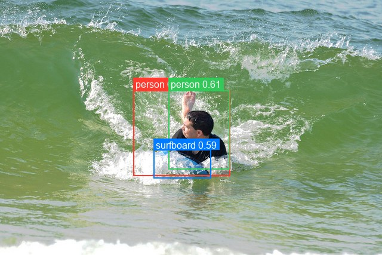
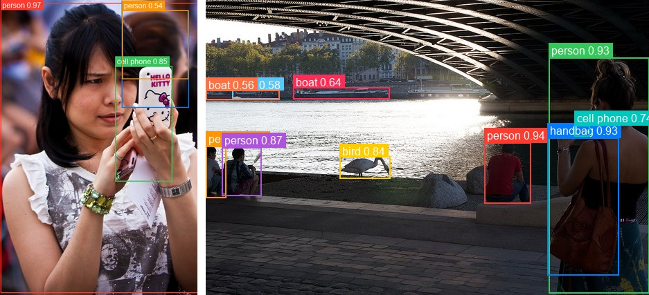

# RT-DETRv2

<div style="background:#dff0d8; border:1px solid #cfe6bf; border-radius:3px; padding:12px 16px; color:#2a3a26;">
<b>Weights:</b> the pretrained weights for the RT-DETRv2 model are hosted on the
kerasformers <a href="https://github.com/IMvision12/KerasFormers/releases/tag/rt-detrv2" style="color:#1a5c8a;">rt-detrv2</a>
release tag, and download automatically the first time you call
<code>from_weights(...)</code>.
</div>
<br>

RT-DETRv2 keeps [RT-DETR](rt_detr.md)'s hybrid encoder and deformable decoder and improves the sampling. Where v1 uses a fixed grid of deformable sampling points, v2 merges the per-level offsets into one dimension and scales them by a learned `n_points_scale` buffer, so the model adapts its sampling radius per feature level. The rest is a refined training recipe, the paper's "bag of freebies".

The API surface is identical to v1, and so is the inference pipeline. The weights are not interchangeable.

**Paper**: [RT-DETRv2: Improved Baseline with Bag-of-Freebies for Real-Time Detection Transformers](https://arxiv.org/abs/2407.17140)

## API

### RTDETRV2Detect

```python
RTDETRV2Detect(backbone_hidden_sizes=(256, 512, 1024, 2048),
               backbone_block_repeats=(3, 4, 6, 3), backbone_embedding_size=64,
               backbone_layer_type="bottleneck", encoder_in_channels=(512, 1024, 2048),
               encoder_hidden_dim=256, encoder_num_layers=1, encoder_ffn_dim=1024,
               encoder_num_heads=8, encode_proj_layers=(2,),
               encoder_activation_function="gelu", activation_function="silu",
               hidden_expansion=1.0, hidden_dim=256, decoder_num_layers=6,
               decoder_ffn_dim=1024, decoder_num_heads=8, decoder_n_points=4,
               decoder_activation_function="relu", num_feature_levels=3,
               feat_strides=(8, 16, 32), num_queries=300, num_classes=80,
               image_size=640, input_tensor=None, name="RTDETRV2Detect")
```

The detector: ResNet-vd backbone, hybrid encoder, and the selective multi-scale
deformable decoder. **This is the class for object detection.**

Parameters match [RT-DETR](rt_detr.md#rtdetrdetect) exactly, since v2 changes the
deformable sampling internals rather than the configuration surface. The ones worth
knowing:

- **num_classes** (`int`, *optional*, defaults to `80`): COCO's 80 categories. No background class.
- **num_queries** (`int`, *optional*, defaults to `300`): decoder queries, the ceiling on detections per image.
- **image_size** (`int`, *optional*, defaults to `640`): input resolution the model is built for. Must be a multiple of 32, see [Input Resolution](#input-resolution).
- **backbone_block_repeats** (`tuple`, *optional*, defaults to `(3, 4, 6, 3)`): ResNet stage depths. `(2, 2, 2, 2)` for r18, `(3, 4, 23, 3)` for r101.
- **backbone_layer_type** (`str`, *optional*, defaults to `"bottleneck"`): `"basic"` for r18 and r34, `"bottleneck"` for r50 and r101.
- **decoder_n_points** (`int`, *optional*, defaults to `4`): deformable sampling points per level, scaled per level by the learned `n_points_scale` in v2.
- **feat_strides** (`tuple`, *optional*, defaults to `(8, 16, 32)`): strides of the three feature levels.
- **input_tensor** (`dict`, *optional*): pre-existing input tensors to build on.
- **name** (`str`, *optional*, defaults to `"RTDETRV2Detect"`): model name.

**Call** `model(pixel_values, training=False)`. **Returns** a `dict`:

- **logits** (`(B, num_queries, num_classes)`): per-query class logits, sigmoid-activated downstream.
- **pred_boxes** (`(B, num_queries, 4)`): normalized `(cx, cy, w, h)` in `[0, 1]`.

### RTDetrV2Model

```python
RTDetrV2Model(..., name="RTDetrV2Model")
```

The backbone and hybrid encoder without detection heads. **Parameters** match
[RTDETRV2Detect](#rtdetrv2detect), minus `num_classes`, with **name** defaulting to
`"RTDetrV2Model"`.

## Preprocessing

### RTDETRV2ImageProcessor

```python
RTDETRV2ImageProcessor(size=None, resample="bilinear", do_rescale=True,
                       rescale_factor=1/255, do_normalize=False, image_mean=None,
                       image_std=None, return_tensor=True, data_format=None)
```

Resizes to a fixed square and rescales to `[0, 1]`. Identical to v1's processor.

**Parameters**

- **size** (`dict`, *optional*, defaults to `{"height": 640, "width": 640}`): target size.
- **resample** (`str`, *optional*, defaults to `"bilinear"`): resize interpolation.
- **do_rescale** (`bool`, *optional*, defaults to `True`): scale pixels to `[0, 1]`.
- **rescale_factor** (`float`, *optional*, defaults to `1/255`): the rescaling factor.
- **do_normalize** (`bool`, *optional*, defaults to **`False`**): see the note below.
- **image_mean** / **image_std** (`tuple`, *optional*): normalization statistics, unused while `do_normalize` is `False`.
- **return_tensor** (`bool`, *optional*, defaults to `True`): return backend tensors rather than numpy.
- **data_format** (`str`, *optional*): `"channels_last"` or `"channels_first"`. Defaults to `keras.config.image_data_format()`.

> **`do_normalize` defaults to `False` here, and that is correct.** Like v1, RT-DETRv2
> was trained on rescaled `[0, 1]` input with no ImageNet normalization, matching
> `PekingU/rtdetr_v2_*` upstream. DETR and RF-DETR default to `True`. Turning it on
> here degrades detection quality.

**Call** `processor(image)` with a path, a PIL image, an array, or a **list** of any
mix of those. **Returns** a `dict`:

- **pixel_values** (`(B, H, W, 3)`): preprocessed images, in the configured data format.

**post_process_object_detection**

```python
processor.post_process_object_detection(outputs, threshold=0.5,
                                        num_top_queries=300, target_sizes=None,
                                        label_names=None)
```

Applies sigmoid, takes the top scoring query/class pairs, converts boxes to pixel
`(x0, y0, x1, y1)`, and filters by `threshold`. Omitting `target_sizes` leaves boxes
normalized.

**Returns** a list with one `dict` per image, holding **scores**, **labels**,
**label_names**, and **boxes**.

## Model Variants

| Variant id        | Backbone      | Params | HF original                |
|-------------------|---------------|-------:|----------------------------|
| `rtdetr-v2-r18vd` | ResNet-18-vd  |  20 M  | `PekingU/rtdetr_v2_r18vd`   |
| `rtdetr-v2-r34vd` | ResNet-34-vd  |  31 M  | `PekingU/rtdetr_v2_r34vd`   |
| `rtdetr-v2-r50vd` | ResNet-50-vd  |  43 M  | `PekingU/rtdetr_v2_r50vd`   |
| `rtdetr-v2-r101vd`| ResNet-101-vd |  76 M  | `PekingU/rtdetr_v2_r101vd`  |

All are 640×640 COCO models. v2 has no Objects365-pretrained variants, unlike v1.

## Basic Usage: Object Detection



```python
from PIL import Image
from kerasformers.models.rt_detr_v2 import RTDETRV2Detect, RTDETRV2ImageProcessor

model = RTDETRV2Detect.from_weights("rtdetr-v2-r18vd")
processor = RTDETRV2ImageProcessor()

image = Image.open("assets/data/coco_surfer.jpg").convert("RGB")
inputs = processor(image)

output = model(inputs["pixel_values"], training=False)
# output["logits"]:     (1, 300, 80)
# output["pred_boxes"]: (1, 300, 4)

results = processor.post_process_object_detection(
    output, threshold=0.5, target_sizes=[(image.height, image.width)]
)[0]

# Queries come back in the model's own order, so sort by score for readability.
detections = sorted(
    zip(results["scores"], results["label_names"], results["boxes"]),
    key=lambda d: -float(d[0]),
)
for score, name, box in detections:
    print(f"{name:14s} {float(score):.3f}  {[round(float(v)) for v in box]}")
```

```
person         0.676  [223, 151, 385, 294]
person         0.606  [282, 151, 384, 283]
surfboard      0.588  [257, 250, 353, 298]
```

Scores here sit lower than on a clean studio shot because the subject is small against
a busy background. Lowering `threshold` surfaces more, at the cost of duplicates.

### Batch Processing Multiple Images

Pass a list of images and one `target_sizes` entry per image:



```python
from PIL import Image
from kerasformers.models.rt_detr_v2 import RTDETRV2Detect, RTDETRV2ImageProcessor

model = RTDETRV2Detect.from_weights("rtdetr-v2-r18vd")
processor = RTDETRV2ImageProcessor()

paths = ["assets/data/coco_woman_phone.jpg", "assets/data/coco_waterfront.jpg"]
images = [Image.open(p).convert("RGB") for p in paths]

inputs = processor(paths)                                  # (2, 640, 640, 3)
output = model(inputs["pixel_values"], training=False)

results = processor.post_process_object_detection(
    output, threshold=0.5,
    target_sizes=[(im.height, im.width) for im in images],
)

for path, result in zip(paths, results):
    print(f"\n{path}")
    detections = sorted(
        zip(result["scores"], result["label_names"], result["boxes"]),
        key=lambda d: -float(d[0]),
    )
    for score, name, box in detections:
        print(f"  {name:12s} {float(score):.3f}  {[round(float(v)) for v in box]}")
```

```
assets/data/coco_woman_phone.jpg
  person       0.969  [1, 6, 428, 635]
  cell phone   0.849  [249, 143, 372, 393]
  person       0.669  [263, 22, 408, 233]
  person       0.539  [264, 22, 407, 171]

assets/data/coco_waterfront.jpg
  person       0.938  [402, 206, 469, 294]
  person       0.931  [495, 83, 640, 424]
  handbag      0.929  [493, 199, 596, 398]
  person       0.884  [0, 211, 29, 286]
  person       0.871  [23, 213, 80, 283]
  bird         0.839  [193, 226, 266, 258]
  cell phone   0.738  [532, 181, 554, 197]
  boat         0.639  [126, 126, 265, 143]
  boat         0.579  [38, 130, 106, 143]
  boat         0.562  [0, 130, 106, 144]
```

Every image is resized to the same square, so stacking is always safe. Batch results
are identical to running the images one at a time.

## Input Resolution

RT-DETRv2 is Functional, so the input shape is fixed when the model is constructed. To
run at another resolution, build at that size and match the processor:

```python
model = RTDETRV2Detect.from_weights("rtdetr-v2-r18vd", image_size=512)
processor = RTDETRV2ImageProcessor(size={"height": 512, "width": 512})
```

**The side must be a multiple of 32**, for the same reason as v1: the encoder fuses an
upsampled stride-32 map with the stride-16 map, and at 600 they come out 37 and 38 wide.

Pretrained weights load at any valid size, since the position encodings are computed
sine functions rather than a learned grid:

```
320:  laptop 0.780, mouse 0.748, tv 0.748, keyboard 0.745
480:  laptop 0.936, keyboard 0.933, tv 0.920, mouse 0.906
512:  keyboard 0.951, laptop 0.943, tv 0.926, mouse 0.918
640:  laptop 0.965, keyboard 0.959, mouse 0.918, tv 0.914   <- native
800:  tv 0.913, keyboard 0.909, mouse 0.905, laptop 0.899
```

480 to 800 is the comfortable band. v2 holds up slightly better than v1 at 320, still
finding all four objects where v1 loses the laptop, though confidence drops sharply.

## Custom Class Names

A model fine-tuned on your own dataset predicts your class indices, not COCO's. Pass
the names so `label_names` reads correctly:

```python
MY_CLASSES = ["cat", "dog", "bird"]

results = processor.post_process_object_detection(
    output, threshold=0.5, target_sizes=[(image.height, image.width)],
    label_names=MY_CLASSES,
)
```

Without it the post-processor falls back to COCO's 80 names, silently mislabeling a
custom model. The integer `labels` are unaffected.

## Data Format

**Both the models and the processors support `channels_last` and `channels_first`.**
Neither is hard-coded to a layout, so the whole pipeline runs either way.

They pick the format differently, which is the one thing to keep straight:

| | How it picks the format |
|---|---|
| Processors | A `data_format` kwarg, per instance. `None` (the default) resolves to `keras.config.image_data_format()`. |
| Models | Read `keras.config.image_data_format()` when they are **constructed**. There is no `data_format` argument. |

### Overriding the processor only

```python
RTDETRV2ImageProcessor(data_format="channels_last")("photo.jpg")
# {"pixel_values": (1, 640, 640, 3)}

RTDETRV2ImageProcessor(data_format="channels_first")("photo.jpg")
# {"pixel_values": (1, 3, 640, 640)}
```

### Switching the whole pipeline

Set the global format before constructing the model, and both sides agree:

```python
import keras

keras.config.set_image_data_format("channels_first")

model = RTDETRV2Detect.from_weights("rtdetr-v2-r18vd")
processor = RTDETRV2ImageProcessor()
```

Detections are the same under either layout. Only the tensor shape changes. Set it once
at the top of a script, since already-built models keep the layout they were
constructed with.

The post-processor is not format-sensitive: it emits `xyxy` pixel boxes and class
indices, which have no channel axis, so it takes no `data_format` kwarg.

## Loading Fine-tuned and Community Weights

Any Hugging Face repo whose `model_type` is `"rt_detr_v2"` loads directly with the
`hf:` prefix.

```python
from kerasformers.models.rt_detr_v2 import RTDETRV2Detect

# Upstream release
model = RTDETRV2Detect.from_weights("hf:PekingU/rtdetr_v2_r18vd")

# Somebody's fine-tune
model = RTDETRV2Detect.from_weights("hf:<user>/rtdetrv2-finetuned-on-my-data")

# Architecture only, randomly initialized
model = RTDETRV2Detect.from_weights("rtdetr-v2-r18vd", load_weights=False)
```

No shape arguments are needed. The architecture is read from the repo's `config.json`
and mapped onto the constructor. Both model classes accept `hf:`, as does
`RTDETRV2ImageProcessor`:

```python
processor = RTDETRV2ImageProcessor.from_weights("hf:PekingU/rtdetr_v2_r18vd")
```

Note that v1 and v2 weights are **not** interchangeable despite the shared
configuration surface: the deformable sampling differs, so load v2 checkpoints into v2
classes only.
