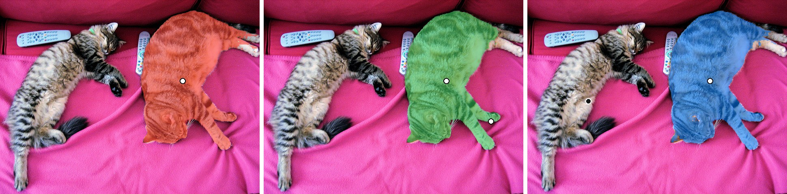
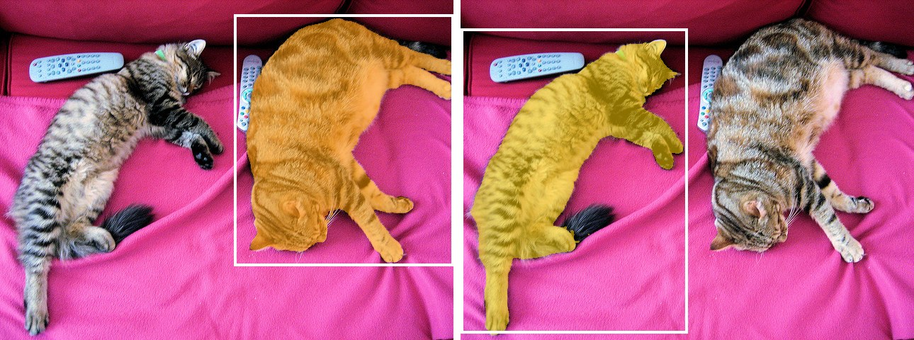
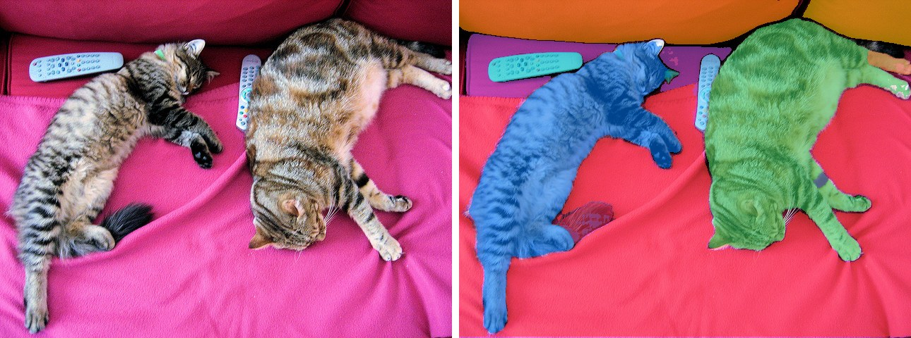

# SAM

<div style="background:#dff0d8; border:1px solid #cfe6bf; border-radius:3px; padding:12px 16px; color:#2a3a26;">
<b>Weights:</b> the pretrained weights for the SAM model are hosted on the
kerasformers <a href="https://github.com/IMvision12/KerasFormers/releases/tag/sam" style="color:#1a5c8a;">sam</a>
release tag, and download automatically the first time you call
<code>from_weights(...)</code>.
</div>
<br>

SAM (Segment Anything Model) segments whatever you point at. It has no class vocabulary at all: you give it a prompt, a click or a box, and it returns a mask. That makes it complementary to every other segmenter in this library, which decide *what* a region is; SAM only decides *where* it is.

The architecture splits into a heavy image encoder and a light prompt decoder. The ViT encoder runs once per image and is most of the cost; the prompt encoder plus mask decoder are small enough to run interactively, so a user can click repeatedly and get new masks without re-encoding.

**Paper**: [Segment Anything](https://arxiv.org/abs/2304.02643)

## API

### SAMPromptableSegment

```python
SAMPromptableSegment(vision_hidden_size=768, vision_num_hidden_layers=12,
                     vision_num_attention_heads=12, vision_mlp_dim=3072,
                     vision_global_attn_indexes=(2, 5, 8, 11),
                     enable_boxes=False, enable_masks=False, ...,
                     name="SAMPromptableSegment")
```

Image encoder, prompt encoder and mask decoder. **This is the class for prompted
segmentation.**

Architecture arguments are filled in by `from_weights` from the variant config. The two
that change the model's **input signature** are worth knowing:

- **enable_boxes** (`bool`, *optional*, defaults to `False`): adds `input_boxes` and `has_boxes_input` to the graph. **Box prompts do nothing unless you set this**, see [Box Prompts](#box-prompts).
- **enable_masks** (`bool`, *optional*, defaults to `False`): adds `input_masks` and `has_mask_input`, for feeding a previous mask back in as a prompt.

**Call** `model(inputs)` with the processor's tensor outputs. **Returns** a `dict`:

- **pred_masks** (`(B, point_batch, 3, 256, 256)`): three mask candidates per prompt, at the decoder's low resolution.
- **iou_scores** (`(B, point_batch, 3)`): the model's own quality estimate for each candidate.

Three candidates is SAM's "multimask" behaviour: a click is ambiguous, so it offers
several plausible scales (a part, a subpart, and the whole object). Picking among them
is your decision, and [not always the top IoU](#choosing-among-the-three-masks).

### SAMModel

```python
SAMModel(vision_hidden_size=768, ..., name="SAMModel")
```

The image encoder alone, producing image embeddings. Useful when you want to encode
once and prompt many times without paying for the ViT again.

## Preprocessing

### SAMImageProcessorWithPrompts

```python
SAMImageProcessorWithPrompts(target_length=1024, image_mean=None,
                             image_std=None, data_format=None)
```

Resizes the long edge to `target_length`, pads to a square, normalizes, and rescales
any prompt coordinates by the same factor.

**Call** `processor(image, input_points=None, input_labels=None, input_boxes=None)`.
**Returns** a `dict`:

- **pixel_values** (`(1, 1024, 1024, 3)`): the padded square.
- **input_points** (`(1, point_batch, num_points, 2)`): prompt coordinates, rescaled.
- **input_labels** (`(1, point_batch, num_points)`): `1` foreground, `0` background, `-1` padding.
- **input_boxes** (`(1, num_boxes, 4)`) and **has_boxes_input**: present only when you pass boxes.
- **original_size** / **reshaped_size**: plain tuples, for `post_process_masks`.

> **The last two are metadata, not model inputs.** Keras refuses a nested call argument
> that mixes tensors and non-tensors, so pass the tensors only.

```python
META = ("original_size", "reshaped_size")
feed = {k: v for k, v in inputs.items() if k not in META}
output = model(feed)
```

Coordinates are in the **original image's** pixel space; the processor handles the
rescale to 1024, so you never convert by hand.

**post_process_masks**

```python
processor.post_process_masks(pred_masks, original_size, reshaped_size,
                             target_length=None)
```

Removes the padding, upsamples the 256×256 decoder output back to the original
resolution, and returns `(B, point_batch, 3, H, W)` float logits. Threshold at zero for
a binary mask.

### SAMImageProcessor

The same preprocessing without the prompt arguments, for use with `SAMModel`.

## Model Variants

| Variant id       | Vision tower | Params | HF original            |
|------------------|--------------|-------:|------------------------|
| `sam_vit_base`   | ViT-B        | ~94 M  | `facebook/sam-vit-base`  |
| `sam_vit_large`  | ViT-L        | ~312 M | `facebook/sam-vit-large` |
| `sam_vit_huge`   | ViT-H        | ~641 M | `facebook/sam-vit-huge`  |

Only the image encoder grows; the prompt decoder is the same size in all three, so
interactive re-prompting costs the same regardless of variant.

## Basic Usage: Point Prompts



White dots are positive points, the black dot is negative.

```python
import keras
import numpy as np
import torch
from PIL import Image
from kerasformers.models.sam import (
    SAMImageProcessorWithPrompts, SAMPromptableSegment,
)

model = SAMPromptableSegment.from_weights("sam_vit_base")
processor = SAMImageProcessorWithPrompts()

image = Image.open("assets/data/coco_cats.jpg").convert("RGB")

# One click on the right-hand cat. Coordinates are in original pixel space.
inputs = processor(
    image,
    input_points=np.array([[[[450, 200]]]], dtype="float32"),
    input_labels=np.array([[[1]]], dtype="int32"),
)

META = ("original_size", "reshaped_size")
with torch.no_grad():
    output = model({k: v for k, v in inputs.items() if k not in META})
# output["pred_masks"]: (1, 1, 3, 256, 256)
# output["iou_scores"]: (1, 1, 3)

masks = processor.post_process_masks(
    output["pred_masks"],
    original_size=inputs["original_size"],
    reshaped_size=inputs["reshaped_size"],
)
masks = np.asarray(keras.ops.convert_to_numpy(masks))
iou = np.asarray(keras.ops.convert_to_numpy(output["iou_scores"])).ravel()

best = int(np.argmax(iou))
mask = masks[0, 0, best] > 0
print(f"iou {[round(float(v), 3) for v in iou]}  best={best}  {int(mask.sum())} px")
```

```
iou [0.904, 0.968, 0.784]  best=1  55518 px
```

The three candidates are different interpretations of the same click. Here candidate 1
is the cat, candidate 0 is a much larger region (the whole sofa scene), and candidate 2
a smaller part.

### Multiple Points for Refinement

Add more positive points to extend the mask:

```python
inputs = processor(
    image,
    input_points=np.array([[[[450, 200], [560, 300]]]], dtype="float32"),
    input_labels=np.array([[[1, 1]]], dtype="int32"),
)
```

```
iou [0.931, 0.950, 0.712]  best=1  53510 px
```

Add a **negative** point (label `0`) to carve a region out:

```python
inputs = processor(
    image,
    input_points=np.array([[[[450, 200], [150, 250]]]], dtype="float32"),
    input_labels=np.array([[[1, 0]]], dtype="int32"),   # 1 = keep, 0 = exclude
)
```

```
iou [0.956, 0.920, 0.873]  best=1  53475 px
```

The mask shrinks from 55518 to 53475 pixels: the negative point on the left-hand cat
trims the overlap where the two animals touch.

### Choosing among the three masks

`argmax(iou)` is the obvious rule and it is **wrong when you use negative points**. On
the example above the three candidates are:

```
cand0  iou 0.956  101767 px   contains the negative point
cand1  iou 0.920   53475 px   excludes it
cand2  iou 0.873   32048 px   excludes it
```

The highest-scoring candidate is the whole-scene mask, which covers the very region you
asked to exclude. IoU measures the model's confidence in a mask's quality, not its
agreement with your prompt. Filter first, then rank:

```python
neg = [(x, y) for (x, y), lab in zip(points, labels) if lab == 0]
valid = [i for i in range(masks.shape[2])
         if not any((masks[0, 0, i] > 0)[y, x] for x, y in neg)]
best = max(valid, key=lambda i: iou[i]) if valid else int(np.argmax(iou))
```

## Box Prompts



A box is a stronger constraint than a click and usually scores higher. **You must build
the model with `enable_boxes=True`**: the box input is not in the default graph, and
passing boxes without it raises a confusing shape error about `input_points`.

```python
import numpy as np
import torch
from PIL import Image
from kerasformers.models.sam import (
    SAMImageProcessorWithPrompts, SAMPromptableSegment,
)

# enable_boxes adds input_boxes and has_boxes_input to the graph
model = SAMPromptableSegment.from_weights("sam_vit_base", enable_boxes=True)
processor = SAMImageProcessorWithPrompts()

image = Image.open("assets/data/coco_cats.jpg").convert("RGB")

# (x0, y0, x1, y1) around the right-hand cat
inputs = processor(image, input_boxes=np.array([[[330, 20, 640, 375]]], "float32"))

META = ("original_size", "reshaped_size")
with torch.no_grad():
    output = model({k: v for k, v in inputs.items() if k not in META})
```

```
box [330, 20, 640, 375]   iou [0.984, 0.973, 0.841]  best=0  57159 px
box [0, 40, 320, 470]     iou [0.926, 0.979, 0.630]  best=1  47985 px
```

Top IoU of **0.984** against 0.968 for the single click on the same cat: the box removes
the scale ambiguity that makes a click return three answers.

The processor supplies `has_boxes_input` and pads the point inputs with SAM's `-1`
"not a point" label automatically, so its output feeds the model unchanged. You can
combine both by passing points and boxes together.

## Automatic Mask Generation



With no prompt at all, `SAMGenerateMasks` sweeps a grid of points over the image and
keeps whatever survives quality and stability filtering. This is "segment everything".

```python
import torch
from kerasformers.models.sam import SAMGenerateMasks, SAMPromptableSegment

model = SAMPromptableSegment.from_weights("sam_vit_base")

with torch.no_grad():
    result = SAMGenerateMasks(
        model, "assets/data/coco_cats.jpg",
        points_per_side=12,             # 12 x 12 = 144 candidate clicks
        points_per_batch=8,
        stability_score_thresh=0.85,    # the default 0.95 drops the cats
    )

print(sorted(result))
print(len(result["masks"]), tuple(result["masks"][0].shape))
```

```
['boxes', 'iou_scores', 'masks', 'rle_masks']
12 (480, 640)
```

Twelve regions from 144 candidate clicks, already at full resolution: both cats, the
blanket, the sofa back and both remotes. Note `masks` is a **list** of bool `(H, W)`
arrays, not a stacked array, alongside `iou_scores` `(N,)` and XYXY `boxes` `(N, 4)` in
original-image pixels. `rle_masks` gives the same masks run-length encoded, which is far
cheaper to store or ship.

### Why the defaults may miss the obvious objects

Run the same call with stock settings and the cats vanish, leaving only small crisp
objects:

```
stability_score_thresh=0.95 (default)  ->  7 masks, largest [25242, 7516, 4100]
stability_score_thresh=0.85            -> 12 masks, largest [135696, 56145, 48796]
pred_iou_thresh=0.7 (quality relaxed)  ->  7 masks, largest [25242, 7516, 4100]
```

Relaxing the **quality** bar changes nothing, because the cats are not low quality: they
score IoU 0.974 and 0.989, and a single click on one scores 0.968. They fail the
**stability** test, which measures how much a mask changes when the binarization
threshold is nudged. A soft, furry boundary against a blanket moves more than the hard
edge of a remote control, so `stability_score_thresh=0.95` discards precisely the
objects you probably wanted.

If automatic generation returns a handful of small fragments, lower
`stability_score_thresh` before touching anything else.

> **Wrap this in `torch.no_grad()` and lower `points_per_batch`.** The mask decoder runs
> a `Conv2DTranspose` per candidate, and the default batch of 64 with autograd live will
> exhaust an 8 GB card. `points_per_batch=8` is comfortable; raise it if you have room.

Key parameters:

- **points_per_side** (`int`, defaults to `32`): grid density. 32 means 1024 candidate clicks, thorough and slow.
- **points_per_batch** (`int`, defaults to `64`): how many candidates go through the decoder at once. This is the memory knob.
- **pred_iou_thresh** (`float`, defaults to `0.88`): drop candidates the model is unsure about.
- **stability_score_thresh** (`float`, defaults to `0.95`): drop masks that change a lot when the threshold is nudged.
- **crop_n_layers** (`int`, defaults to `0`): re-run on image crops to catch small objects, at multiplied cost.

## Encode Once, Prompt Many Times

The ViT encoder dominates the cost, and an interactive tool re-prompts the same image
over and over. `SAMPromptableSegment` splits itself into two sub-models for exactly this,
so the backbone runs once and each new click pays only for the decoder:

```python
import keras
import numpy as np
import torch
from PIL import Image
from kerasformers.models.sam import SAMImageProcessorWithPrompts, SAMPromptableSegment

model = SAMPromptableSegment.from_weights("sam_vit_base")
processor = SAMImageProcessorWithPrompts()
image = Image.open("assets/data/coco_cats.jpg").convert("RGB")

# Run the ViT once.
with torch.no_grad():
    embedding = model.vision_encoder_model(processor(image)["pixel_values"])

# Then pay only for the decoder on each new click.
for x, y in [(450, 200), (150, 250)]:
    inputs = processor(image,
                       input_points=np.array([[[[x, y]]]], "float32"),
                       input_labels=np.array([[[1]]], "int32"))
    with torch.no_grad():
        output = model.prompt_decoder_model({
            "image_embeddings": embedding,
            "input_points": inputs["input_points"],
            "input_labels": inputs["input_labels"],
        })
    masks = processor.post_process_masks(
        output["pred_masks"],
        original_size=inputs["original_size"],
        reshaped_size=inputs["reshaped_size"],
    )
    masks = np.asarray(keras.ops.convert_to_numpy(masks))
    iou = np.asarray(keras.ops.convert_to_numpy(output["iou_scores"])).ravel()
    best = int(np.argmax(iou))
    print(f"({x}, {y}) -> {int((masks[0, 0, best] > 0).sum())} px")
```

```
(450, 200) -> 55518 px
(150, 250) -> 47481 px
```

The first click reproduces the whole-model number above exactly, which is the point:
splitting the graph changes nothing but where the time goes.

The prompt encoder and mask decoder are identical across all three variants, so the
per-click cost does not change between `sam_vit_base` and `sam_vit_huge`; only the
one-off encode does.

> **`SAMModel` is the encoder-only class**, but it has no entry on the release tag, so
> `SAMModel.from_weights("sam_vit_base")` raises. Use `hf:facebook/sam-vit-base` if you
> want it standalone, or the `vision_encoder_model` sub-model above.

## Data Format

**Both the model and the processor support `channels_last` and `channels_first`.**

| | How it picks the format |
|---|---|
| Processors | A `data_format` kwarg, per instance. `None` (the default) resolves to `keras.config.image_data_format()`. |
| Models | Read `keras.config.image_data_format()` when they are **constructed**. There is no `data_format` argument. |

`post_process_masks` returns `(B, point_batch, 3, H, W)` in either case: masks have no
channel axis to reorder.

## Loading Fine-tuned and Community Weights

Any Hugging Face repo whose `model_type` is `"sam"` loads with the `hf:` prefix.

```python
from kerasformers.models.sam import SAMPromptableSegment

model = SAMPromptableSegment.from_weights("hf:facebook/sam-vit-base")
model = SAMPromptableSegment.from_weights("hf:<user>/sam-finetuned-on-my-data")

# Architecture only, randomly initialized
model = SAMPromptableSegment.from_weights("sam_vit_base", load_weights=False)

# Box prompts work through the hf: route too
model = SAMPromptableSegment.from_weights("hf:facebook/sam-vit-base", enable_boxes=True)
```

See also [SAM2](sam2.md), which extends this to video and a faster Hiera backbone, and
[SAM3](sam3.md), which adds text prompts.
