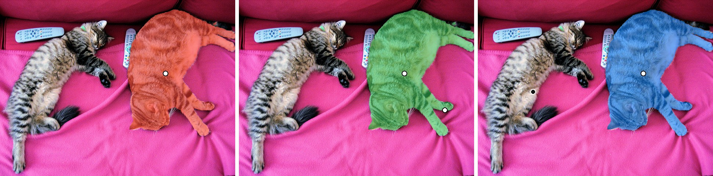
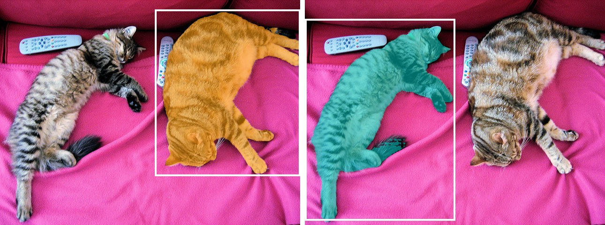
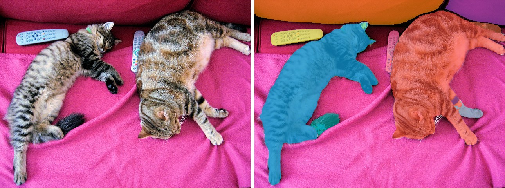

# SAM2

<div style="background:#dff0d8; border:1px solid #cfe6bf; border-radius:3px; padding:12px 16px; color:#2a3a26;">
<b>Weights:</b> the pretrained weights for the SAM2 model are hosted on the
kerasformers <a href="https://github.com/IMvision12/KerasFormers/releases/tag/sam2" style="color:#1a5c8a;">sam2</a>
release tag, and download automatically the first time you call
<code>from_weights(...)</code>.
</div>
<br>

SAM2 keeps [SAM](sam.md)'s promptable formulation and replaces the plain ViT with a **Hiera** backbone: a hierarchical encoder that produces multi-scale features, feeding an FPN neck before the mask decoder. The result is both faster and sharper at object boundaries than the original.

The paper's headline is video, where a memory bank carries object identity across frames. **This port covers the image path only**: the classes here segment a single image from point or box prompts, with no memory or frame propagation.

**Paper**: [SAM 2: Segment Anything in Images and Videos](https://arxiv.org/abs/2408.00714)

## API

### SAM2PromptableSegment

```python
SAM2PromptableSegment(hidden_dim=96, blocks_per_stage=(1, 2, 7, 2),
                      embed_dim_per_stage=(96, 192, 384, 768),
                      num_attention_heads_per_stage=(1, 2, 4, 8),
                      window_size_per_stage=..., num_multimask_outputs=3,
                      include_box_input=False, include_mask_input=False,
                      multimask_output=True, image_size=1024,
                      name="SAM2PromptableSegment")
```

Hiera image encoder, FPN neck, prompt encoder and mask decoder. **This is the class for
prompted segmentation.**

Architecture arguments are filled in by `from_weights` from the variant config. The
per-stage tuples are where the size difference between variants lives.

| Argument | What it does |
|---|---|
| `include_box_input` | Adds an `input_boxes` input to the graph. Off by default: the point-only graph is what [automatic mask generation](#automatic-mask-generation) requires. |
| `include_mask_input` | Adds `input_masks` plus a `has_input_masks` gate, for refining a mask from a previous pass. |
| `multimask_output` | `True` returns three candidates; `False` returns one. |

Because the prompt inputs are baked into the functional graph, **choose the flags at
construction**, not per call.

**Call** `model(inputs)` with the processor's tensor outputs. **Returns** a `dict`:

- **pred_masks** (`(B, point_batch, 3, 256, 256)`): three mask candidates per prompt.
- **iou_scores** (`(B, point_batch, 3)`): predicted quality per candidate.
- **object_score_logits** (`(B, point_batch, 1)`): whether an object is present at all. SAM has no equivalent; it is the signal SAM2 uses in video to notice an object has left the frame.

### SAM2Model

```python
SAM2Model(hidden_dim=96, ..., name="SAM2Model")
```

The Hiera encoder and neck alone, producing multi-scale image embeddings. Use it to
encode once and prompt repeatedly.

## Preprocessing

### SAM2ImageProcessorWithPrompts

```python
SAM2ImageProcessorWithPrompts(target_length=1024, image_mean=None,
                              image_std=None, data_format=None)
```

Stretches the image to a square `target_length`, normalizes, and rescales prompt
coordinates the same way.

> **SAM2 stretches, SAM pads.** SAM resizes the long edge and pads the short one, so a
> single scale factor covers both axes. SAM2 stretches each axis independently, so `x`
> and `y` are scaled by different factors. This is also why `post_process_masks` needs
> no `reshaped_size`: there is no padding to undo.

**Call** `processor(image, input_points=None, input_labels=None, input_boxes=None)`.
**Returns** a `dict`:

- **pixel_values** (`(1, 1024, 1024, 3)`).
- **input_points** (`(1, point_batch, num_points, 2)`): coordinates, rescaled from the original image's pixel space.
- **input_labels** (`(1, point_batch, num_points)`): `1` foreground, `0` background, `-1` padding.
- **input_boxes** (`(1, num_boxes, 4)`), only when `input_boxes` was passed: `(x1, y1, x2, y2)`, rescaled.
- **original_size** / **reshaped_size**: plain tuples, for `post_process_masks`.

> **The last two are metadata, not model inputs.** Keras refuses a nested call argument
> that mixes tensors and non-tensors, so pass the tensors only.

```python
META = ("original_size", "reshaped_size")
output = model({k: v for k, v in inputs.items() if k not in META})
```

**post_process_masks**

```python
processor.post_process_masks(pred_masks, original_size, target_length=None)
```

Upsamples the decoder output back to the original resolution and returns
`(B, point_batch, 3, H, W)` float logits; threshold at zero.

### SAM2ImageProcessor

The same preprocessing without prompt arguments, for use with `SAM2Model`.

## Model Variants

| Variant id             | Backbone     | Params | HF original                   |
|------------------------|--------------|-------:|-------------------------------|
| `sam2_hiera_tiny`      | Hiera-T      |  ~39 M | `facebook/sam2.1-hiera-tiny`   |
| `sam2_hiera_small`     | Hiera-S      |  ~46 M | `facebook/sam2.1-hiera-small`  |
| `sam2_hiera_base_plus` | Hiera-B+     |  ~81 M | `facebook/sam2.1-hiera-base-plus` |
| `sam2_hiera_large`     | Hiera-L      | ~224 M | `facebook/sam2.1-hiera-large`  |

Even `sam2_hiera_tiny` at 39 M is less than half `sam_vit_base`, while producing
tighter boundaries.

## Basic Usage: Point Prompts



White dots are positive points, the black dot is negative.

```python
import keras
import numpy as np
import torch
from PIL import Image
from kerasformers.models.sam2 import (
    SAM2ImageProcessorWithPrompts, SAM2PromptableSegment,
)

model = SAM2PromptableSegment.from_weights("sam2_hiera_tiny")
processor = SAM2ImageProcessorWithPrompts()

image = Image.open("assets/data/coco_cats.jpg").convert("RGB")

# One click on the right-hand cat, in original pixel space.
inputs = processor(
    image,
    input_points=np.array([[[[450, 200]]]], dtype="float32"),
    input_labels=np.array([[[1]]], dtype="int32"),
)

META = ("original_size", "reshaped_size")
with torch.no_grad():
    output = model({k: v for k, v in inputs.items() if k not in META})
# output["pred_masks"]:          (1, 1, 3, 256, 256)
# output["iou_scores"]:          (1, 1, 3)
# output["object_score_logits"]: (1, 1, 1)

masks = processor.post_process_masks(
    output["pred_masks"], original_size=inputs["original_size"]
)
masks = np.asarray(keras.ops.convert_to_numpy(masks))
iou = np.asarray(keras.ops.convert_to_numpy(output["iou_scores"])).ravel()

best = int(np.argmax(iou))
mask = masks[0, 0, best] > 0
print(f"iou {[round(float(v), 3) for v in iou]}  best={best}  {int(mask.sum())} px")
```

```
iou [0.610, 0.852, 0.980]  best=2  57302 px
```

Note the candidate ordering differs from SAM's. SAM returns its most confident mask at
index 1 on this image; SAM2 puts it at index 2, and spreads the scores much wider
(0.610 to 0.980 against SAM's 0.784 to 0.968). **Never hard-code a candidate index**:
always rank by `iou_scores`.

### Multiple Points for Refinement

```python
inputs = processor(
    image,
    input_points=np.array([[[[450, 200], [560, 300]]]], dtype="float32"),
    input_labels=np.array([[[1, 1]]], dtype="int32"),
)
```

```
iou [0.894, 0.524, 0.976]  best=2  57391 px
```

A negative point (label `0`) carves a region out:

```python
inputs = processor(
    image,
    input_points=np.array([[[[450, 200], [150, 250]]]], dtype="float32"),
    input_labels=np.array([[[1, 0]]], dtype="int32"),   # 1 = keep, 0 = exclude
)
```

```
iou [0.767, 0.816, 0.975]  best=2  56960 px
```

All three prompts land within about 400 pixels of each other (57302, 57391, 56960),
which is the point: SAM2's mask on this cat is already tight enough that extra prompts
barely move it. The same three prompts on SAM shift the mask by nearly 2000 pixels.

**As with SAM, `argmax(iou)` can pick a candidate that contains your negative point.**
Filter first, then rank:

```python
neg = [(x, y) for (x, y), lab in zip(points, labels) if lab == 0]
valid = [i for i in range(masks.shape[2])
         if not any((masks[0, 0, i] > 0)[y, x] for x, y in neg)]
best = max(valid, key=lambda i: iou[i]) if valid else int(np.argmax(iou))
```

## Box Prompts



A box is the easiest prompt to produce automatically, since any detector already emits
them. **Box support is off by default**, so build the model with `include_box_input=True`:

```python
import keras
import numpy as np
import torch
from PIL import Image
from kerasformers.models.sam2 import (
    SAM2ImageProcessorWithPrompts, SAM2PromptableSegment,
)

model = SAM2PromptableSegment.from_weights(
    "sam2_hiera_tiny", include_box_input=True
)
processor = SAM2ImageProcessorWithPrompts()
image = Image.open("assets/data/coco_cats.jpg").convert("RGB")

# (x1, y1, x2, y2) in original pixel space, shaped (batch, num_boxes, 4).
inputs = processor(image, input_boxes=np.array([[[330, 20, 640, 375]]], "float32"))

META = ("original_size", "reshaped_size")
with torch.no_grad():
    output = model({k: v for k, v in inputs.items() if k not in META})

masks = processor.post_process_masks(
    output["pred_masks"], original_size=inputs["original_size"]
)
masks = np.asarray(keras.ops.convert_to_numpy(masks))
iou = np.asarray(keras.ops.convert_to_numpy(output["iou_scores"])).ravel()

best = int(np.argmax(iou))
print(f"iou {[round(float(v), 3) for v in iou]}  best={best}  {int((masks[0, 0, best] > 0).sum())} px")
```

```
iou [0.967, 0.968, 0.980]  best=2  57664 px
```

The second box, `[0, 40, 320, 470]`, gives `iou [0.916, 0.941, 0.973]` and 50398 px.
In both panels the mask escapes the box where the animal does, following the tail and
the outstretched paw past the drawn edge: the box is a hint about *which* object, not a
crop.

> **The box-enabled graph still declares the point inputs.** Passing `input_boxes` alone
> is fine, the processor pads the points with SAM2's "not a point" label (`-1`) for you.
> If you pass both, `num_boxes` must equal `point_batch`, because the box embedding is
> concatenated onto the point embedding along that axis.

`include_mask_input=True` adds `input_masks` and a `has_input_masks` gate on the same
pattern, for feeding a previous mask back in as a starting point.

## Automatic Mask Generation



With no prompt, `SAM2GenerateMasks` sweeps a grid of points and keeps whatever survives
quality and stability filtering.

```python
import torch
from kerasformers.models.sam2 import SAM2GenerateMasks, SAM2PromptableSegment

model = SAM2PromptableSegment.from_weights("sam2_hiera_tiny")

with torch.no_grad():
    result = SAM2GenerateMasks(
        model, "assets/data/coco_cats.jpg",
        points_per_side=12,             # 12 x 12 = 144 candidate clicks
        points_per_batch=8,
        stability_score_thresh=0.85,    # the default 0.95 drops soft-edged objects
    )

print(sorted(result))
print(len(result["masks"]), tuple(result["masks"][0].shape))
```

```
['boxes', 'iou_scores', 'masks', 'rle_masks']
11 (480, 640)
```

`masks` is a **list** of bool `(H, W)` arrays, one per surviving object, alongside
`iou_scores` `(N,)`, XYXY `boxes` `(N, 4)` in original-image pixels, and `rle_masks` in
COCO run-length form.

Two parameters need attention, for the same reasons as [SAM](sam.md#automatic-mask-generation):

- **`stability_score_thresh`** defaults to `0.95`, which discards objects with soft boundaries such as fur, keeping only crisp-edged ones. Lower it first if the output looks sparse.
- **`points_per_batch`** defaults to `64`, which runs 64 `Conv2DTranspose` calls at once and will exhaust an 8 GB card. Wrap the call in `torch.no_grad()` and use `8` to start.

`SAM2GenerateMasks` needs the **point-only** graph and raises if you hand it a model
built with `include_box_input=True` or `include_mask_input=True`, since it drives the
decoder with grid points and supplies neither.

## Encode Once, Prompt Many Times

The Hiera encoder dominates the cost, and an interactive tool re-prompts the same image
over and over. `SAM2PromptableSegment` splits itself into two sub-models for exactly
this, so the backbone runs once and each new click pays only for the decoder:

```python
import keras
import numpy as np
import torch
from PIL import Image
from kerasformers.models.sam2 import SAM2ImageProcessorWithPrompts, SAM2PromptableSegment

model = SAM2PromptableSegment.from_weights("sam2_hiera_tiny")
processor = SAM2ImageProcessorWithPrompts()
image = Image.open("assets/data/coco_cats.jpg").convert("RGB")

# Run the Hiera backbone once.
with torch.no_grad():
    features = model.vision_encoder_model(processor(image)["pixel_values"])

# Then pay only for the decoder on each new click.
for x, y in [(450, 200), (150, 250)]:
    inputs = processor(image,
                       input_points=np.array([[[[x, y]]]], "float32"),
                       input_labels=np.array([[[1]]], "int32"))
    with torch.no_grad():
        output = model.prompt_decoder_model({
            **features,
            "input_points": inputs["input_points"],
            "input_labels": inputs["input_labels"],
        })
    masks = processor.post_process_masks(
        output["pred_masks"], original_size=inputs["original_size"]
    )
    masks = np.asarray(keras.ops.convert_to_numpy(masks))
    iou = np.asarray(keras.ops.convert_to_numpy(output["iou_scores"])).ravel()
    best = int(np.argmax(iou))
    print(f"({x}, {y}) -> {int((masks[0, 0, best] > 0).sum())} px")
```

```
(450, 200) -> 57302 px
(150, 250) -> 48363 px
```

The first click reproduces the whole-model number above exactly, which is the point:
splitting the graph changes nothing but where the time goes.

`vision_encoder_model` returns three tensors, not one. SAM2 feeds `high_res_feat_s0` and
`high_res_feat_s1` past the low-resolution `image_embeddings` straight into the decoder,
and those skip connections are where the sharper boundaries come from. Splatting the
dict with `**features` keeps all three.

> **`SAM2Model` is the encoder-only class**, but it has no entry on the release tag, so
> `SAM2Model.from_weights("sam2_hiera_tiny")` raises. Use `hf:facebook/sam2.1-hiera-tiny`
> if you want it standalone, or the `vision_encoder_model` sub-model above.

## Data Format

**Both the model and the processor support `channels_last` and `channels_first`.**

| | How it picks the format |
|---|---|
| Processors | A `data_format` kwarg, per instance. `None` (the default) resolves to `keras.config.image_data_format()`. |
| Models | Read `keras.config.image_data_format()` when they are **constructed**. There is no `data_format` argument. |

`post_process_masks` returns `(B, point_batch, 3, H, W)` in either case.

## Loading Fine-tuned and Community Weights

Any Hugging Face repo whose `model_type` is `"sam2"` loads with the `hf:` prefix.

```python
from kerasformers.models.sam2 import SAM2PromptableSegment

model = SAM2PromptableSegment.from_weights("hf:facebook/sam2.1-hiera-tiny")
model = SAM2PromptableSegment.from_weights("hf:<user>/sam2-finetuned-on-my-data")

# Architecture only, randomly initialized
model = SAM2PromptableSegment.from_weights("sam2_hiera_tiny", load_weights=False)
```

See also [SAM](sam.md), the original, and [SAM3](sam3.md), which prompts with text.
