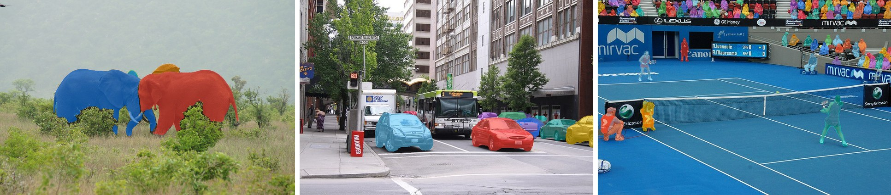
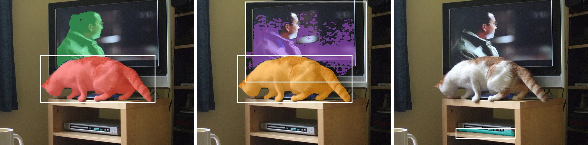
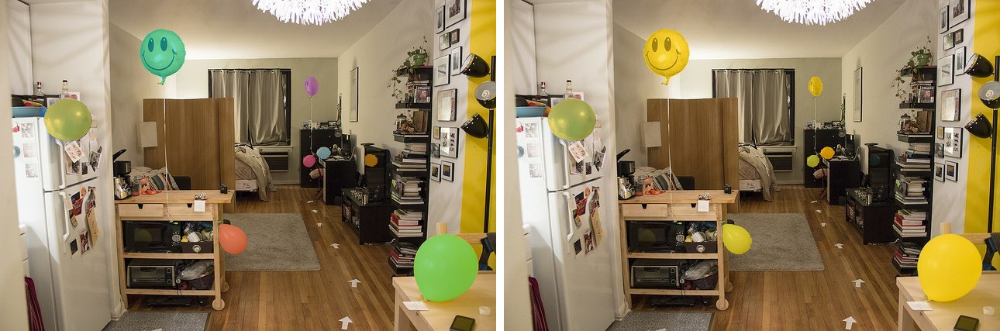
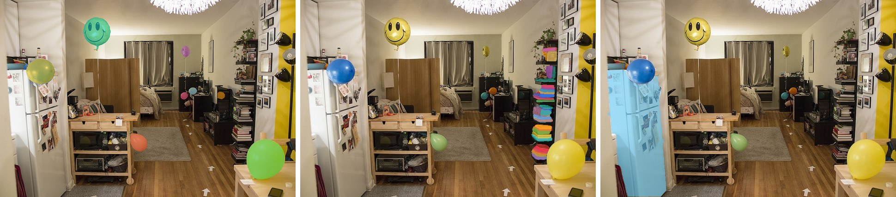

# SAM3

<div style="background:#fff4e5; border:1px solid #f0dcc0; border-radius:3px; padding:12px 16px; color:#4a3a26;">
<b>Gated weights:</b> SAM3 is not redistributed on the kerasformers release page.
Accept the license at <a href="https://huggingface.co/facebook/sam3" style="color:#1a5c8a;">facebook/sam3</a>,
then authenticate with <code>huggingface-cli login</code> or <code>export HF_TOKEN=...</code>.
The first <code>from_weights</code> call downloads the checkpoint, converts it, and caches
the result at <code>~/.cache/kerasformers/sam3_saco/</code> (about 3.1 GB); later calls load
straight from that cache.
</div>
<br>

SAM3 breaks with [SAM](sam.md) and [SAM2](sam2.md): instead of a click or a box saying
*this thing here*, you give it a **noun phrase** and it finds every instance. "car"
returns eleven cars; "person" returns ninety-five people including the crowd in the
stands. The prompt is a concept, not a location, so a single call segments an open
vocabulary the model was never given a fixed label set for.

Architecturally it is a different model too: a ViT-L backbone and FPN feed a DETR-style
encoder/decoder with 200 object queries, a CLIP text encoder supplies the open-vocabulary
side, and a mask decoder turns each surviving query into a mask. Boxes are still
available, through a geometry encoder, and can be mixed with text.

**Paper**: [SAM 3: Segment Anything with Concepts](https://arxiv.org/abs/2511.16719)

## API

Three task wrappers share one `SAM3Model`. They differ only in what they return.

```python
SAM3Detect(model=None, variant="sam3_saco", load_weights=True)
SAM3InstanceSegment(model=None, variant="sam3_saco", load_weights=True)
SAM3SemanticSegment(model=None, variant="sam3_saco", load_weights=True)
```

Constructing one with no arguments loads `sam3_saco`. **Pass `model=` to share a loaded
backbone** rather than paying for a second copy:

```python
from kerasformers.models.sam3 import (
    SAM3Detect, SAM3InstanceSegment, SAM3SemanticSegment,
)

segmenter = SAM3InstanceSegment()
detector = SAM3Detect(model=segmenter.model)          # same weights, no reload
semantic = SAM3SemanticSegment(model=segmenter.model)
```

**predict**

```python
task.predict(images=None, text=None, input_boxes=None, input_boxes_labels=None,
             threshold=0.3, vision_embeds=None, text_embeds=None)
```

`SAM3InstanceSegment.predict` also takes `mask_threshold=0.5`. All three return a **list
with one entry per image**:

| Class | Each entry |
|---|---|
| `SAM3Detect` | `{"scores": (N,), "boxes": (N, 4)}`, boxes `(x1, y1, x2, y2)` in original pixels |
| `SAM3InstanceSegment` | the same plus `"masks"` `(N, H, W)` int32, at original resolution |
| `SAM3SemanticSegment` | a single `(H, W)` int32 mask, not a dict |

`images` accepts a path, a PIL image, a numpy array, or a list of any of those.

### SAM3Model

The functional model underneath. Its `detect` / `segment_instances` / `segment_semantic`
methods are what the wrappers delegate to, and `encode_image` / `encode_text` are the
caching entry points. Raw outputs:

- **pred_logits** `(B, 200)` and **presence_logits**: multiply the sigmoids to get scores.
- **pred_boxes** `(B, 200, 4)` normalized `cxcywh`.
- **pred_masks** `(B, 200, 288, 288)` per-query mask logits.
- **semantic_seg** `(B, 288, 288, 1)` logits.

Free functions `post_process_object_detection`, `post_process_instance_segmentation` and
`post_process_semantic_segmentation` turn those into the dicts above if you drive the
model directly.

## Model Variants

| Variant id   | Backbone | Params | Source                   |
|--------------|----------|-------:|--------------------------|
| `sam3_saco`  | ViT-L/14 | ~839 M | `facebook/sam3` (gated)  |

One variant. Input resolution is fixed at **1008x1008**: the ViT uses windowed attention
with 2-D RoPE sized to a 72x72 patch grid, and `predict` always preprocesses to that size.

## Text Prompts



```python
import torch
from kerasformers.models.sam3 import SAM3InstanceSegment

segmenter = SAM3InstanceSegment()

with torch.no_grad():
    result = segmenter.predict(
        images="assets/data/coco_elephants.jpg", text="elephant"
    )[0]

print(len(result["scores"]), [round(float(s), 3) for s in result["scores"]])
print(result["masks"].shape)
```

```
4 [0.939, 0.379, 0.919, 0.642]
(4, 425, 640)
```

The same call with `text="car"` on a street scene returns 11 instances, and
`text="person"` on a tennis match returns 95, including the spectators. Nothing about
the prompt is drawn from a fixed label set.

> Wrap inference in `torch.no_grad()` on the torch backend. A ViT-L at 1008x1008 is
> 5184 tokens per image, and autograd will hold every intermediate.

### Threshold

`threshold` filters on `sigmoid(pred_logits) * sigmoid(presence_logits)`. On the street
scene with `text="car"`:

| `threshold` | instances |
|---|---|
| `0.1` | 26 |
| `0.3` (default) | 11 |
| `0.5` | 6 |
| `0.7` | 5 |

Open-vocabulary scores are not calibrated across prompts. Sweep it per prompt rather
than trusting the default.

## Box Prompts



A box says *this region*, and needs no text at all. Coordinates are `(x1, y1, x2, y2)`
in original pixels.

```python
CAT = [133, 183, 512, 340]
TV = [158, 5, 560, 272]

with torch.no_grad():
    result = segmenter.predict(
        images="assets/data/coco_cat_tv.jpg", input_boxes=[[CAT]]
    )[0]
print(len(result["scores"]), [round(float(s), 3) for s in result["scores"]])
```

```
2 [0.975, 0.386]
```

> **`input_boxes` is nested per image.** The outer list is the batch. Two boxes on one
> image is `[[CAT, TV]]`; writing `[CAT, TV]` is read as one box for each of two images,
> and since only one image was passed, **the second box is silently dropped**. The call
> succeeds and returns the single-box answer, so nothing warns you.

With both boxes, `[[CAT, TV]]` returns 3 instances scoring `[0.695, 0.965, 0.859]`.

Boxes reach objects that are awkward to name. A box on the DVD player,
`[[203, 423, 400, 458]]`, returns one mask at `0.934`, against `0.884` for the text
prompt `"dvd player"`.

### Mixing Text and Boxes

Pass both, and label each box. **Labels index a learned `Embedding(2, dim)`**, so `0` and
`1` are conditioning signals, not a hard include/exclude:

```python
with torch.no_grad():
    result = segmenter.predict(
        images="assets/data/coco_cat_tv.jpg",
        text="cat",
        input_boxes=[[CAT]],
        input_boxes_labels=[[0]],      # 0 = negative, 1 = positive
    )[0]
```

| Call | instances | top score |
|---|---|---|
| `text="cat"` | 1 | 0.978 |
| `text="cat"` + negative box on the cat | 1 | 0.481 |

The cat survives, but its score halves. **A negative box suppresses, it does not
delete.** If you need it gone, threshold on the suppressed score.

Leaving `text=None` while passing boxes substitutes the prompt `"visual"` for you, which
is the box-only mode above. Every image in a batch needs either text or boxes, or
`predict` raises.

## Semantic Segmentation



Same prompt, same image, different question. Instance mode asks *which balloons*;
semantic mode asks *where is balloon*, and returns one merged binary mask.

```python
from kerasformers.models.sam3 import SAM3SemanticSegment

semantic = SAM3SemanticSegment(model=segmenter.model)

with torch.no_grad():
    mask = semantic.predict(images="assets/data/coco_apartment.jpg", text="balloon")[0]

print(mask.shape, mask.dtype, int(mask.sum()), sorted(set(mask.ravel().tolist())))
```

```
(427, 640) int32 13256 [0, 1]
```

The instance call on the same image returns 9 separate masks. Note the return is a bare
array per image, not a dict, and `threshold` here defaults to `0.5` and binarizes the
semantic map rather than filtering queries.

## Detection Only

Skip the mask decoder when boxes are all you need:

```python
from kerasformers.models.sam3 import SAM3Detect

detector = SAM3Detect(model=segmenter.model)

with torch.no_grad():
    result = detector.predict(images="assets/data/coco_city_bus.jpg", text="car")[0]

print(sorted(result), len(result["scores"]))
print([[round(float(v), 1) for v in b] for b in result["boxes"][:2]])
```

```
['boxes', 'scores'] 11
[[388.5, 245.6, 432.1, 263.0], [580.0, 253.3, 641.1, 320.7]]
```

## Encode Once, Prompt Many Times



The ViT-L dominates the cost and does not depend on the prompt, so cache it with
`encode_image` and pay only the decoder per prompt:

```python
import torch
from kerasformers.models.sam3 import SAM3InstanceSegment

segmenter = SAM3InstanceSegment()

with torch.no_grad():
    features = segmenter.model.encode_image("assets/data/coco_apartment.jpg")
print(sorted(features))

for prompt in ("balloon", "book", "refrigerator"):
    with torch.no_grad():
        r = segmenter.predict(text=prompt, vision_embeds=features)[0]
    print(f"{prompt:14s} {len(r['scores']):3d}  {r['scores'].max():.3f}")
```

```
['fpn_0', 'fpn_1', 'fpn_2', 'fpn_3', 'original_size', 'text_projected']
balloon          9  0.969
book            52  0.692
refrigerator     1  0.977
```

The `balloon` row reproduces the uncached call exactly, which is the point: caching moves
where the time goes, not the answer.

`encode_text` is the mirror image, for one prompt against many images:

```python
text = segmenter.model.encode_text("balloon")
r = segmenter.predict(images="other.jpg", text_embeds=text)[0]
```

> **`vision_embeds` is single-image and text-only.** It carries one `original_size`, so
> the batch axis is fixed at 1, and the cached path holds no `pixel_values` for the
> geometry encoder to read, so it cannot be combined with `input_boxes`.

## Batching

Pass a list of images. One shared prompt applies to all; a list of prompts pairs
positionally.

```python
images = ["a.jpg", "b.jpg"]

with torch.no_grad():
    rs = segmenter.predict(images=images, text="animal")              # shared
    rs = segmenter.predict(images=images, text=["elephant", "bus"])   # per image
    rs = segmenter.predict(images=images, text=["elephant", None],
                           input_boxes=[[], [[200, 150, 400, 330]]])  # mixed
```

In the mixed form, `None` text with boxes falls back to `"visual"`, and `[]` means that
image has no boxes. Batched rows are identical to running the images one at a time,
verified against the same image duplicated.

> **Batching is memory-bound, not compute-bound.** Two images at 1008x1008 through a
> ViT-L needs roughly 3 GB more than an 8 GB card has free, so batch size 2 already OOMs
> there. Looping one image at a time costs the same compute and is the practical choice
> on consumer hardware. Box prompts are looped internally regardless: the geometry
> encoder runs once per image.

## Data Format

`channels_last` and `channels_first` are both supported. The model reads
`keras.config.image_data_format()` when it is **constructed**, so set it first:

```python
import keras
keras.config.set_image_data_format("channels_first")

from kerasformers.models.sam3 import SAM3InstanceSegment
segmenter = SAM3InstanceSegment()
```

Returned masks and boxes are in original-image pixel space either way.

## Visualization

`sam3_utils` ships the overlay helpers used for the figures above:

```python
from kerasformers.models.sam3.sam3_utils import (
    draw_detections, draw_instance_masks, draw_semantic_mask,
)

draw_instance_masks(image, result, title="balloons").save("out.jpg")
```

## Tokenizer

`SAM3CLIPTokenizer` is the OpenAI CLIP BPE tokenizer with `max_seq_len=32`. It resolves
`tokenizer.json` from the gated repo on the fly, so it needs the same authentication as
the weights. `encode` returns an `(input_ids, attention_mask)` **tuple**, not a dict.

```python
from kerasformers.models.sam3 import SAM3CLIPTokenizer

tokenizer = SAM3CLIPTokenizer()
input_ids, attention_mask = tokenizer.encode("a photo of a cat")
```

See also [SAM](sam.md) and [SAM2](sam2.md), which prompt by location rather than concept.
