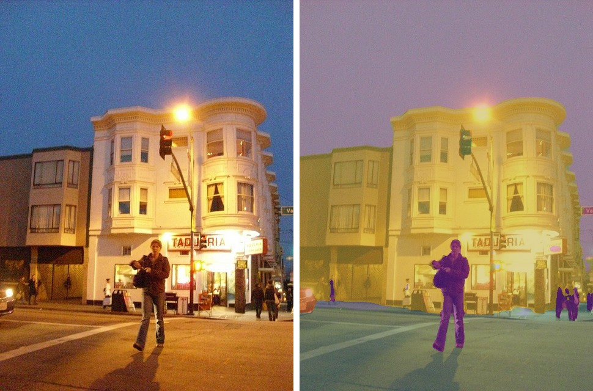
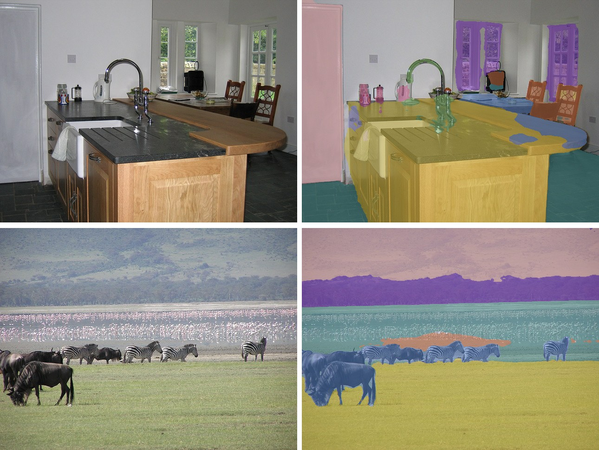

# SegFormer

<div style="background:#dff0d8; border:1px solid #cfe6bf; border-radius:3px; padding:12px 16px; color:#2a3a26;">
<b>Weights:</b> the pretrained weights for the SegFormer model are hosted on the
kerasformers <a href="https://github.com/IMvision12/KerasFormers/releases/tag/segformer" style="color:#1a5c8a;">segformer</a>
release tag, and download automatically the first time you call
<code>from_weights(...)</code>.
</div>
<br>

SegFormer pairs a hierarchical transformer encoder (MiT) with a decoder that is nothing but a few MLPs. The encoder produces features at four scales like a CNN, and the decoder simply upsamples each scale, concatenates, and projects. No dilated convolutions, no attention in the decoder.

Two design choices make it efficient. The encoder uses **sequence-reduction attention**, shrinking keys and values before the attention product, and it has **no positional encoding at all**: position comes from a 3x3 depthwise convolution inside each MLP. That is why SegFormer transfers to resolutions it never trained on without the interpolation that ViT-style models need.

**Paper**: [SegFormer: Simple and Efficient Design for Semantic Segmentation with Transformers](https://arxiv.org/abs/2105.15203)

## API

### SegFormerSemanticSegment

```python
SegFormerSemanticSegment(embed_dim=None, depths=None, decode_head_dim=256,
                         dropout_rate=0.1, num_classes=19, image_size=512,
                         input_tensor=None, name="SegFormerSemanticSegment")
```

The MiT encoder plus the all-MLP decode head. **This is the class for semantic
segmentation.**

**Parameters**

- **embed_dim** (`tuple`, *optional*): per-stage widths. Filled in by `from_weights` from the variant config.
- **depths** (`tuple`, *optional*): blocks per stage, the main size lever from B0 to B5.
- **decode_head_dim** (`int`, *optional*, defaults to `256`): width of the MLP decoder.
- **dropout_rate** (`float`, *optional*, defaults to `0.1`): decoder dropout, active only during training.
- **num_classes** (`int`, *optional*, defaults to `19`): Cityscapes' 19. The ADE20K variants use `150`.
- **image_size** (`int`, *optional*, defaults to `512`): input resolution the model is built for.
- **input_tensor** (`dict`, *optional*): pre-existing input tensors to build on.
- **name** (`str`, *optional*, defaults to `"SegFormerSemanticSegment"`): model name.

**Call** `model(pixel_values, training=False)`. **Returns** a tensor of shape
`(B, H, W, num_classes)`: per-pixel class logits.

### SegFormerModel

```python
SegFormerModel(embed_dim=None, depths=None, image_size=512,
               input_tensor=None, name="SegFormerModel")
```

The MiT encoder alone, for its multi-scale features.

## Preprocessing

### SegFormerImageProcessor

```python
SegFormerImageProcessor(do_resize=True, size=None, resample="bilinear",
                        do_rescale=True, rescale_factor=1/255,
                        do_normalize=True, image_mean=None, image_std=None,
                        return_tensor=True, data_format=None, variant=None)
```

Resizes to a fixed square, rescales to `[0, 1]`, and normalizes with ImageNet
statistics.

> **Prefer `SegFormerImageProcessor.from_weights(variant)`.** The variants train at
> 512, 640, 768 or 1024, so the bare constructor's 512 mismatches the model for most of
> them and the forward pass raises on shape.

**Parameters**

- **variant** (`str`, *optional*): release variant whose resolution to adopt. Ignored when `size` is given.
- **do_resize** (`bool`, *optional*, defaults to `True`): resize before normalizing.
- **size** (`dict`, *optional*): target size, overriding `variant`. Falls back to 512.
- **resample** (`str`, *optional*, defaults to `"bilinear"`): resize interpolation.
- **do_rescale** / **rescale_factor**: scale pixels to `[0, 1]`.
- **do_normalize** (`bool`, *optional*, defaults to `True`): apply ImageNet normalization.
- **image_mean** / **image_std** (`tuple`, *optional*): defaults to the ImageNet statistics.
- **return_tensor** (`bool`, *optional*, defaults to `True`): return backend tensors rather than numpy.
- **data_format** (`str`, *optional*): `"channels_last"` or `"channels_first"`. Defaults to `keras.config.image_data_format()`.

**post_process_semantic_segmentation**

```python
processor.post_process_semantic_segmentation(outputs, target_size=None,
                                             label_names=None, data_format=None)
```

Takes the per-pixel argmax and resizes the label map to `target_size`. **Returns** a
`dict` with **segmentation** `(H, W)`, **unique_classes**, and **class_names**.

Names default to the label set matching the head width: ADE20K's 150 or Cityscapes' 19.

## Model Variants

Thirteen variants across two label sets. B0 is the smallest and B5 the largest:

| Variant id                     | Backbone | Classes | Resolution |
|--------------------------------|----------|--------:|-----------:|
| `segformer_b0_ade_512`         | MiT-B0   |     150 |        512 |
| `segformer_b1_ade_512`         | MiT-B1   |     150 |        512 |
| `segformer_b2_ade_512`         | MiT-B2   |     150 |        512 |
| `segformer_b3_ade_512`         | MiT-B3   |     150 |        512 |
| `segformer_b4_ade_512`         | MiT-B4   |     150 |        512 |
| `segformer_b5_ade_640`         | MiT-B5   |     150 |        640 |
| `segformer_b0_cityscapes_768`  | MiT-B0   |      19 |        768 |
| `segformer_b0_cityscapes_1024` | MiT-B0   |      19 |       1024 |
| `segformer_b1_cityscapes_1024` | MiT-B1   |      19 |       1024 |
| `segformer_b2_cityscapes_1024` | MiT-B2   |      19 |       1024 |
| `segformer_b3_cityscapes_1024` | MiT-B3   |      19 |       1024 |
| `segformer_b4_cityscapes_1024` | MiT-B4   |      19 |       1024 |
| `segformer_b5_cityscapes_1024` | MiT-B5   |      19 |       1024 |

The ADE20K variants cover 150 indoor and outdoor classes; the Cityscapes ones cover 19
street-scene classes at higher resolution.

## Basic Usage: Semantic Segmentation



Each figure is the original image beside the predicted segmentation overlaid on it.


```python
import keras
import numpy as np
from PIL import Image
from kerasformers.models.segformer import (
    SegFormerImageProcessor, SegFormerSemanticSegment,
)

model = SegFormerSemanticSegment.from_weights("segformer_b5_ade_640")
processor = SegFormerImageProcessor.from_weights("segformer_b5_ade_640")  # 640

image = Image.open("assets/data/coco_street_dusk.jpg").convert("RGB")
output = model(processor(image)["pixel_values"], training=False)
# output: (1, 640, 640, 150)

result = processor.post_process_semantic_segmentation(
    output, target_size=(image.height, image.width)
)
seg = np.asarray(keras.ops.convert_to_numpy(result["segmentation"]))

areas = [(int((seg == int(c)).sum()), n)
         for c, n in zip(result["unique_classes"], result["class_names"])]
for area, name in sorted(areas, reverse=True):
    print(f"{name:14s} {area} px")
```

```
building           133158 px
sky                101140 px
road               61001 px
person             8240 px
sidewalk           1481 px
car                966 px
traffic light      791 px
signboard          341 px
streetlight        80 px
trade name         2 px
```

Ten classes, and the fine structure is what a large model buys: an 84-pixel
`streetlight`, a 794-pixel `traffic light`, and `trade name` (the shop signage) at 8
pixels. The person is cut out cleanly against the road behind.

These three scenes follow the qualitative figures in the paper: an outdoor street, an
indoor room, and animals in a field.

### Batch Processing Multiple Images



```python
import keras
import numpy as np
from PIL import Image
from kerasformers.models.segformer import (
    SegFormerImageProcessor, SegFormerSemanticSegment,
)

model = SegFormerSemanticSegment.from_weights("segformer_b5_ade_640")
processor = SegFormerImageProcessor.from_weights("segformer_b5_ade_640")  # 640

paths = ["assets/data/coco_open_kitchen.jpg", "assets/data/coco_herd_field.jpg"]
images = [Image.open(p).convert("RGB") for p in paths]

outputs = model(processor(paths)["pixel_values"], training=False)  # (2, 640, 640, 150)

for path, image, logits in zip(paths, images, outputs):
    result = processor.post_process_semantic_segmentation(
        logits[None], target_size=(image.height, image.width)
    )
    seg = np.asarray(keras.ops.convert_to_numpy(result["segmentation"]))
    areas = [(int((seg == int(c)).sum()), n)
             for c, n in zip(result["unique_classes"], result["class_names"])]
    print(f"\n{path}")
    for area, name in sorted(areas, reverse=True)[:6]:
        print(f"  {name:12s} {area} px")
```

```
assets/data/coco_open_kitchen.jpg
  cabinet      101128 px
  wall         97424 px
  door         33833 px
  floor        27494 px
  windowpane   20683 px
  table         9980 px

assets/data/coco_herd_field.jpg
  grass        110387 px
  mountain     68734 px
  field        59707 px
  tree         35713 px
  animal       26212 px
  water        5713 px
```

The kitchen resolves 15 classes in total, down to a 2-pixel `countertop`, and the field
separates `grass` from `field` and picks the herd out as `animal`. Both listings are
truncated to the six largest. Every image is resized to the same square, so stacking is
always safe.

## Data Format

**Both the model and the processor support `channels_last` and `channels_first`.**

| | How it picks the format |
|---|---|
| Processors | A `data_format` kwarg, per instance. `None` (the default) resolves to `keras.config.image_data_format()`. |
| Models | Read `keras.config.image_data_format()` when they are **constructed**. There is no `data_format` argument. |

```python
import keras

keras.config.set_image_data_format("channels_first")

model = SegFormerSemanticSegment.from_weights("segformer_b5_ade_640")
processor = SegFormerImageProcessor.from_weights("segformer_b5_ade_640")  # 640
```

`post_process_semantic_segmentation` also takes `data_format`, since it needs to know
which axis holds the classes. It always returns `(H, W)`.

## Custom Class Names

```python
result = processor.post_process_semantic_segmentation(
    output, target_size=(image.height, image.width),
    label_names=["background", "road", "building"],
)
```

Without it the post-processor picks ADE20K or Cityscapes names from the head width.

## Loading Fine-tuned and Community Weights

Any Hugging Face repo whose `model_type` is `"segformer"` loads with the `hf:` prefix.

```python
from kerasformers.models.segformer import SegFormerSemanticSegment

model = SegFormerSemanticSegment.from_weights(
    "hf:nvidia/segformer-b0-finetuned-ade-512-512"
)
model = SegFormerSemanticSegment.from_weights("hf:<user>/segformer-finetuned-on-my-data")

# Architecture only, randomly initialized
model = SegFormerSemanticSegment.from_weights("segformer_b0_ade_512", load_weights=False)
```

The architecture is read from the repo's `config.json`, including the class count, so a
fine-tune with a different vocabulary needs no extra arguments. Both model classes
accept `hf:`, as does `SegFormerImageProcessor`.

See also [DeepLabV3](deeplabv3.md) for the convolutional approach to the same task.
